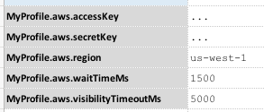

<a href="https://docs.aws.amazon.com/sqs/index.html" class="external-link" target="_nexial_external">SQS, or Simple 
Queue Service</a>, is a cloud service provided by Amazon AWS.  One can utilize such service to send, receive
and delete messages from a provisioned SQS queue.  Currently Nexial supports the use of SQS for sending, receiving 
and deleting messages. Future version of Nexial could extend towards manage of queues.



In addition, the following connection configuration should be considered as well when working with receiving messages:

|data variable                      |value                                                                             | note                                                    |
|-----------------------------------|----------------------------------------------------------------------------------|---------------------------------------------------------|
|`<profile>.aws.waitTimeMs`         |A period of time, in milliseconds, to wait on arrival of messages before giving up|See <a href="https://docs.aws.amazon.com/AWSSimpleQueueService/latest/SQSDeveloperGuide/sqs-long-polling.html" class="external-link" target="_nexial_external">Amazon SQS Long Polling</a> for more details. The detail is 20000 (20 seconds).|
|`<profile>.aws.visibilityTimeoutMs`|A period of time, in milliseconds, during which SQS prevents other consumers from receiving and processing the same message received|See <a href="https://docs.aws.amazon.com/AWSSimpleQueueService/latest/SQSDeveloperGuide/sqs-visibility-timeout.html" class="external-link" target="_nexial_external">Amazon SQS Visibility Timeout</a> for more details. The default value is 30000 (30 seconds).|

 

For example, suppose we have a "profile" named as `MyProfile`: 

Shown above, `MyProfile` will be used as a "profile" throughout the "aws.sqs" commands for SQS-related automation.

**NOTE**: 
1. Consider using [nexial-crypt](../../userguide/BatchFiles#nexial-cryptcmd--nexial-cryptsh) to encrypt your access
   key and secret key information.
2. It is possible to create multiple profiles and use them selectively during execution.

The "aws.sqs" command type represents a series of commands regarding AWS SQS.

### Available Commands
- [`deleteMessage(profile,queue,receiptHandle)`](deleteMessage(profile,queue,receiptHandle))
- [`receiveMessage(profile,queue,var)`](receiveMessage(profile,queue,var))
- [`receiveMessages(profile,queue,var)`](receiveMessages(profile,queue,var))
- [`sendMessage(profile,queue,message,var)`](sendMessage(profile,queue,message,var))
- [`purgeQueue(profile,queue,var)`](purgeQueue(profile,queue,var))
