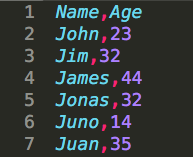

### Description
This command transform a contiguous cell `range` from a Excel `worksheet` to a CSV `output` file. The `file` parameter
represents the Excel file to read from.

### Parameters
- **file** - The excel file to read from.
- **worksheet** - The worksheet to read from.
- **range** - The range to read from.
- **output** - The CSV output to write to (as CSV format). 

### Example
**Script**: 

The Excel worksheet in question is as follows: 

The **output** CSV file look something like this: 

### See Also
- [`json(file,worksheet,range,header,output)`](json(file,worksheet,range,header,output))
- [`[EXCEL(...) => csv()]`](../../expressions/EXCELexpression#csv)
- [`[EXCEL(...) => csvWithHeader()]`](../../expressions/EXCELexpression#csvwithheader)
- [`[EXCEL(...) => json(firstRowAsHeader)]`](../../expressions/EXCELexpression#jsonfirstrowasheader)
