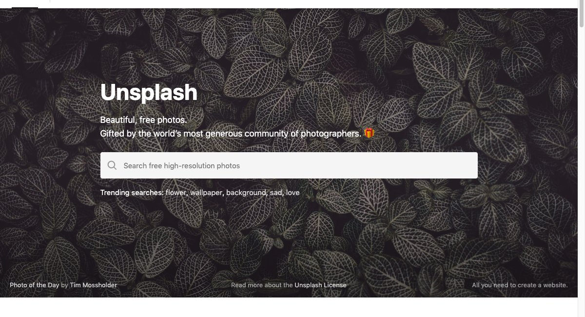

### Description
This command crops an image, whose location is denoted by `image`, and save it to another location denoted as 
`saveTo`. The parameter dimension represents the starting point (aka {`x,y}`), the width and the height to crop. 
These 4 values are separated by [`nexial.textDelim`](../../systemvars/index#nexial.textDelim), must be positive 
integers and must be represent an area within the bounds of `image`. 
Nexial supports `*`(Asterisks) in place of width and height in dimension parameter if width or height of image is unknown. 
Following are the ways to represent dimensions assuming [`nexial.textDelim`](../../systemvars/index#nexial.textDelim) is `comma(,)`:-
1. `10,10,100,200` - crop image with starting point as (10,10) and width of 100 and height of 200.
2. `10,10,100,*` - crop image with starting point as (10,10) and width of 100 and till the height of image. 
3. `10,10,*,200` - crop image with starting point as (10,10) and height of 200 and till the width of image. 
4. `10,10,*,*` - crop image with starting point as (10,10) and till the width and height of image. 

### Parameters
- **image** - the full path of the image to crop
- **dimension** - the x position, y position, width in pixel, and height in pixel of the intended crop area. 
  These values are separated by [`nexial.textDelim`](../../systemvars/index#nexial.textDelim).
- **saveTo** - the full path of the cropped image

### Example
Script:- 

Output:- 

**Original Image**:- 
 

---------------------------------------------

**Cropped Image**:- 
