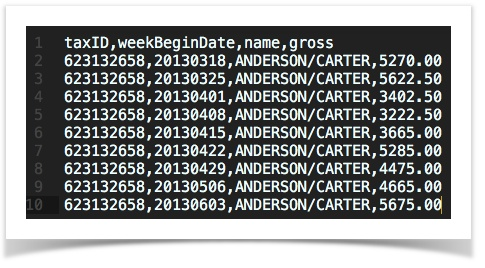
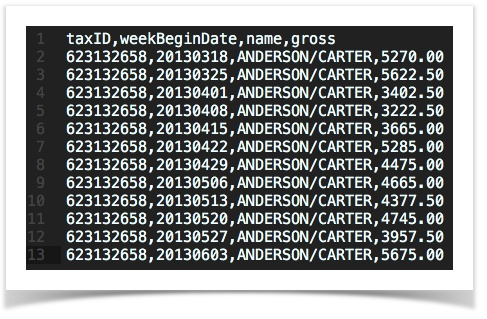
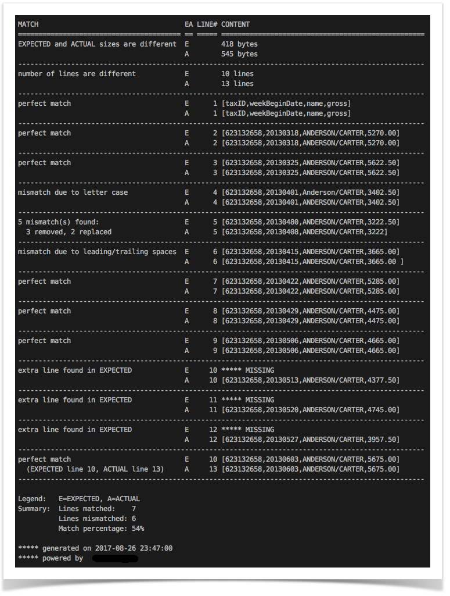

### Description
**NOTE THAT THIS COMMAND IS THE SAME AS 
[csv &raquo; `compare(expected,actual,failFast)`](../csv/compare(expected,actual,failFast)). Internally Nexial uses 
the same implementation for both commands.**

This command compares two text files (or two text content) and provides a comparison report at the end. The 
corresponding step will result in a `FAIL` if any differences are found between `expected`and `actual`. Note that much 
like many Nexial commands, both  `expected` and `actual` can be expressed as:

- An external file referenced either by its physically accessible file or via [`$(syspath)`](../../functions/$(syspath)).
  Examples:
  - `C:\my_path\my_file.txt`
  - `$(syspath|out|fullpath)/my_file.txt`
- A data variable, a [Nexial built-in function](../../functions), [Nexial expression](../../expressions), or a 
  combination of these 3, that would resolves to the text content to be compared. Examples:
  - `${my_data}`
  - `${my_text} with $(random|any|50) and [TEXT(${data}) => upper]`
- Text literal, which might contain newlines, carriage returns and other text formatting. Examples:
  - `This is a line to be tested`
  - `This is another line, with <b>HTML</b> formatting and whatnots`
- A HTTP resource reference, either expressed in the `http://...`, `https://...` form or as a data variable. Examples:
  - `http://mywebsite/mydata/myfile.txt`
  - `${web_resource}`

This is possible for `expected` and `actual` to derive from different sources (e.g. one from a file while the 
other from a data variable). In the end, Nexial will resolve to compare the two respective text content. 

One can determine the type of comparison report to be generated:
- [`nexial.compare.textReport`](../../systemvars/index#nexial.compare.textReport) - `true` (default) to generate the 
  text-based comparison report.
- [`nexial.compare.jsonReport`](../../systemvars/index#nexial.compare.jsReport) - `true` (default is `false`) to 
  generate the JSON-based comparison report.
- [`nexial.compare.htmlReport`](../../systemvars/index#nexial.compare.jsReport) - `true` (default is `false`) to 
  generate the HTML-based comparison report.

Setting `failfast` as `false` would instruct Nexial to provide detailed comparison report. Additionally,
- [`nexial.compare.reportMatch`](../../systemvars/index#nexial.compare.reportMatch) - `true` (default is `false`) to 
  turn on the reporting of matching lines.
  - Assign this System variable to `true` will result in Nexial generating the comparison report for the lines that 
    matched. This may be helpful to provide better context such the case for reports, essays, manuscripts, dialogs, 
    etc. The default for this System variable is is `false`. One can set this System variable _just_ before the 
    comparison to impact specific use of this command.

Let's look at an example. Suppose we have the following CSV file, `expected` and `actual`:<br/>
  

The `expected` has 10 lines while the `actual` has 13 lines. Clearly there will be some mismatches here. Here's an 
example of the comparison report that Nexial produces at the end of comparing these 2 text content:


The above report shows the following:
1. File level differences (number of lines, content size, difference in `CRLF` and `LF` for end-of-line character).
2. Line-by-line comparison, which shows the various type of differences such as leading/trailing spaces, upper/lower 
   case differences, missing characters, etc. Reporting of the matched lines can be turned off for brevity.
3. Overall comparison statistics can be seen at the end of the file.

The same comparison report generated as a JSON document would have the following structure:<br/>


The HTML comparison provides similar information. Here's an example (different than above):<br/>


The HTML comparison report provides the same information. However it is critical to note that Nexial does not generate a
**complete** HTML document on the basis that the generated HTML report might be better served as embedded content. For 
example, one could generate a HTML document that contains the text files that are being compared _and_ the
generated HTML report. Or, one could generate a HTML document that contains _all_ the generated HTML comparison reports
for ease of distribution and reference.

Nexial provides a public/default stylesheet for the generated HTML report - 
[https://nexiality.github.io/documentation/assets/report/io-compare-report.css](https://nexiality.github.io/documentation/assets/report/io-compare-report.css)

One can embedded this stylesheet (or another one) with the generated HTML comparison report like this:

  ```html
  <html>
  <head>
  <link rel="stylesheet" href="https://nexiality.github.io/documentation/assets/report/io-compare-report.css"/>
  <title>Comparison Reports - powered by Nexial Automation</title>
  <style>
  /* add additional stylesheet here, as per your liking */
  body { font-family: Calibri, serif; font-size: 10pt; background-color: #fff; }
  h2   { background: #ccc; padding: 15px; margin: -10px 0; }
  </style>
  </head>
  <body>
  <h1>File Comparison Results</h1>
  <br/><br/>
  <h2>Compare #1</h2>
    *** INSERT THE GENERATED HTML COMPARISION REPORT HERE ***
  <br/><br/>
  <h2>Compare #2</h2>
    *** INSERT ANOTHER GENERATED HTML COMPARISION REPORT HERE ***
  ... ...
  </body>
  </html>
  ```
The final HTML document would look something like this:<br/>


Note: to generate the HTML (like the one above) dynamically, one can consider using the 
[`writeFile(file,content,append)`](writeFile(file,content,append)) command. By setting `append` as `true`, the HTML
content can be "build up" over multiple commands.


### Parameters
- **expected** - this parameter is the expected file or text
- **actual** - this parameter is the actual file or text
- **failFast** - this parameter is the boolean value true or false to determine if the script execution need to be 
  continued or stopped at this comparison


### Example
**Script**:<br/>


**Output**:<br/>


The link **`log report`** will link to the text-based comparison report. The link **`json report`** will link to the 
JSON-based comparison report.


### See Also
- [`saveDiff(var,expected,actual)`](saveDiff(var,expected,actual))
