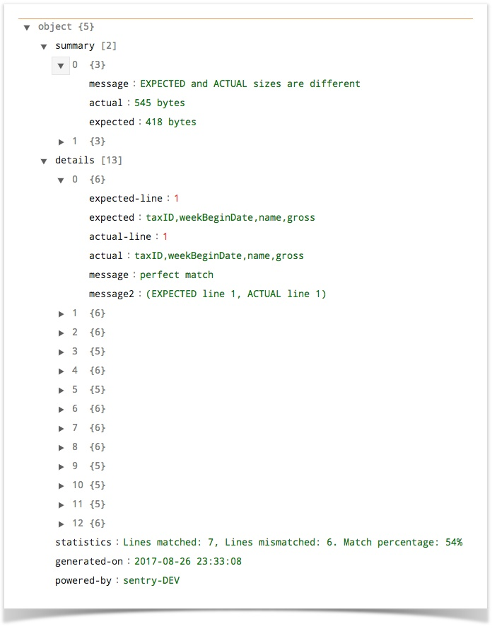

### Description
**NOTE THAT THIS COMMAND IS THE SAME AS 
[csv &raquo; `compare(expected,actual,failFast)`](../csv/compare(expected,actual,failFast)).  Internally Nexial uses 
the same implementation for both commands.**

This command compares two text files (or two text content) and provides a comparison report at the end.  A `FAIL` is 
deemed if any differences are found between `expected`and `actual`.  Note that much like many Nexial commands, both 
`expected` and `actual` can be expressed as:
- An external file, referenced either by its physical file (e.g. `C:\my_path\my_file.txt`) or via 
  [`$(syspath)`](../../functions/$(syspath)) (e.g. `$(syspath|out|fullpath)/my_file.txt`). 
- A data variable, which would resolve to the text content to be compared (e.g. `${my_data}`).
- Text literal, which might contain newlines, carriage returns and other text formatting (e.g. 
  `This is a line to be tested`).

This is possible for `expected` and `actual` to derive from different sources (e.g. one from a file while the 
other from a data variable).  In the end, Nexial will resolve to compare the two respective text content.  Let's 
look at an example.

Suppose we have the following CSV file, `expected` and `actual`: 
  

The `expected` has 10 lines while the `actual` has 13 lines.  Clearly there will be some mismatches here.  Here's an 
example of the comparison report that Nexial produces at the end of comparing these 2 text content:

The above report shows the following:
1. File level differences (number of lines, content size, difference in CRLF and LF for end-of-line character).
2. Line-by-line comparison, which shows the various type of differences such as trailing spaces, upper/lower case 
   differences, etc.
   1.  matched lines can be turned off for brevity.
3. Overall comparison statistics can be seen at the end of the file.

In addition, the comparison report can be generated as a JSON document as well.  The generated JSON has the following 
structure:

One can control the behavior of this command in the following ways:
- Turn on (default) or off the text-based comparison report - [`nexial.compare.textReport`](../../systemvars/index#nexial.compare.textReport).
- Turn on or off (default) the JSON-based comparison report - [`nexial.compare.jsonReport`](../../systemvars/index#nexial.compare.jsReport).
- Turn on or off (default) the reporting of matching lines - [`nexial.compare.reportMatch`](../../systemvars/index#nexial.compare.reportMatch).

### Parameters
- **expected** \- this parameter is the expected file or text
- **actual** \-this parameter is the actual file or text
- **failFast** \-this parameter is the boolean value true or false to determine if the script execution need to be 
  continued or stopped at this comparison

### Example
**Script**: 

**Output**: 

The link **`log report`** will link to the text-based comparison report.  The link **`json report`** will link to the 
JSON-based comparison report.

### See Also
- [`saveDiff(var,expected,actual)`](saveDiff(var,expected,actual))
