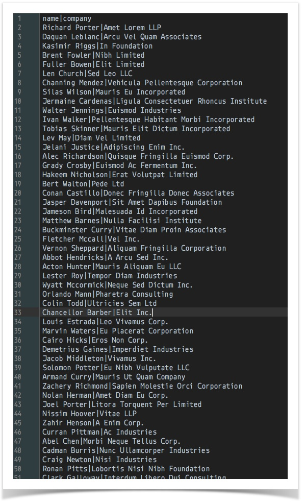
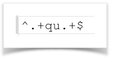

### Description
This command filters out all the lines found in `source` via the specified `matchPattern` (regular expression) and 
stores the matched lines in `target`.  This can be advantageous for situation where a fairly large file contains the 
content of interest but only in small portion.  Instead of scanning through such large file with return of deriving 
at a relatively fewer lines of interest (which takes time and compute resource), using this command could drastically 
cut down the processing time.  As a side effect, this command will produce a file - i.e. `target` \- which contains 
only the _lines_ of interest.  For example,

`source` (shown only the first 50 lines) 

`matchPattern` (line contains 'qu') 

`target` (17 lines found with 'qu') 

### Parameters
- **source** \- the file to scan for matching pattern
- **target** \- the file to save all matched lines
- **matchPattern** \- the pattern to match.  This is regular expression, matched a line at a time

### Example
see above
