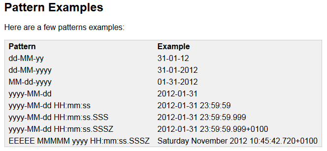

### Description
This command validates any text file with the fields in each record (line) either as a 
'**Fixed Length Fields'** type or **'Delimiter Separated Fields**' type.

Various validations can be carried out as configured. The configurations includes, self description 
of each field and the validations to be carried out.

**Validation Types supported**:

Each field in the record will go through the below validations mentioned.
- **Data Type:** (**Numeric, Alphanumeric, Blank**)
  - **Text Alignment Check:** (**Left, Right**) 
  - **REGEX** - Regular expression to check against actual field value 
  - **EQUALS** - Equals to check against actual field value 
  - **IN** - IN to check the presence of actual field value against a list of expected values
  - **DATE** - to do date field validation against given date pattern. See below for the date pattern syntax. 
  - **SQL** - to check field value against a database query

- **API** (**In Progress**)

- **RANGE**

- **Map Functions supported**
  Map Functions are to apply below functions on all the records on a field and get the value. Which could be later used to validate against any another field in any record. 
  - **COUNT** - Count to calculate the total count of the fields present
  - **MIN** -  to calculate the MIN amount
  - **MAX** - to calculate the MAX amount
  - **AGGREGATE** - to calculate the aggregate amount
  - **AVERAGE** - to calculate the average amount

### Parameters
- **var** - variable name to store the results
- **profile** - profile name that has to be defined in data file **(see below example)**
- **inputFile** - input file path that is to be validated

### Example
In the below example, the data file is defined with the variables with profile name. In this case, the profile name 
is **project_profile**.

**Explanation**:

**Data file:** 

- **project_profile.mappingExcel**: It is the excel file where the description of each field is defined.
- **project_profile.configJson**: It is the configuration file in JSON format to define the validations to be 
  executed
- **project_profile.reportType**: It is the report type to be mentioned to generate the reports

**Script**: 

**Output**: 
The output file
- Displays the total number of records processed with failed count
- Also provides a link to open the generated report file. The generated excel report file will have all the details, 
  that consists of 'Summary' sheet and 'Error_Report' sheet.

Map Function Format to use condition:

Date format pattern letters and their meaning: 
- G - Era designator (AD)
- y - Year (1996; 96)
- Y - Week Year (2009; 09)
- M - Month in year (July; Jul; 07)
- w - Week in year (27)
- W - Week in month (2)
- D - Day in year (189)
- d - Day in month (10)
- F - Day of week in month (2)
- E - Day name in week (Tuesday; Tue)
- u - Day number of week (1 = Monday, ..., 7 = Sunday)
- a - AM/PM marker
- H - Hour in day (0-23)
- k - Hour in day (1-24)
- K - Hour in am/pm (0-11)
- h - Hour in am/pm (1-12)
- m - Minute in hour (30)
- s - Second in minute (55)
- S - Millisecond (978)
- z - General time zone (Pacific Standard Time; PST; GMT-08:00)
- Z - RFC 822 time zone (-0800)
- X - ISO 8601 time zone (-08; -0800; -08:00)

### Downloads
- [Excel Descriptor Template](excel-mapping-config-template.json): the config template file for 'Excel' specification.
- [JSON Config Template](json-mapping-config-template.json): the config template for "JSON' specification.

