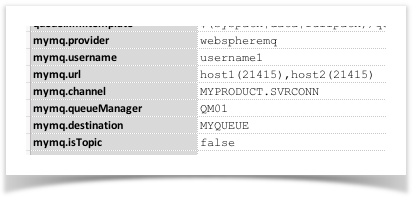
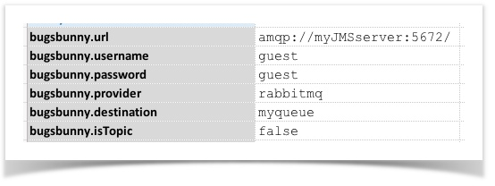

JMS standards Java Messaging Service.  It is an essential feature in the Java Enterprise Edition specification 
(since v1.4).  You can get more introductory content about JMS 
<a href="https://dzone.com/articles/introduction-jms" class="external-link" target="_nexial_external">here</a>, 
<a href="https://docs.oracle.com/javaee/6/tutorial/doc/bncdq.html" class="external-link" target="_nexial_external">here</a> and 
<a href="https://en.wikipedia.org/wiki/Java_Message_Service" class="external-link" target="_nexial_external">here</a>.

With regards to JMS, Nexial's aim is not to implement every single JMS capability.  From test automation standpoint, 
the bulk of the message interaction evolves around "send message" and "receive message".  These 2 operations are 
currently supported in Nexial.  Based on needs and demand, we might possibly implement other JMS operations, such as 
DELETE.

### Connection Configuration
Similar to other commands that interact with remote system, the JMS commands require a "configuration" object to 
specify the connectivity and security credential.  These set of configurations are "bundled" together under a name, 
such as `MyServer`.  Below is a table to outline such configurations:

<table cellspacing="0" cellpadding="3" style="text-align:left; vertical-align:top">
<thead>
<tr>
<th nowrap="nowrap">configuration name</th>
<th>value</th>
<th>explanation</th>
</tr>
</thead>

<tbody>
<tr>
<td nowrap="nowrap">
<code>MyServer.provider</code>
</td>
<td nowrap="nowrap">
Possible values:<ul>
<li><code>activemq</code></li>
<li><code>webspheremq</code></li>
<li><code>rabbitmq</code></li>
<li><code>jndi</code></li>
</ul>
</td>
<td>
<b>[REQUIRED]</b> 
More options could be added on as-needed basis. Raise an 
<a href="https://github.com/nexiality/nexial-core/issues" class="external-link" target="_nexial_external">issue</a> if your JMS vendor is not 
on this list. 
 
For <codewebspheremq</code> (WebSphere MQ), additional jar files are required to be added to the 
<code>${NEXIAL_HOME}/lib</code> directory.  Visit 
<a href="http://www-01.ibm.com/support/docview.wss?uid=swg21376217" class="external-link" target="_nexial_external">here</a> to learn more about
the required WebSphere MQ client jar files.
</td>
</tr>

<tr>
<td nowrap="nowrap">
<code>MyServer.url</code>
</td>
<td>
e.g.:<ul>
<li><code>amqp://[HOST]:[PORT]/</code></li>
<li><code>tcp://[HOST]:[PORT]/</code></li>
<li><code>jnp://[HOST]:[PORT]/</code></li>
</ul>
</td>
<td>
<b>[REQUIRED]</b> 
The URL or URI specific to the target Message server. This is usually vendor specific (except for JNDI-based 
JMS server). Check product documentation or IT support for details. 
 
For <u>RabbitMQ</u>, the <code>url</code> starts with <code>amqp://</code> or <code>amqps://</code>. Note that the 
virtual host (aka virtual context) is specified as the part of the <code>url</code>. For a virtual host of 
<code>/</code>, end the <code>url</code> with <code>/</code>. 
 
For <u>WebSphereMQ</u>, the <code>url</code> consists of a list of listeners in the form of <code>host(port)</code>. 
For example, <code>server1(port1),server2(port2)</code>. 
 
For <u>ActiveMQ</u>, the <code>url</code> starts with <code>tcp://</code> or <code>tcps://</code>. 
 
For JNDI-based JMS server, the <code>url</code> would be the standard JNDI url - <code>jnp://host:port/</code>.
</td>
</tr>

<tr>
<td nowrap="nowrap">
<code>MyServer.username</code>
</td>
<td>
the username to access the target JMS server
</td>
<td>
<b>[REQUIRED] if required by JMS server and <code>provider</code> is not <code>jndi</code></b> 
Consider using <a href="../../userguide/BatchFiles#nexial-cryptcmd--nexial-cryptsh"><code>nexial-crypt</code></a> to protect sensitive information.
</td>
</tr>

<tr>
<td nowrap="nowrap">
<code>MyServer.password</code>
</td>
<td>
the password to access the target JMS server
</td>
<td>
<b>[REQUIRED] if required by JMS server and <code>provider</code> is not <code>jndi</code> </b> 
Consider using <a href="../../userguide/BatchFiles#nexial-cryptcmd--nexial-cryptsh"><code>nexial-crypt</code></a> to protect sensitive information.
</td>
</tr>

<tr>
<td nowrap="nowrap">
<code>MyServer.destination</code>
</td>
<td>
either topic or queue name
</td>
<td>
<b>[REQUIRED]</b> 
use<code>isTopic</code>to determine if this destination is a queue or a topic.
</td>
</tr>

<tr>
<td nowrap="nowrap">
<code>MyServer.isTopic</code>
</td>
<td>
<code>true</code> or <code>false</code> 
</td>
<td>
specify as <code>true</code> if your destination is a Topic. Default is <code>false</code>.
</td>
</tr>

<tr>
<td nowrap="nowrap">
<code>MyServer.initialContextFactory</code>
</td>
<td>
</td>
<td>
<b>For JNDI-based JMS access only.</b> 
 
<b>[REQUIRED] if <code>provider</code> is <code>jndi</code></b> 
Specifying the initial context factory to use. The value of the property should be the fully qualified class 
name of the factory class that will create an initial context. This would be synonymous to 
"<code>java.naming.factory.initial</code>".
</td>
</tr>

<tr>
<td nowrap="nowrap">
<code>MyServer.connectionFactory</code>
</td>
<td>
</td>
<td>
<b>For JNDI-based JMS access only.</b> 
 
<b>[REQUIRED] if <code>provider</code> is <code>jndi</code></b> 
Specify the JNDI name of the object that provides connection to the target JMS server. Consult vendor 
documentation or IT Support for details.
</td>
</tr>

<tr>
<td nowrap="nowrap">
<code>MyServer.jndiUsername</code>
</td>
<td>
</td>
<td>
<b>For JNDI-based JMS access only.</b> 
 
<b>[REQUIRED] if <code>provider</code> is <code>jndi</code></b> 
Specify the username to access the target JNDI server. This would be synonymous to 
"<code>java.naming.security.principal</code>".
</td>
</tr>

<tr>
<td nowrap="nowrap">
<code>MyServer.jndiPassword</code>
</td>
<td>
</td>
<td>
<b>For JNDI-based JMS access only.</b> 
 
<b>[REQUIRED] if <code>provider</code> is <code>jndi</code></b> 
Specify the password to access the target JNDI server. This would be synonymous to 
"<code>java.naming.security.credentials</code>".
</td>
</tr>

<tr>
<td nowrap="nowrap">
<code>MyServer.channel</code>
</td>
<td>
</td>
<td>
<b>For WebSphereMQ access only.</b> 
 
<b>[REQUIRED] if <code>provider</code> is <code>webspheremq</code></b> 
 
The channel name by which the intended JMS connections and operations will be connected. Check vendor 
documentation or IT Support for details.
</td>
</tr>

<tr>
<td nowrap="nowrap">
<code>MyServer.queueManager</code>
</td>
<td>
</td>
<td>
<b>For WebSphereMQ access only.</b> 
 
<b>[REQUIRED] if <code>provider</code> is <code>webspheremq</code></b> 
The name of the queue manager from which the message operations will be issued. Check vendor documentation or 
IT Support for details.
</td>
</tr>
</tbody>
</table>

#### Examples
- WebSphereMQ 
  
- ActiveMQ 
  
- RabbitMQ 
  

### Available Commands
- [`receive(var,config,waitMs)`](receive(var,config,waitMs))
- [`send(config,messageId,payload)`](send(config,messageId,payload))