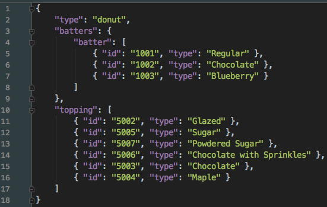
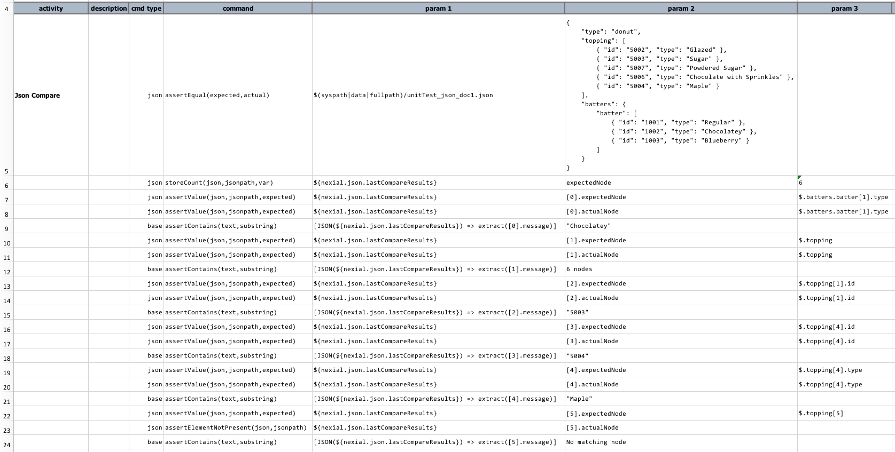
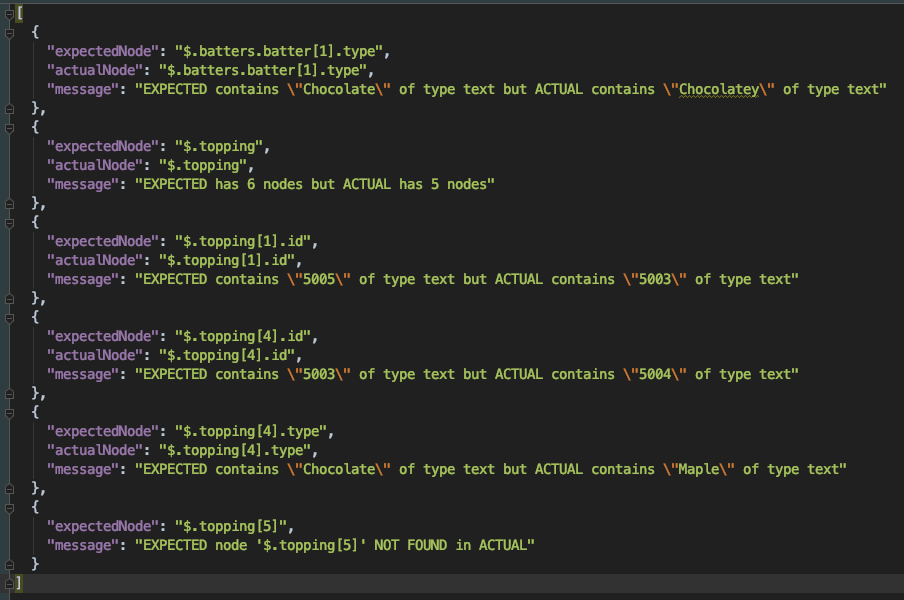
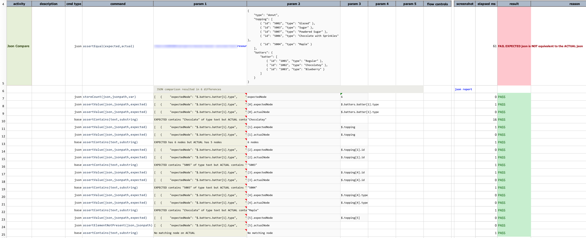

### Description
This command performs equivalent-test against `expected` and `actual` JSON documents.  The idea of equivalent-test is
to consider the logical equivalence of 2 structurally different JSON documents.  In JSON, as in the case of XML, some 
nodes may be arranged in different order without changing its logical context.  Consider the following 2 JSON documents:

```json
{
    "name": "Johnny Rocket",
    "age": 19,
    "hobby": "Fly to the moon"
}
```

```json
{
    "age": 19,
    "hobby": "Fly to the moon",
    "name": "Johnny Rocket"
}
```

Technically they are 2 separate and different documents. But logically speaking, they represent the same set of 
information (i.e. _Johnny Rocket, who is 19, likes to fly to the moon_). This command serves the purpose of asserting
the logical equivalence of 2 JSON documents. As such, the above 2 documents would be considered as "equal".

In contract, [base &raquo; `assertEqual(expected,actual)`](../base/assertEqual(expected,actual)) performs byte-level
comparison. Using such command with the above documents would yield FAIL since they are not the same at the byte level.

Note that both `expected` and `actual` can be either a JSON document (text), JSON array (text) or a fully qualified 
file path with valid JSON content. If a file is specified, Nexial will also perform data variable substitution on this 
file PRIOR to performing the equivalent-test.

JSON array is treated differently than JSON document. With JSON document, the order of its child nodes does not alter 
the logical connotation thereof. However with JSON array, the order of its child nodes is significant. For example,

```json
[ "Johnny", "Sammy", "Mark" ]
```

```json
[ "Sammy", "Mark", "Johnny" ]
```

If the above JSON arrays each represents a winner list, the first array would mean "1st place: Johnny, 2nd place: 
Sammy, 3rd place: Mark", and the second array: "1st place: Sammy, 2nd place: Mark, 3rd place: Johnny". _BIG DIFFERENCE..._

This command will treat child node order of a JSON array with significance. The above 2 JSON documents will not be
considered as logically equivalent.

Should this command finds any differences between `expected` and `actual`, 3 consequences can be expected:
1. This command will result in a FAIL.
2. The comparison result will be made available as another JSON document and linked to the execution output.
3. System variable, `nexial.json.lastCompareResults`, will be assigned the same JSON document as #2. One may use this
   variable for further automation or processing.


### Parameters
- **expected** - the expected JSON document
- **actual** - the actual JSON document


### Example
Consider the following JSON document as the `expected`:


We can compare against this document either with another file or a JSON document (`${...}` or hardcoded).
The example shows such capability.  After comparison (which ends in FAIL due to logical difference), one can use the
`nexial.json.lastCompareResults` as a JSON document to inspect failure details.

**Script**:<br/>


**Output**:<br/>
Here's the comparison report as a JSON document. One will observe that the comparison is expressed as a JSON array, 
where each node represents a difference between the 2 JSON documents. The `$` character represents the top of the
document (or root node) so that `$.batters.batter[1].type` would mean "_the node named `type` from the 2nd element 
(0-based) of its parent array named `batter` whose parent node is named `batters` whose parent node is the root of the 
JSON document_".


As a JSON document, we can query the comparison report for more specific details via the [json commands](../json/index)
and [JSON Path](../../jsonpath), which is shown below from row 7 through 25. 



### See Also
- [base &raquo; `assertEqual(expected,actual)`](../base/assertEqual(expected,actual))
