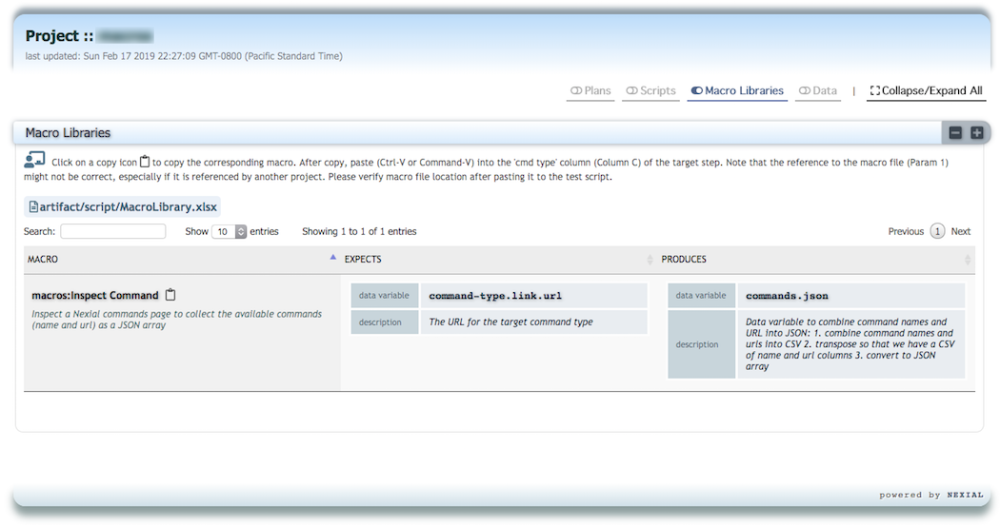

The concept of "macro" is explained in the [macro(file,sheet,name)](../base/macro(file,sheet,name)) page. To better 
support the implementation and the use of macros, Nexial provides a set of commands designed specifically to clarify the
intent of each macros in terms of:
1. The intent of a macro, much akin to documentation.
2. The data variables (input) expected by a macro.
2. The data variable(s) (output) produced by a macro.

### Using `nexial-project-inspector`
Nexial ships with a batch script to scan for these macro-focused commands to generate documentation (HTML).  When 
executed, the [`nexial-project-inspector`](../../userguide/BatchFiles#nexial-project-inspectorcmd--nexial-project-inspectorsh) 
batch performs the following actions:
1. Searches for all valid macro files within a project.
2. For each macro file, scan through all worksheets.
3. For each macro found, scan for all instances of [`description()`](description()) commands and collect the content 
   of the corresponding "description" column.
4. For each macro found, scan for all instances of [`expects(var,default)`](expects(var,default)) commands and collect 
   the content of the corresponding "description" column, the expected data variables (denoted as `var`) and default 
   value (denotes as `default`).
5. For each macro found, scan for all instances of [`produces(var,value)`](produces(var,value)) commands and collect 
   the content of the corresponding "description" column and the data variable produced by this macro (`var`).
4. Information gathered from the above step 3-5 are then gathered into a single JSON, which will be rendered via a 
   HTML file saved to the corresponding project home directory.

Check [`nexial-project-inspector`](../../userguide/BatchFiles#nexial-project-inspectorcmd--nexial-project-inspectorsh)
for more details of this batch file. One can execute the `nexial-project-inspector` batch file at any time, and even 
commit the generated JSON/HTML files so that other team members can benefit from the generated documentation. Here's 
an example of the generated documentation (part of Project Inspector): 
 

The screenshot shows that the generated documentation contains a macro, its description, the data variables it expects 
and the data variable it produces. One can sort, search and even copy/paste the macros to a test script. The clipboard 
icon next to the macro name allows one to copy the macro reference and paste it directly into a test script (place 
cursor at the **[cmd type]** column before paste).

With some effort to properly implemented these macro-focused commands, the corresponding macros would be easier to 
find, to understand and to use.

### Available Commands
- [`description()`](description())
- [`expects(var,default)`](expects(var,default))
- [`produces(var,value)`](produces(var,value))
