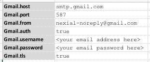

The "mail" command type represents the automation command regarding sending emails. This command helps to configure the 
email dynamically. With the help of this command we can:-

- Add TO, CC and BCC recipients.
- Set the email subject.
- Append content to the body of the email at various steps.
- Add attachments to the email.

In order to send email, appropriate mail server connectivity must be defined first.  The section below describes how
mail server connectivity would be configured. 

It is noteworthy to clarify that the mail server connectivity used here may not necessarily be the same as that used
by Nexial to [send out email notification](../../systemvars/index#nexial.enableEmail).

### Mail Settings
The `mail` command type uses a "profile" to group related data variables together, much like the case for 
[`ssh`](../ssh/index#connection-setup), [`rdbms`](../rdbms/index#database-connection-setup) or 
[`aws.s3`](../aws.s3/index#connection-setup).  The profile-based connectivity setting can be defined via command line 
(i.e. `-D`), [`project.properties`](../../userguide/UnderstandingProjectStructure#artifactprojectproperties), or the 
appropriate data file.  For example, via command line:

> set JAVA_OPT=-DMyMail.from=boss@mystore.com -DMyMail.host=mail.mystore.com -DMyMail.port=25
> 
> nexial.sh -plan ... ...

Here are the various settings available to configure the appropriate mail server for your automation 
(assuming profile is `MyEmail`):

| data variable         | description                                                                    |
| --------------------- | ------------------------------------------------------------------------------ |
| `MyEmail.host`        | **[REQUIRED]** the SMTP host for nexial                                        |
| `MyEmail.port`        | **[REQUIRED]** the SMTP port for nexial; default is `25`                       |
| `MyEmail.username`    | [optional] auth user for SMTP host. Required only if `auth` is true            |
| `MyEmail.password`    | [optional] auth credential for SMTP host. Required only if `auth` is true      |
| `MyEmail.tls`         | [optional] boolean; determine if TTLS is enable for SMTP                       |
| `MyEmail.localhost`   | [optional] determine if SMTP service is locally available                      |
| `MyEmail.from`        | **[REQUIRED]** the sender of mail sent via nexial                              |
| `MyEmail.protocol`    | **[REQUIRED]** `smtp` or `imap`; default is `smtp`                             |
| `MyEmail.auth`        | [optional] whether authentication is required to send mail; default is `false` |
| `MyEmail.bufferSize`  | [optional] buffer size for smtp packet; default to system default of `512`     |
| `MyEmail.contentType` | [optional] smtp MIME type to use; default is `text/html`                       |

 

#### Gmail
Sending email via Gmail is possible, albeit a few things to take care initially.

Here's the settings for targeting Gmail as the mail host: 

Note that you need to fill in the correct email and password for `Gmail.username` and `Gmail.password`. You can 
optionally rename the profile from `Gmail` to something else.



### Available Commands
- [mail &raquo; `composeMail(var,action,value)`](../mail/composeMail(var,action,value))
- [mail &raquo; `send(profile,var)`](../mail/send(profile,var))
- [mail &raquo; `clearMail(var)`](../mail/clearMail(var))
