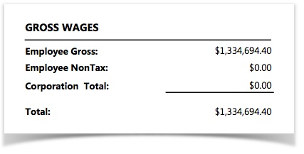
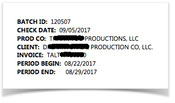

A lot can be said about PDF data model.  Not text extraction - which is just the extracting of textual content from a 
PDF document - but the extracting of information into a form of data structure. A simple form of data structure is 
the name-value pair, like:

> `first name=Johnny`
>
> `middle initial=B.`
>
> `last name=Good`
>
> `hobby=Go places`

The content of a PDF document is not necessarily laid out in a predictable, consistent manner.  Extract such content 
into a well-formed structure can be challenging. In fact, at times, it should not be done at all - e.g. a PDF document 
of a fictional story, _per se_.

This is one of the main reason why we designed different PDF-related commands in Nexial.  For free-flowing textual 
content, commands like [**`assertPatternPresent(pdf,regex)`**](assertPatternPresent(pdf,regex)), 
[**`assertTextPresent(pdf,text)`**](assertTextPresent(pdf,text)), [**`count(pdf,text,var)`**](count(pdf,text,var)), 
[**`saveAsText(pdf,destination)`**](saveAsText(pdf,destination)), 
[**`saveAsPages(pdf,destination)`**](saveAsPages(pdf,destination)) are created to handle it.  For more structured 
content, such as a form or a report, then we can use commands like 
[**`saveFormValues(pdf,var,pageAndLineStartEnd,strategy)`**](saveFormValues(pdf,var,pageAndLineStartEnd,strategy)), 
[**`assertFormValue(var,name,expected)`**](assertFormValue(var,name,expected)). 

 

### PDF Form Data Extraction
To extract data structure out of a PDF document, one would need to consider the appropriate extraction strategy to 
apply.  Such strategy must also be appropriately scoped to a well-defined portion of the document, since any given PDF 
might contain multiple types of data structure or layout.  In Nexial, we have defined a few commonly used extraction 
strategies.  One may use one of these strategies as is, or creating a new strategy by basing it on an existing one.

Here are the default extraction strategies:
`KEY REGEX`: **`^([0-9A-Za-z\\\/\ \.\,\"\'\(\)\[\]\#\-]+)\:?\s*$`**

| STRATEGY                   | KEY_REGEX | TRIM_KEY | VALUE_POSITION                | TRIM_VALUE | VALUE MERGE AS 1 LINE | Description | Example |
| -------------------------- | --------- | -------- | ----------------------------- | ---------- | --------------------- | ----------- | ------- |
| `ALTERNATING_ROW`          | default   | `true`   | alternate row                 | `true`     | `true` | The name and value are laid out in alternating row. In the example (right), `STREET ADDRESS`would be considered in a separate row than its corresponding value `2200 West Empire Ave.,` |  |
| `ALTERNATING_CELL`         | default   | `true`   | alternate cell                | `true`     | `true` | The name and value are laid out in alternative cell. In the example (right), `Employee Gross` is presented in one cell, while its corresponding value `$1,334,694.40` is in another. |  |
| `SHARE_CELL`               | default   | `true`   | same cell                     | `true`     | `true` | Both the name and value are stored in the same cell, forming a contiguous string of text. | |
| `HEADER_ONLY`              | default   | `true`   | after first row               | `true`     | `true` | All the name of the target data structure are laid out horizontally across the same line (like table header), while the corresponding values are laid out in subsequent lines (like CSV). | |
| `SHARE_CELL_THEN_ALT_CELL` | default   | `true`   | same cell, could be next cell | `true`     | `true` | This is a combination of `SHARE_CELL` and `ALTERNATING_CELL`. The `SHARE_CELL`strategy is tried first, and in need be the `ALTERNATING_CELL`strategy is employed as backup. | 

 

### PDF Form Parsing Strategy

| Option | Possible Data | Default Value | Description | 
| --- | --- | --- | --- | 
|nexial.pdfFormStrategy.**[NAME]**.basedOn |ALTERNATING_ROW ALTERNATING_CELL SHARE_CELL HEADER_ONLY SHARE_CELL_THEN_ALT_CELL | |  use one of the strategies as your starting point |
|nexial.pdfFormStrategy.**[NAME]**.keyThenValue | true / false | | determine if form 'key' should appear before the corresponding 'value' |
|nexial.pdfFormStrategy.**[NAME]**.keyPattern | regular expression | ^([0-9A-Za-z\\\/\ \.\,\"\'\(\)\[\]\#\-]+)\:?\s*$ | the extraction pattern for form 'key' |
|nexial.pdfFormStrategy.**[NAME]**.keyValueDelimiter | text | : | the delimiter (or separator) between form 'key' and 'value' |
|nexial.pdfFormStrategy.**[NAME]**.trimKey | true / false | false | determine if Nexial should remove leading and ending spaces from extracted form 'key'|
|nexial.pdfFormStrategy.**[NAME]**.normalizeKey | true / false | true | determine if Nexial should remove duplicate whitespaces from extracted form 'key'. If true, FIRST or   LAST -   name would become **FIRST or LAST - name**.|
|nexial.pdfFormStrategy.**[NAME]**.skipKeyWithoutDelim|true / false|false|determine if extract form 'key' without corresponding 'value' would be removed|
|nexial.pdfFormStrategy.**[NAME]**.trimValue|true / false|false|determine if Nexial should remove leading and ending spaces from extracted form 'value'|
|nexial.pdfFormStrategy.**[NAME]**.normalizeValue|true / false|true|determine if Nexial should remove duplicate whitespaces from extracted form 'value'. |
|nexial.pdfFormStrategy.**[NAME]**.valueAsOneLine|true / false|determine if Nexial should remove newline or carriage return characters rom extracted form 'value'.|

### Available Commands
- [`assertContentEqual(actualPdf,expectedPdf)`](assertContentEqual(actualPdf,expectedPdf))
- [`assertFormElementPresent(var,name)`](assertFormElementPresent(var,name))
- [`assertFormValue(var,name,expected)`](assertFormValue(var,name,expected))
- [`assertFormValues(var,name,expectedValues,exactOrder)`](assertFormValues(var,name,expectedValues,exactOrder))
- [`assertPatternNotPresent(pdf,regex)`](assertPatternNotPresent(pdf,regex))
- [`assertPatternPresent(pdf,regex)`](assertPatternPresent(pdf,regex))
- [`assertTextArray(pdf,textArray,ordered)`](assertTextArray(pdf,textArray,ordered))
- [`assertTextNotPresent(pdf,text)`](assertTextNotPresent(pdf,text))
- [`assertTextPresent(pdf,text)`](assertTextPresent(pdf,text))
- [`count(pdf,text,var)`](count(pdf,text,var))
- [`saveAsPages(pdf,destination)`](saveAsPages(pdf,destination))
- [`saveAsText(pdf,destination)`](saveAsText(pdf,destination))
- [`saveFormValues(pdf,var,pageAndLineStartEnd,strategy)`](saveFormValues(pdf,var,pageAndLineStartEnd,strategy))
- [`saveMetadata(pdf,var)`]( saveMetadata(pdf,var))
- [`saveToVar(pdf,var)`](saveToVar(pdf,var))
