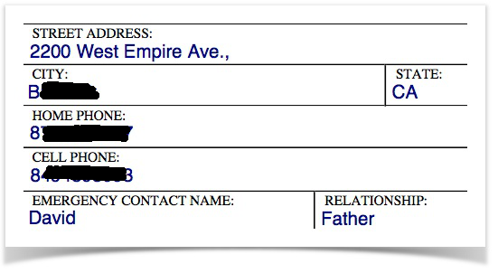

A lot can be said about PDF data model. Ths is note the same as text extraction, which is just the extracting of 
textual content from a PDF document, but the extracting of information into a structured format. A simple form of data 
structure is the name-value pair, like:

> `first name=Johnny` 
> `middle initial=B.` 
> `last name=Good` 
> `hobby=Go places` 

The content of a PDF document is not necessarily laid out in a predictable and consistent manner. Extract such content 
into a well-formed structure can be challenging. There are situations where such extraction should not be performed at 
all, such as the case when the PDF document is a fictional story. This is one of the main reasons why different 
PDF-related commands are designed in Nexial. 

For free-flowing textual content, one can use commands such as:
- [**`assertPatternPresent(pdf,regex)`**](assertPatternPresent(pdf,regex))
- [**`assertTextPresent(pdf,text)`**](assertTextPresent(pdf,text))
- [**`count(pdf,text,var)`**](count(pdf,text,var)), 
- [**`saveAsText(pdf,destination)`**](saveAsText(pdf,destination)), 
- [**`saveAsPages(pdf,destination)`**](saveAsPages(pdf,destination)) 

For more structured content, such as a form or a report, the following commands could be of help:
- [**`saveFormValues(pdf,var,pageAndLineStartEnd,strategy)`**](saveFormValues(pdf,var,pageAndLineStartEnd,strategy))
- [**`assertFormValue(var,name,expected)`**](assertFormValue(var,name,expected))

### PDF Form Data Extraction
To extract data structure out of a PDF document, one would need to consider the appropriate extraction strategy to 
apply. Such strategy must also be appropriately scoped to a well-defined portion of the document, since any given PDF 
might contain multiple types of data structure or layout. In Nexial, we have defined a few commonly used extraction 
strategies. One may use one of these strategies as is, or creating a new strategy by basing it on an existing one.

This is the default regular expression for key extraction: **`^([0-9A-Za-z\\/\ \.,"'\(\)\[\]\#\-]+):?\s*$`**

| STRATEGY                 | KEY_REGEX | TRIM KEY | VALUE POSITION               | TRIM VALUE | VALUE MERGED AS 1 LINE | Description                                                                                                                                                                                         | Example             |
|:-------------------------|:----------|:---------|:-----------------------------|:-----------|:-----------------------|:----------------------------------------------------------------------------------------------------------------------------------------------------------------------------------------------------|:--------------------|
|`ALTERNATING_ROW`         |default    |`true`    |alternate row                 |`true`      |`true`                  |The name and value are laid out in alternating row. In the example (right),`STREET ADDRESS` would be considered in a separate row than its corresponding value `2200 West Empire Ave.,`  ||
|`ALTERNATING_CELL`        |default    |`true`    |alternate cell                |`true`      |`true`                  |The name and value are laid out in alternative cell. In the example (right), `Employee Gross` is presented in one cell, while its corresponding value `$1,334,694.40` is in another.     ||
|`SHARE_CELL`              |default    |`true`    |same cell                     |`true`      |`true`                  |Both the name and value are stored in the same cell, forming a contiguous string of text.                                                                                                        ||
|`HEADER_ONLY`             |default    |`true`    |after first row               |`true`      |`true`                  |All the name of the target data structure are laid out horizontally across the same line (like table header), while the corresponding values are laid out in subsequent lines (like CSV).||
|`SHARE_CELL_THEN_ALT_CELL`|default    |`true`    |same cell, could be next cell |`true`      |`true`                  |This is a combination of `SHARE_CELL` and `ALTERNATING_CELL`. The `SHARE_CELL`strategy is tried first, and in need be the `ALTERNATING_CELL` strategy is employed as backup.             |                     |

 

If these built-in extraction strategies don't quite fit the target PDF document, one can customize (more like enhance) 
the extraction strategy by setting up profile(s), using the data variables below.

##### PDF Form Parsing Strategy

| Option                                              | Possible Data                                                                                            | Default Value                               | Description                                                             | 
|:----------------------------------------------------|:---------------------------------------------------------------------------------------------------------|:--------------------------------------------|:------------------------------------------------------------------------|
|nexial.pdfFormStrategy.**[NAME]**.basedOn            |`ALTERNATING_ROW` `ALTERNATING_CELL` `SHARE_CELL` `HEADER_ONLY` `SHARE_CELL_THEN_ALT_CELL`|                                             |use one of the strategies as your starting point                         |
|nexial.pdfFormStrategy.**[NAME]**.keyThenValue       |`true` / `false`                                                                                          |`true`                                       |should the form 'key' appear before the corresponding 'value'?           |
|nexial.pdfFormStrategy.**[NAME]**.keyPattern         |regular expression                                                                                        |`^([0-9A-Za-z\\/\ \.,"'\(\)\[\]\#\-]+):?\s*$`|the extraction pattern for form 'key'                                    |
|nexial.pdfFormStrategy.**[NAME]**.keyValueDelimiter  |text                                                                                                      |`:`                                          |the delimiter between form 'key' and 'value'                             |
|nexial.pdfFormStrategy.**[NAME]**.trimKey            |`true` / `false`                                                                                          |`false`                                      |should Nexial remove leading and ending spaces from extracted form 'key'?|
|nexial.pdfFormStrategy.**[NAME]**.normalizeKey       |`true` / `false`                                                                                          |`true`                                       |should Nexial remove duplicate whitespaces from extracted form 'key'?    |
|nexial.pdfFormStrategy.**[NAME]**.skipKeyWithoutDelim|`true` / `false`                                                                                          |`false`                                      |should the extracted form 'key' without 'value' be removed?              |
|nexial.pdfFormStrategy.**[NAME]**.trimValue          |`true` / `false`                                                                                          |`false`                                      |should Nexial remove leading and ending spaces from form 'value'?        |
|nexial.pdfFormStrategy.**[NAME]**.normalizeValue     |`true` / `false`                                                                                          |`true`                                       |should Nexial remove duplicate whitespaces from extracted form 'value'?  |
|nexial.pdfFormStrategy.**[NAME]**.valueAsOneLine     |`true` / `false`                                                                                          |                                             |should Nexial remove newline characters from extracted form 'value'?     |

### Available Commands
- [`assertContentEqual(actualPdf,expectedPdf)`](assertContentEqual(actualPdf,expectedPdf))
- [`assertFormElementPresent(var,name)`](assertFormElementPresent(var,name))
- [`assertFormValue(var,name,expected)`](assertFormValue(var,name,expected))
- [`assertFormValues(var,name,expectedValues,exactOrder)`](assertFormValues(var,name,expectedValues,exactOrder))
- [`assertPatternNotPresent(pdf,regex)`](assertPatternNotPresent(pdf,regex))
- [`assertPatternPresent(pdf,regex)`](assertPatternPresent(pdf,regex))
- [`assertTextArray(pdf,textArray,ordered)`](assertTextArray(pdf,textArray,ordered))
- [`assertTextNotPresent(pdf,text)`](assertTextNotPresent(pdf,text))
- [`assertTextPresent(pdf,text)`](assertTextPresent(pdf,text))
- [`combine(path,fileFilter,saveTo)`](combine(path,fileFilter,saveTo))
- [`count(pdf,text,var)`](count(pdf,text,var))
- [`saveAsPages(pdf,destination)`](saveAsPages(pdf,destination))
- [`saveAsPdf(profile,content,file)`](saveAsPdf(profile,content,file))
- [`saveAsText(pdf,destination)`](saveAsText(pdf,destination))
- [`saveFormValues(pdf,var,pageAndLineStartEnd,strategy)`](saveFormValues(pdf,var,pageAndLineStartEnd,strategy))
- [`saveMetadata(pdf,var)`]( saveMetadata(pdf,var))
- [`savePageCount(pdf,var)`](savePageCount(pdf,var))
- [`saveToVar(pdf,var)`](saveToVar(pdf,var))
- [`split(pdf,saveTo)`](split(pdf,saveTo))