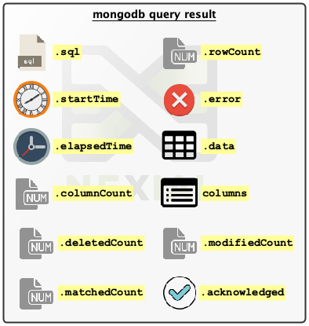

### Working with Execution Result
Executing a SQL statement results in a series of outcome. The most common and sought-after is, of course, the 
resultset or dataset - assuming the executed SQL statement is a SELECT statement. However, for UPDATE, DELETE or 
INSERT, one might be more interested in the number of rows affected by the SQL statement in question. Or, perhaps one 
is interested in capturing any errors generated on the database server during SQL execution. For these reasons, Nexial 
is designed to encapsulate the various execution result into a "wrapper", or a "object". This wrapper can be thought 
of as the "outer casing" which houses the various execution results. There are 2 types of wrapper - one for SELECT 
statements and the other one for INSERT/UPDATE/DELETE: 

To reference the specific execution result, one would use the dot notation (`.`) like this: `${result}.sql`. This 
would retrieve the SQL statement associated to this execution.  Of course one could assign a different variable name 
other than `result`. 
- `${...}.sql` - retrieves the SQL statement executed to derive this execution result
- `${...}.startTime` - retrieves the time when this SQL was executed, in 
  <a href="https://en.wikipedia.org/wiki/Unix_time" class="external-link" target="_nexial_link">epoch</a> format. 
  Considering using the [`date`](../../functions/$(date)) built-in function to convert the timestamp value into a 
  human-readable form.
- `${...}.elapsedTime` - retrieves the time spent to complete the associated SQL execution, in milliseconds.
- `${...}.rowCount` - retrieves the number of rows affected by the execution of the associated SQL statement. This 
   is usually used when executing a INSERT, DELETE or UPDATE statement. 
- `${...}.error` - retrieves the error message as a result of executing the associated SQL statement. 
- `${...}.data` - retrieves the resultset or dataset; usually only contains data for SELECT statements. To retrieve 
  portion of the dataset,
  - use `${...}.data[1]` notation to retrieve a row of data (row index is zero-based)
  - use `${...}.data[1].column-name` notation to retrieve the value of a specific cell
- `${...}.cells[COLUMN_NAME]`
  - ONLY APPLICABLE TO SELECTs
  - Retrieves data column-wise so that the values of the matching column (as specified via `COLUMN_NAME`) are 
    retrieved, in the order of the rows returned from the query execution, as a list
  - For example, suppose a query returns a data set like this: 
      

    If this resultset is encapsulated in a variable named as `${result}`, then  
    
    
    would produce the following: 
    
  - Note that some database vendors adhered to case sensitivity for column names
- `${...}.columns` - retrieves the column names of the resultset
- `${...}.columnCount` - retrieves the number of columns in the resultset
- `${...}.rolledBack` - `true` or `false` to indicate whether the execution had resulted in a transaction rollback

Note that many database vendors (and the corresponding database drivers) adhere to case-sensitivity so that column 
'Address' is considered NOT THE SAME as 'address' or 'ADDRESS'.

### Working with MongoDb Query Result
In addition to the execution result as shown above, MongoDb query result contains additional information: 

As shown above, there are additional execution results for MongoDb:
- `${...}.deletedCount` - retrieves the number of documents deleted; applicable only when using MongoDb's 
   [delete commands](https://docs.mongodb.com/manual/reference/method/db.collection.find/).
- `${...}.modifiedCount` - retrieves the number of documents modified; applicable only when using MongoDb's 
   [update commands](https://docs.mongodb.com/manual/reference/command/update/). 
- `${...}.matchedCount` - retrieves the number of documents matched to the 
   [update commands](https://docs.mongodb.com/manual/reference/command/update/) command.
- `${...}.acknowledged` - `true`/`false` to signify whether a write operation was acknowledged by the corresponding 
   MongoDb server. It is often safe to ignore this except for high volume writes to replica set. For more information, 
   check out MongoDb's document on [Write Concern](https://docs.mongodb.com/manual/reference/write-concern/).

### See Also
- [`MongoDB connection setup`](mongodbConnectionSetup)
- [`resultToCSV(var,csvFile,delim,showHeader)`](resultToCSV(var,csvFile,delim,showHeader))
- [`runFile(var,db,file)`](runFile(var,db,file))
- [`runSQL(var,db,sql)`](runSQL(var,db,sql))
- [`runSQLs(var,db,sqls)`](runSQLs(var,db,sqls))
- [`saveResult(db,sql,output)`](saveResult(db,sql,output))
- [`saveResults(db,sqls,outputDir)`](saveResults(db,sqls,outputDir))
