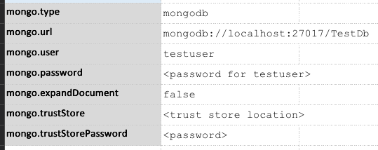

#### Connecting to MongoDB
[MongoDB](https://www.mongodb.com/) is not a relational database. It is another form of database called 
[NoSQL](https://en.wikipedia.org/wiki/NoSQL) that provides a mechanism for managing unstructured (or non-tabular)
data structure. As a convenience, Nexial provides MongoDb connectivity via the `rdbms` commands so that those familar
with the `rdbms` command type might be able to adapt quickly to automating with MongoDb.

Connecting to MongoDb via Nexial is similar to how one would connect to MongoDb directly. One can utilize the same
[MongoDb connection URL](https://docs.mongodb.com/manual/reference/connection-string/). Be sure to specify the 
`<connection name>.type` as `mongodb`, and supply the appropriate credentials via the `<connection name>.user` and 
`<connection name>.password` data variables. For example:<br/>


In addition, there's another specialized data variable - `<connection name>.expandDocument` to "expand" the retrieved 
document into columns. This may be of some help as one would be able to directly access the retrieved document via its 
top-level key. For example, by default each document retrieved (such as using 
[db.find()](https://docs.mongodb.com/manual/reference/method/db.collection.find/) command) would be shown as a 
"document" column in separate rows:<br/>


As shown above, each row contains a "document" column, each with the corresponding retrieved JSON document.

When the `.expandDocument` is set to `true`, the retrieved document is "expanded" into individual columns:<br/>
<br/>
<br/>

It is possible to connect to MongoDB via SSL/TLS. However there is a bit of upfront (one-time) work to get it working:

1. Obtain the appropriate `.pem` file for the target MongoDB server.
2. Run the following command with the `keytool` utility that comes with your Java installation (in `$JAVA_HOME/bin`):<br/>
   ```
   keytool -importcert -trustcacerts -file <pem file location> -keystore <trust store location> -storepass <password>
   ```
3. Now reference the generated "trust store" file in your MongoDB connectivity:<br/>
   


### See Also
- [`Execution Result`](executionResult)
