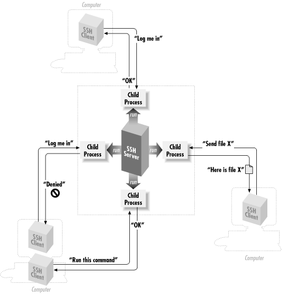

### Description
**SSH**, stands for **S**ecure **Sh**ell, is a popular and well-regarded form of accessing and controlling remote 
compute and I/O resources.  While being known mostly amongsts the *NIX and Mac users, it is recently gaining 
popularity and acceptance in the Windows/PC world.  Using the ssh protocol, one can securely transfer files between a 
remote and local location, as well as access and control compute resources remotely. 

For more introductory information, check 
<a href="https://docstore.mik.ua/orelly/networking_2ndEd/ssh/ch01_01.htm" class="external-link" target="_nexial_external">here</a>, 
<a href="https://www.startutorial.com/articles/view/ssh-basics-part-1-introduction" class="external-link" target="_nexial_external">here</a>, and 
<a href="https://www.secureblackbox.com/kb/articles/Introduction-to-SSH.rst" class="external-link" target="_nexial_external">here</a>. 

ssh is the base protocol of various secure-remote commands.  Nexial currently supports 2 of such commands - SCP and SFTP.

SCP - secure copy - is the replacement for _rcp_ (remote copy).  Using ssh as the protocol, it provides a secure way to 
copy files between 2 hosts.  Nexial supports SCP via these commands:
-  [`scpCopyFrom(var,profile,remote,local)`](scpCopyFrom(var,profile,remote,local))
-  [`scpCopyTo(var,profile,local,remote)`](scpCopyTo(var,profile,local,remote))  

SFTP - secure FTP - is the replacement for _ftp _(file transfer protocol).  Via ssh, SFTP provides the same base 
functionality as ftp, but with added security in place.  Nexial supports SFTP via the following commands:
-  [`sftpCopyFrom(var,profile,remote,local)`](sftpCopyFrom(var,profile,remote,local))
-  [`sftpCopyTo(var,profile,local,remote)`](sftpCopyTo(var,profile,local,remote))
-  [`sftpDelete(var,profile,remote)`](sftpDelete(var,profile,remote))
-  [`sftpList(var,profile,remote)`](sftpList(var,profile,remote))
-  [`sftpMoveFrom(var,profile,remote,local)`](sftpMoveFrom(var,profile,remote,local))
-  [`sftpMoveTo(var,profile,local,remote)`](sftpMoveTo(var,profile,local,remote))

#### Connection Setup
All the ssh commands in Nexial uses the concept of `profile` to specify the connectivity and security context.  For 
example, let's suppose a profile named as "`MyServer`":

| data name                        | data value(s) | description |
| -------------------------------- | ------------- | ----------- |
| `MyServer.username`              | **[REQUIRED]** username to access remote host | This is the username to access the specified remote host. Note that all commands will be propagated through the security context of this user |
| `MyServer.password`              | **[REQUIRED]** credential to access remote host | This is the password for the specified username. It is recommended to consider [encrypt](../../userguide/BatchFiles#nexial-cryptcmd--nexial-cryptsh) sensitive information before storing them in data file |
| `MyServer.host`                  | **[REQUIRED]** the remote host, either as IP or hostname |
| `MyServer.port`                  | the remote port, default is `22` ||
| `MyServer.strictHostKeyChecking` | `true` (default) or `false` | `true` means that only "known" hosts will be permitted to engage in ssh communication (see next line). Use `false` to indicate that the specified host is already known |
| `MyServer.knownHosts`            | fully qualified location of a `known_hosts`file | The `known_hosts` file is a file that contains the digital identity signature of all "known" hosts, commonly stored in `~/.ssh/known_hosts`. The hosts specified in this file have been individually identified and acknowledged, usually via one of the ssh-implemented commands. Example of such file:   |

Feel free to substitute `MyServer` with another name of your choice, to make your script/data more meaningful and 
readable.



Note that while some ssh-implemented commands such as SCP supports copy from one remote location to another remote 
location, Nexial currently does not support this on the account that it is not considered as a command test automation 
requirement (_unless you think you really need it? Comment below_)

### Available Commands
- [`scpCopyFrom(var,profile,remote,local)`](scpCopyFrom(var,profile,remote,local))
- [`scpCopyTo(var,profile,local,remote)`](scpCopyTo(var,profile,local,remote))
- [`sftpCopyFrom(var,profile,remote,local)`](sftpCopyFrom(var,profile,remote,local))
- [`sftpCopyTo(var,profile,local,remote)`](sftpCopyTo(var,profile,local,remote))
- [`sftpDelete(var,profile,remote)`](sftpDelete(var,profile,remote))
- [`sftpList(var,profile,remote)`](sftpList(var,profile,remote))
- [`sftpMoveFrom(var,profile,remote,local)`](sftpMoveFrom(var,profile,remote,local))
- [`sftpMoveTo(var,profile,local,remote)`](sftpMoveTo(var,profile,local,remote))
