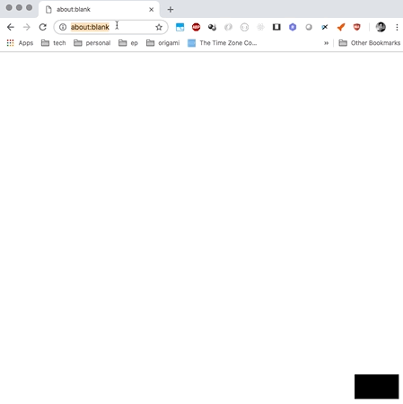
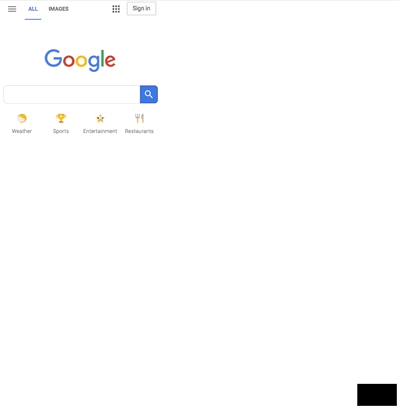

Nexial supports browser automation via the popular 
<a href="https://en.wikipedia.org/wiki/Selenium_(software)" class="external-link" target="_nexial_link">Selenium<a/>/
<a href="https://www.seleniumhq.org/docs/03_webdriver.jsp" class="external-link" target="_nexial_link">WebDriver</a>
automation framework. In effect, Nexial translates the commands in the Nexial script (spreadsheet) to Selenium- or 
WebDriver- specific API calls, along with other automation work such as error handling and browser lifecycle management.
Similar with [web cookie](../webcookie/) and [JavaScript alert](../webalert) automation, Nexial acts as the translator
to mediate between the automation script and the underlying Selenium/WebDriver framework. As part of the overall 
approach on building an automation platform, the Nexial development team tries to keep up the latest official releases 
of its third-party libraries. Selenium is no exception. As of July 2018 Nexial uses Selenium 3.1.13 and the latest 
releases of related webdrivers.

## Locators
For effective automation of Web application, there are a number of critical technical knowledge and techniques to 
apply. The most important of which is the right technique of writing locators. Locators are a collections of ways 
(7 in total) to identify elements of a web page. It is by such mechanism one can effectively identify elements on a web
page, interact with them and perform automation upon them. 

_**Note: Most of the information on the Web about locators are not created from the standpoint 
of a codeless or hybrid framework like Nexial. This applies to the links in this page. Reader's discretion is 
advised...**_

Here's a quick summary of the various locators: 


-----

## Browser Support
Nexial currently supports the following browsers (recent versions only):
- [Firefox (via geckodriver)](#firefox)
- [Firefox in Headless Mode](#firefox-headless)
- [Chrome](#chrome)
- [Chrome in Headless Mode](#chrome-headless)
- [Chrome in Embedded Mode](#chrome-embedded)
- [Electron (Chromium)](#electron)
- [Safari (on MacOS)](#safari)
- [Safari Technology Preview (on MacOS)](#safari-technology-preview)
- [Internet Explorer 9 and above (on Windows 7 and above)](#internet-explorer)
- [Microsoft Edge (currently in beta) (on Windows 10)](#microsoft-edge)
- [BrowserStack](#browserstack)
- [CrossBrowserTesting](#crossbrowsertesting)

### Firefox
Enabling Firefox automation is straightforward:
1. Make sure a recent version of <a href="https://www.mozilla.org/en-US/firefox/" class="external-link" target="_nexial_link">Firefox</a> 
   suitable to your platform is installed locally. For Linux and Mac OS, `firefox` or `firefox-bin` is expected to be 
   found in the `$PATH` environment variable. The order of paths in `$PATH` determines the precedence in being selected 
   as the target executable for automation. For Windows, Firefox is expected to be installed in either
   `%ProgramFiles%\Mozilla Firefox` or `%ProgramFiles(x86)%\Mozilla Firefox`.
2. Set [`nexial.browser`](../../systemvars/index#nexial.browser) to `firefox`.
3. Begin scripting...

### Firefox Headless
Follow the same instruction as [Firefox](index#firefox), except setting 
[`nexial.browser`](../../systemvars/index#nexial.browser) to `firefox.headless`.

### Chrome
Enabling Chrome automation requires the following steps:
1. Make sure a recent version of <a href="https://www.google.com/chrome/" class="external-link" target="_nexial_link">Chrome</a>
   suitable to your platform is installed locally. Linux installation differs based on distro - check distribution 
   vendor website or Google for more details. Do be sure that `google-chrome` can be found in `$PATH` environment 
   variable. For Mac, `Google Chrome` is expected to be installed either in the standard `/Applications/Google Chrome.app` 
   or in the home directory of the current user (give precedence).
2. Set [`nexial.browser`](../../systemvars/index#nexial.browser) to `chrome`.
3. Begin scripting...

#### Mobile Device Emulation
It is possible to emulate mobile device during automation via the Chrome webdriver (i.e. `nexial.browser` as `chrome`).
There are 2 ways of enabling mobile device emulation:
1. via the `nexial.browser.emulation.deviceName` data variable
2. via the `nexial.browser.emulation.userAgent` data variable.

The first approach is simpler. Simply specify a mobile device name that is supported by the Chrome browser to enable
such emulation. For example, 

The second approach offers finer controls. Along with the "User Agent" string to match the target mobile device, one
can also specify the width (via `nexial.browser.emulation.width` data variable), the height 
(`nexial.browser.emulation.height` data variable), the pixel ratio (via the `nexial.browser.emulation.pixelRatio` data 
variable) and touch activation (via the `nexial.browser.emulation.touch` data variable). For example, 

Note that `nexial.browser.emulation.pixelRatio` defaults to `3.0` and `nexial.browser.emulation.touch` defaults to 
`true`. 

For a list of supported mobile devices and their respective "user-agent" string, visit the following link: 
<a href="https://codesearch.chromium.org/codesearch/f/chromium/src/third_party/blink/renderer/devtools/front_end/emulated_devices/module.json" 
class="external-link" target="_nexial_link">
https://codesearch.chromium.org/codesearch/f/chromium/src/third_party/blink/renderer/devtools/front_end/emulated_devices/module.json
</a> 

For more information about mobile device emulation, visit ChromeDriver's 
<a href="http://chromedriver.chromium.org/mobile-emulation" class="external-link" target="_nexial_link">Mobile Emulation</a> 
page. While it is cost effective to use the emulation capability of ChromeDriver, it is noteworthy that there are 
<a href="https://bugs.chromium.org/p/chromedriver/issues/detail?id=2144&desc=2" 
class="external-link" target="_nexial_link">known issues and limitations</a> of using ChromeDriver's mobile emulation.

Note that screen capturing when emulation is active might cause a sudden "grow-and-shrink" behavior as shown below: 

Emulators cannot accurately reflect the real devices in terms of hardware and OS-specific nuances. For more accurate
testing, consider using [BrowserStack](#browserstack) or [CrossBrowserTesting](#crossbrowsertesting) services (both 
commercial) instead.

### Chrome Headless
Follow the same instruction as [Chrome](index#chrome), except setting 
[`nexial.browser`](../../systemvars/index#nexial.browser) to `chrome.headless`.

### Chrome Embedded
<a href="https://en.wikipedia.org/wiki/Chromium_Embedded_Framework" class="external-link" target="_nexial_link">Chrome Embedded Framework</a>,
or CEF for short, is 
<a href="https://bitbucket.org/chromiumembedded/" class="external-link" target="_nexial_link">an open source framework</a> 
for embedding chrome browser (technically chromium) in a desktop application. The ability to do so opens up a wide 
range of possibilities in application development.

To enable CEF automation, follow these steps:
1. Make sure the Chrome-embedded application (AUT) is properly installed. In most cases, one should find a `libcef.dll`
   or `libcef.so` in the same location as the CEF-enabled application.
2. Set [`nexial.browser`](../../systemvars/index#nexial.browser) to `chrome.embedded`.
3. Set [`nexial.browser.embedded.appLocation`](../../systemvars/index#nexial.browser.embedded.appLocation) to the full
   path of the application executable program.
4. Begin scripting...

### Electron
<a href="https://en.wikipedia.org/wiki/Electron_(software_framework)" class="external-link" target="_nexial_link">Electron</a>
is an open source framework to create desktop applications using JavaScript. It combines the use of Node.js runtime as
the backend and Chromium as the frontend engine to create a compelling, cross-platform desktop GUI framework that powers
popular applications such as Atom, Microsoft team, Microsoft Visual Studio Code, WhatsApp, Slack and Cycligent.

To enable Electron application automation, follow these steps:
1. Make sure the target Electron application is properly installed.
2. Set [`nexial.browser`](../../systemvars/index#nexial.browser) to `electron`.
3. Set [`nexial.browser.electron.appLocation`](../../systemvars/index#nexial.browser.electron.appLocation) to the full
   path of the executable program. For MacOS, the executable is usually found under `$APPLICATION/Contents/MacOS/`.
4. Begin scripting...

### Safari
Enabling Safari automation requires the following steps:
1. Make sure a recent version of <a href="https://support.apple.com/downloads/#safari" class="external-link" target="_nexial_link">Safari</a>
   is installed locally. Only MacOS is supported for safari automation at this time.
2. Set [`nexial.browser`](../../systemvars/index#nexial.browser) to `safari`.
3. Begin scripting...

### Safari Technology Preview
Enabling Safari Technology Preview automation requires the following steps:
1. Make sure a recent version of <a href="https://developer.apple.com/safari/technology-preview/" class="external-link" target="_nexial_link">Safari Technology Preview</a>
   is installed locally. Only MacOS is supported for Safari automation at this time.
2. Set [`nexial.browser`](../../systemvars/index#nexial.browser) to `safari`.
3. Set [`nexial.browser.safari.useTechPreview`](../../systemvars/index#nexial.browser.safari.useTechPreview) to `true`.
4. Begin scripting...

### Internet Explorer
Enabling IE automation requires the following steps:
1. Make sure a recent version of <a href="https://www.microsoft.com/en-us/download/internet-explorer.aspx" class="external-link" target="_nexial_link">Internet Explorer</a>
   suitable to your platform is installed locally. Only Windows 7 and above is supported at this time.
2. Set [`nexial.browser`](../../systemvars/index#nexial.browser) to `ie`.
3. Be sure to read through and follow the recommendations listed in 
   [Web Automation On IE](../../tipsandtricks/WebAutomationOnIE).
4. Begin scripting...

### Microsoft Edge
Enabling IE automation requires the following steps:
1. Make sure a recent version of <a href="https://www.microsoft.com/en-us/windows/microsoft-edge" class="external-link" target="_nexial_link">Microsft Edge Browser</a>
   suitable to your platform is installed locally. Only Windows 10 is supported at this time.
2. Set [`nexial.browser`](../../systemvars/index#nexial.browser) to `edge`.
3. Be sure to read through and follow the recommendations listed in 
   [Web Automation On IE](../../tipsandtricks/WebAutomationOnIE) (these IE recommendations are applicable to Edge 
   as well!).
4. Begin scripting...

### BrowserStack
<a href="http://browserstack.com/" class="external-link" target="_nexial_link">BrowserStack</a> is a popular cloud, web 
and mobile testing platform that enables developers to test their websites and mobile applications across on-demand 
browsers, operating systems and real mobile devices. This is a paid service.

To enable BrowserStack integration, be sure to read up on the 
[BrowserStack Integration](../../tipsandtricks/BrowserStackIntegration) page.

### CrossBrowserTesting
_excerpts from <a href="https://crossbrowsertesting.com/blog/browsers/what-is-cross-browser-testing/" class="external-link" target="_nexial_link">CrossBrowserTesting.com</a>:_ 
> ... Browser testing is a method of quality assurance for web applications across multiple browsers. ... 
> It’s implemented to ensure a website’s functionality and design and includes testing a range of 
> devices and operating systems being used in the market and customer base.

<a href="http://www.crossbrowsertesting.com/" class="external-link" target="_nexial_link">CrossBrowserTesting</a> is a 
popular cloud, web and mobile testing platform that enables developers to test their websites and mobile applications 
across on-demand browsers, operating systems and real mobile devices. And, much like BrowserStack, this is also a paid 
service.

To enable CrossBrowserTesting integration, be sure to read up on the 
[CrossBrowserTesting Integration](../../tipsandtricks/CrossBrowserTestingIntegration) page.

### WebDriver Support
Nexial automatically downloads required webdriver, during runtime as needed. Webdrivers are downloaded to user's home
directory under `.nexial` folder. Also, a `.manifest` file with the driver details is maintained in the same
directory. The `.manifest` file is used to check and download the latest version available based on the current OS.
If there should be any reason not to update to the newer/latest webdriver (e.g. due to compatibility with older browser),
one can disable the automatic webdriver update by setting `"neverCheck": true` in `.manifest` file.

-----

The "web" command type represents a series of automation commands regarding web operations. See below for a list of 
available commands.

### Available Commands
- [`assertAndClick(locator,label)`](assertAndClick(locator,label))
- [`assertAttribute(locator,attrName,value)`](assertAttribute(locator,attrName,value))
- [`assertAttributeContains(locator,attrName,contains)`](assertAttributeContains(locator,attrName,contains))
- [`assertAttributeNotContains(locator,attrName,contains)`](assertAttributeNotContains(locator,attrName,contains))
- [`assertAttributeNotPresent(locator,attrName)`](assertAttributeNotPresent(locator,attrName))
- [`assertAttributePresent(locator,attrName)`](assertAttributePresent(locator,attrName))
- [`assertChecked(locator)`](assertChecked(locator))
- [`assertContainCount(locator,text,count)`](assertContainCount(locator,text,count))
- [`assertCssNotPresent(locator,property)`](assertCssNotPresent(locator,property))
- [`assertCssPresent(locator,property,value)`](assertCssPresent(locator,property,value))
- [`assertElementByAttributes(nameValues)`](assertElementByAttributes(nameValues))
- [`assertElementByText(locator,text)`](assertElementByText(locator,text))
- [`assertElementCount(locator,count)`](assertElementCount(locator,count))
- [`assertElementNotPresent(locator)`](assertElementNotPresent(locator))
- [`assertElementPresent(locator)`](assertElementPresent(locator))
- [`assertElementsPresent(prefix)`](assertElementsPresent(prefix))
- [`assertFocus(locator)`](assertFocus(locator))
- [`assertFrameCount(count)`](assertFrameCount(count))
- [`assertFramePresent(frameName)`](assertFramePresent(frameName))
- [`assertIECompatMode()`](assertIECompatMode())
- [`assertIENavtiveMode()`](assertIENavtiveMode())
- [`assertLinkByLabel(label)`](assertLinkByLabel(label))
- [`assertMultiSelect(locator)`](assertMultiSelect(locator))
- [`assertNotChecked(locator)`](assertNotChecked(locator))
- [`assertNotFocus(locator)`](assertNotFocus(locator))
- [`assertNotText(locator,text)`](assertNotText(locator,text))
- [`assertNotVisible(locator)`](assertNotVisible(locator))
- [`assertOneMatch(locator)`](assertOneMatch(locator))
- [`assertScrollbarHNotPresent(locator)`](assertScrollbarHNotPresent(locator)) 
- [`assertScrollbarHPresent(locator)`](assertScrollbarHPresent(locator))
- [`assertScrollbarVNotPresent(locator)`](assertScrollbarVNotPresent(locator)) 
- [`assertScrollbarVPresent(locator)`](assertScrollbarVPresent(locator))
- [`assertSingleSelect(locator)`](assertSingleSelect(locator))
- [`assertTable(locator,row,column,text)`](assertTable(locator,row,column,text))
- [`assertText(locator,text)`](assertText(locator,text))
- [`assertTextContains(locator,text)`](assertTextContains(locator,text))
- [`assertTextCount(locator,text,count)`](assertTextCount(locator,text,count))
- [`assertTextList(locator,list,ignoreOrder)`](assertTextList(locator,list,ignoreOrder))
- [`assertTextMatches(text,minMatch,scrollTo)`](assertTextMatches(text,minMatch,scrollTo))
- [`assertTextNotPresent(text)`](assertTextNotPresent(text))
- [`assertTextOrder(locator,descending)`](assertTextOrder(locator,descending))
- [`assertTextPresent(text)`](assertTextPresent(text))
- [`assertTitle(text)`](assertTitle(text))
- [`assertValue(locator,value)`](assertValue(locator,value))
- [`assertValueOrder(locator,descending)`](assertValueOrder(locator,descending))
- [`assertVisible(locator)`](assertVisible(locator))
- [`checkAll(locator)`](checkAll(locator))
- [`clearLocalStorage()`](clearLocalStorage())
- [`click(locator)`](click(locator))
- [`clickAll(locator)`](clickAll(locator))
- [`clickAndWait(locator,waitMs)`](clickAndWait(locator,waitMs)) 
- [`clickByLabel(label)`](clickByLabel(label)) 
- [`clickByLabelAndWait(label,waitMs)`](clickByLabelAndWait(label,waitMs)) 
- [`clickOffset(locator,x,y)`](clickOffset(locator,x,y))
- [`clickWithKeys(locator,keys)`](clickWithKeys(locator,keys)) 
- [`close()`](close())
- [`closeAll()`](closeAll())
- [`deselectMulti(locator,array)`](deselectMulti(locator,array))
- [`dismissInvalidCert()`](dismissInvalidCert())
- [`dismissInvalidCertPopup()`](dismissInvalidCertPopup())
- [`doubleClick(locator)`](doubleClick(locator))
- [`doubleClickAndWait(locator,waitMs)`](doubleClickAndWait(locator,waitMs))
- [`doubleClickByLabel(label)`](doubleClickByLabel(label))
- [`doubleClickByLabelAndWait(label,waitMs)`](doubleClickByLabelAndWait(label,waitMs))
- [`dragAndDrop(fromLocator,toLocator)`](dragAndDrop(fromLocator,toLocator))
- [`dragTo(fromLocator,xOffset,yOffset)`](dragTo(fromLocator,xOffset,yOffset))
- [`editLocalStorage(key,value)`](editLocalStorage(key,value))
- [`executeScript(var,script)`](executeScript(var,script))
- [`focus(locator)`](focus(locator))
- [`goBack()`](goBack())
- [`goBackAndWait()`](goBackAndWait())
- [`maximizeWindow()`](maximizeWindow())
- [`mouseOver(locator)`](mouseOver(locator))
- [`open(url)`](open(url))
- [`openAndWait(url,waitMs)`](openAndWait(url,waitMs))
- [`openHttpBasic(url,username,password)`](openHttpBasic(url,username,password))
- [`openIgnoreTimeout(url)`](openIgnoreTimeout(url))
- [`refresh()`](refresh())
- [`refreshAndWait()`](refreshAndWait())
- [`resizeWindow(width,height)`](resizeWindow(width,height))
- [`rightClick(locator)`](rightClick(locator))
- [`saveAllWindowIds(var)`](saveAllWindowIds(var))
- [`saveAllWindowNames(var)`](saveAllWindowNames(var))
- [`saveAttribute(var,locator,attrName)`](saveAttribute(var,locator,attrName))
- [`saveAttributeList(var,locator,attrName)`](saveAttributeList(var,locator,attrName))
- [`saveCount(var,locator)`](saveCount(var,locator))
- [`saveDivsAsCsv(headers,rows,cells,nextPage,file)`](saveDivsAsCsv(headers,rows,cells,nextPage,file))
- [`saveElement(var,locator)`](saveElement(var,locator))
- [`saveElements(var,locator)`](saveElements(var,locator))
- [`saveLocalStorage(var,key)`](saveLocalStorage(var,key))
- [`saveLocation(var)`](saveLocation(var))
- [`savePageAs(var,sessionIdName,url)`](savePageAs(var,sessionIdName,url))
- [`savePageAsFile(sessionIdName,url,file)`](savePageAsFile(sessionIdName,url,file))
- [`saveTableAsCsv(locator,nextPageLocator,file)`](saveTableAsCsv(locator,nextPageLocator,file))
- [`saveText(var,locator)`](saveText(var,locator))
- [`saveTextArray(var,locator)`](saveTextArray(var,locator))
- [`saveTextSubstringAfter(var,locator,delim)`](saveTextSubstringAfter(var,locator,delim))
- [`saveTextSubstringBefore(var,locator,delim)`](saveTextSubstringBefore(var,locator,delim))
- [`saveTextSubstringBetween(var,locator,start,end)`](saveTextSubstringBetween(var,locator,start,end))
- [`saveValue(var,locator)`](saveValue(var,locator))
- [`saveValues(var,locator)`](saveValues(var,locator))
- [`scrollElement(locator,xOffset,yOffset)`](scrollElement(locator,xOffset,yOffset))
- [`scrollLeft(locator,pixel)`](scrollLeft(locator,pixel))
- [`scrollPage(xOffset,yOffset)`](scrollPage(xOffset,yOffset))
- [`scrollRight(locator,pixel)`](scrollRight(locator,pixel))
- [`scrollTo(locator)`](scrollTo(locator))
- [`select(locator,text)`](select(locator,text))
- [`selectFrame(locator)`](selectFrame(locator))
- [`selectMulti(locator,array)`](selectMulti(locator,array))
- [`selectMultiOptions(locator)`](selectMultiOptions(locator))
- [`selectText(locator)`](selectText(locator))
- [`selectWindow(winId)`](selectWindow(winId))
- [`selectWindowAndWait(winId,waitMs)`](selectWindowAndWait(winId,waitMs))
- [`selectWindowByIndex(index)`](selectWindowByIndex(index))
- [`selectWindowByIndexAndWait(index,waitMs)`](selectWindowByIndexAndWait(index,waitMs))
- [`toggleSelections(locator)`](toggleSelections(locator))
- [`type(locator,value)`](type(locator,value))
- [`typeKeys(locator,value)`](typeKeys(locator,value))
- [`uncheckAll(locator)`](uncheckAll(locator))
- [`unselectAllText()`](unselectAllText())
- [`updateAttribute(locator,attrName,value)`](updateAttribute(locator,attrName,value))
- [`upload(fieldLocator,file)`](upload(fieldLocator,file))
- [`verifyContainText(locator,text)`](verifyContainText(locator,text))
- [`verifyText(locator,text)`](verifyText(locator,text))
- [`wait(waitMs)`](wait(waitMs))
- [`waitForElementPresent(locator)`](waitForElementPresent(locator)) 
- [`waitForPopUp(winId,waitMs)`](waitForPopUp(winId,waitMs))
- [`waitForTextPresent(text)`](waitForTextPresent(text))
- [`waitForTitle(text)`](waitForTitle(text))
