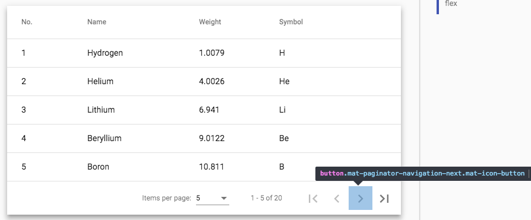
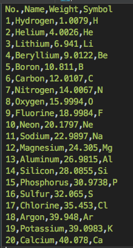

### Description
This command automatically collects cell data found a HTML table, as represented by `locator`, and save them as CSV 
into `file`. If the target table contains a header row, which is usually composed through the `<thead><tr><th>...` or 
`<tr><th>...` construct, it will be collected as the header of the CSV file as well. As with most CSV-related features
in Nexial, the field delimiter is determined via the [`nexial.textDelim`](../../systemvars/index#nexial.textDelim) 
System variable.

It is not uncommon for a HTML table to contain more than one "page" worth of data, and additional "pages" of data are 
accessed via a designated web element (button, anchor, etc.). This technique is commonly known as pagination.  By 
default, this command will collect only the data that are displayed at the time of execution. However, this command has 
an optional feature to automatically visit all the pages of a HTML table and collect all the data presented on each 
page. This can be a great help when the gathering of the entire data set is desired, such as comparing such data set
against the result of a SQL query or a CSV data file.

To enable the auto-pagination, specify the appropriate locator for the web component that would forward the HTML data
to the next page as `nextPageLocator`. For example, consider the following HTML table built with pagination control: 

In this case, the highlighted control (`>`) would be the `nextPageLocator`, which can be defined as 
`//button[contains(@class,'mat-paginator-navigation-next')]` or `class=mat-paginator-navigation-next`.

By specifying the appropriate `nextPageLocator`, this command will automatically forward through the subsequent pages to
collect all the data. Below is a sample of the CSV file generated via this command: 

Note that:
- `nextPageLocator` is optional. Specifying it as `(empty)` or `(blank)` would disable any pagination automation.
- Nexial will not attempt to "rewind" the pagination back to the initial or first page.

### Parameters
- **locator** - locator of the target table component.
- **nextPageLocator** - locator of component that would forward the pagination
- **file** - the location of the CSV file

### Example
See above

### See Also
- [`assertTable(locator,row,column,text)`](assertTable(locator,row,column,text))
