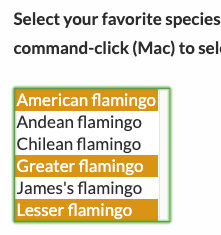

### Description
This command instructs Nexial to select (multiple possible) from the specified `<SELECT>` element.

The `locator` parameter is used to find the first matching `<SELECT>` element. Such element should support multi-select
(i.e. `<SELECT multiple ...>`). The items to be selected are specified via the `array` parameter. For every child 
`<OPTION>` element whose text matches an item in the specified `array`, such item will be selected.

### Parameters
- **locator** - this parameter is the locator of the list or combo box element.
- **array** - this parameter is the item values to be selected in the list or combo box (i.e. `<SELECT>`).

### Example
**Script**: 

**Output**: 

### See Also
- [`deselectMulti(locator,array)`](deselectMulti(locator,array))
- [`saveSelectedText(var,locator)`](saveSelectedText(var,locator))
- [`saveSelectedValue(var,locator)`](saveSelectedValue(var,locator))
- [`selectMultiOptions(locator)`](selectMultiOptions(locator))