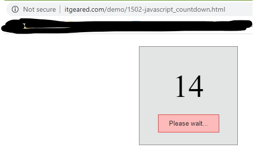
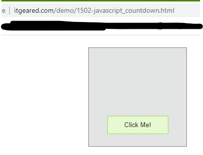

### Description
Ths command instructs Nexial to continuously poll for a Web element (denoted by `locator`) until it becomes enabled 
(for automation/interaction). If the target element is already enabled at the start of this command, then this command 
will end immediately with a **PASS**. If not, this command will poll for the target web element to be enabled until the 
specified `waitMs`. If the target element is not enabled or not found when `waitMs` time is reached, this command will 
return with a **FAIL**.

Note that this command is mostly used for form input elements such as button, textbox, checkbox, etc. 

### Parameters
- **locator** - the locator of the target element.
- **waitMs** - the maximum amount of time to wait for said condition.

### Example
The following website contains a countdown timer: 
 

At the end of the count down, the "Please wait..." button will change to "Click Me!" 
 

We can use this command to wait until the "Click Me!" button becomes visible. Like this:

**Script**: 
 

Note that Nexial will end the wait as soon as the target element becomes enabled (instead of waiting for the entire 
specified `waitMs` time).

### See Also
- [`waitForElementPresent(locator,waitMs)`](waitForElementPresent(locator,waitMs)) 
- [`waitForElementsPresent(locators)`](waitForElementsPresent(locators)) 
- [`waitUntilDisabled(locator,waitMs)`](waitUntilDisabled(locator,waitMs))
- [`waitUntilHidden(locator,waitMs)`](waitUntilHidden(locator,waitMs))
- [`waitUntilVisible(locator,waitMs)`](waitUntilVisible(locator,waitMs))