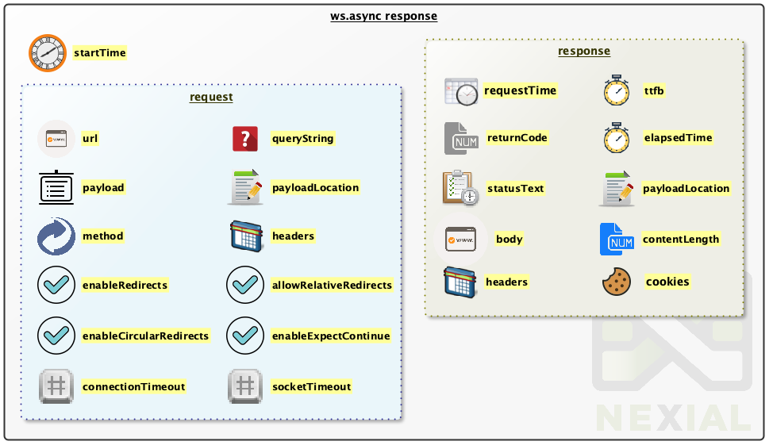

`ws.async` is short for Web Service Asynchronous (or async ws, as some would call it). This set of commands are similar
to many of the [`ws` commands](../ws/index), except for the synchronicity of the HTTP request and response interaction.

The conventional HTTP request/response model (such as using the `ws` commands) assumes the predictable, serial form of:
1. Construct a request.
2. Invoke a URL with that request.
3. Wait for the target endpoint to response.
4. Process the returned response.

In general, this is a good idea because it allows for a focused, uninterrupted, step-by-step processing of the HTTP
interaction. For test automation, this often is the preferred approach as it simplifies the scripting and validation
aspects of the automation. However there are situations where one would elect to invoke HTTP endpoints asynchronously, 
which would allow for the processing of associated response at a later time without blocking the flow of current 
execution. The `ws.async` commands are designed for such purpose.

#### How does it work?
In a nutshell, this is the general effect of using `ws.async` commands:
1. Construct a request.
2. Invoke a URL with such request asynchronously - such as using the 
   [ws.async &raquo; `get(url,queryString,output)`](get(url,queryString,output)) command.
3. The execution carries on to the next steps __without__ waiting the HTTP invocation to return with a response. A JSON
   file is associated to this invocation, and will be used to store the corresponding response.
4. ... ...<br/>
   While the execution carries on, the HTTP response is received (in the background) by Nexial. Nexial in turn stores
   the response to the associated JSON file for later processing.
5. At a _later time_, read the response of a previous asynchronous HTTP invocation from the associated JSON file.
6. Process the response as stored in the associated JSON file.
7. ... ...

Due to the asynchronous nature, HTTP invocations no longer hold up the execution while waiting for the response. As 
such, the execution can proceed forward - possibly with even more asynchronous HTTP invocation - and the HTTP response 
can be processed at a later time. At a first glance, it might appear as obvious that invoking HTTP endpoints 
asynchronously can be a strategy to complete the execution faster. However this should be considered only as a side 
effect (or side benefit). One must carefully weight out the following consequences of asynchronous HTTP invocation:
- **OUT-OF-SEQUENCE RESPONSES**: The order to which a HTTP response is made available can potentially misaligned to the 
  corresponding HTTP invocation; your automation script should be able to handle such situation
- **LATE FAILURE CONDITION**: The failure of a HTTP invocation cannot timely impact the intended execution flow

In terms of setting up HTTP headers, the `ws.async` commands work the same way as the `ws` commands. See 
[ws &raquo; `header(name,value)`](../ws/header(name,value)) for more details. Likewise, for general information about 
web service and HTTP invocation, please visit [`ws`](../ws/index) for more details.


#### HTTP Response
When a HTTP request is made, the corresponding server responds with a set of information generally known as 
<a href="https://www.w3.org/Protocols/rfc2616/rfc2616-sec6.html" class="external-link" target="_nexial_external">HTTP Response</a>. 
Since the response is received asynchronously, Nexial stores it in a designated JSON file so that it can be processed 
later. To further assist such processing (could be validation as well), the corresponding request information is also
persisted in the same file. Below is the general JSON structure:<br/>


 
A few critical things to note:
- The diagram above depicts corresponding request and response for a specific HTTP invocation. The request "container"
  reflects the request information for a given HTTP invocation, and the response "container" reflects the response
  of such invocation. From a JSON perspective, these 2 containers are 2 sibling JSON nodes. For example:
  ```json
  {
    "startTime": 1528582477366,

    "request": {
        "url": "... ...",
        "payload": "... ...",
        "method": "POST",
        "connectionTimeout": 300000,
        "socketTimeout": 300000,
        "enableRedirects": true,
        "enableExpectContinue": true,
        "allowCircularRedirects": false,
        "allowRelativeRedirects": true,
        "headers": { "User-Agent": "... ...", "Content-Length": "...", "Content-Type": "application/json" }
    },

    "response": {
        "body": "... ...",
        "returnCode": 200,
        "statusText": "OK",
        "elapsedTime": 1234567890,
        "contentLength": 12345,
        "headers": { "set-cookie": "... ...", "Content-Length": "...", "Content-Type": "application/json" }
    }
  }
  ```
- In the case of [ws.async &raquo; `download(url,queryString,saveTo)`](download(url,queryString,saveTo)), both 
  `request.payload` and `response.body` are omitted since the actual payload is saved to an external file. This external
  file is reflected via `request.payloadLocation` and `response.payloadLocation`.
- In the case of [ws.async &raquo; `get(url,queryString,output)`](get(url,queryString,output)), `request.payload` is omitted
  but `request.queryString` will reflect the query string used in such HTTP invocation.
- `response.body` will store the response payload as plain text (even if the underlying payload is a XML or JSON document)
- `startTime` and `response.elapsedTime` are both in milliseconds, as with most timestamp information in Nexial.
- Cookie information can be found via `response.headers.set-cookie`.

For more explanation please visit [HTTP response](../ws/index#http-response).


### Available Commands
- [`delete(url,body,var)`](delete(url,body,output))
- [`download(url,queryString,saveTo)`](download(url,queryString,saveTo))
- [`get(url,queryString,var)`](get(url,queryString,output))
- [`head(url,var)`](head(url,output))
- [`patch(url,body,var)`](patch(url,body,output))
- [`post(url,body,var)`](post(url,body,output))
- [`put(url,body,var)`](put(url,body,output))
