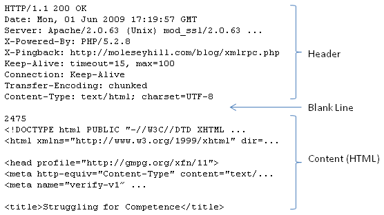
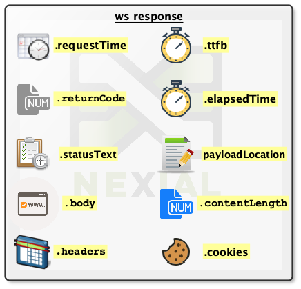



`ws` is short for Web Service.  For Nexial, this refers to any form of HTTP-based web services (i.e. REST, SOAP, etc.).  
This set of commands provides a set of web service related interactions and validations.  The specific of each 
commands are documented in the designated pages (below).  However there are a few common things to note:

##### [`ws.header(name,value)`](header) 
1. This command affects all subsequent `ws` commands.  The main purpose of this command is to prepare or set up 
   HTTP header for the web service calls to be invoked.  Hence one can create a series of HTTP header, for example:  
   

##### HTTP Response
When a HTTP request is made, the corresponding server responds with a set of information generally known as 
<a href="https://www.w3.org/Protocols/rfc2616/rfc2616-sec6.html" class="external-link" target="_nexial_external">HTTP Response</a>.  It looks
something like this: 

The response contains all sorts of useful information.  Nexial capture such information and made them available during
execution so that validation and further processing can be done with them.  Here's a snapshot of what is available
via Nexial: 

Assuming that the response is stored in a data variable named `var`, one can use access the response payload via the
**`${var}.body`** syntax.  This usually returns some form of text, which can be further processed via the 
[`json`](../json/index) command type, [`xml`](../xml/index) command type or [`io`](../io/index) command type for plain
text.

The `${var}.contentLength` syntax returns the length of the payload.

The `${var}.elapsedTime` syntax returns the number of millisecond between the request sent from Nexial to the intended
server, and when the response was first received by Nexial in return.

All HTTP response header information can be retrieved via the `${var}.headers[HEADER_NAME]` syntax (assuming response
is stored to the `var` data variable).  For example, to retrieve response content type, we can specify
`${var}.headers[Content-Type]`.  HTTP response headers inherently also include cookie information.  But to simplify
your scripting, Nexial provides a more direct access in the form of `${var}.cookies[COOKIE_NAME].value`.

Each cookie contains the following property:
- **name**: the name of a cookie.  Syntax: `${var}.cookies[COOKIE_NAME].name`
- **value**: the value of a cookie.  Syntax: `${var}.cookies[COOKIE_NAME].value`
- **domain**: The domain for which a cookie is considered valid and accessible. Syntax: `${var}.cookies[COOKIE_NAME].domain`
- **expiryDate**: the date of when a cookie would be expired and removed from its attached browser.  Date format is
	 `Wdy, DD mmm yyyy HH:mm:ss GMT`.  Syntax: `${var}.cookies[COOKIE_NAME].expiryDate`
- **path**: The URL subset of the origin server to which a cookie was issue.  Similar to the domain option, this is 
  another way to control access.  The path indicates a URL path that must exist in the requested resource before 
  sending the Cookie header. Syntax: `${var}.cookies[COOKIE_NAME].path`
- **persistent**: true or false to indicate if a cookie is a session cookie (expires when browser is restarted) or not
  (cookie is preserves between browser restarts).  Syntax: `${var}.cookies[COOKIE_NAME].persistent`
- **secure**: true or false to indicate if a cookie requires a secure (HTTPS) connection for access.  A secure cookie 
  will only be sent to the server when a request is made using SSL and the HTTPS protocol. The idea that the contents 
  of the cookie are of high value and could be potentially damaging to transmit as clear text.  Syntax: 
  `${var}.cookies[COOKIE_NAME].secure`

The status code (as in `${var}.returnCode`) and status text (as in `${var}.statusText) are equivalent, except the former
is the numeric value of a response return code. 

For more information about HTTP status codes, refer to
<a href="https://httpstatuses.com/" class="external-link" target="_nexial_external">https://httpstatuses.com/</a>.  

### Available Commands
- [`assertReturnCode(var,returnCode)`](assertReturnCode(var,returnCode))
- [`delete(url,body,var)`](delete(url,body,var))
- [`download(url,queryString,saveTo)`](download(url,queryString,saveTo))
- [`get(url,queryString,var)`](get(url,queryString,var))
- [`head(url,var)`](head(url,var))
- [`header(name,value)`](header(name,value))
- [`headerByVar(name,var)`](headerByVar(name,var))
- [`jwtParse(var,token,key)`](jwtParse(var,token,key))
- [`jwtSignHS256(var,payload,key)`](jwtSignHS256(var,payload,key))
- [`oauth(var,url,auth)`](oauth(var,url,auth))
- [`patch(url,body,var)`](patch(url,body,var))
- [`post(url,body,var)`](post(url,body,var))
- [`put(url,body,var)`](put(url,body,var))
- [`saveResponsePayload(var,file,append)`](saveResponsePayload(var,file,append))
- [`soap(action,url,payload,var)`](soap(action,url,payload,var))
