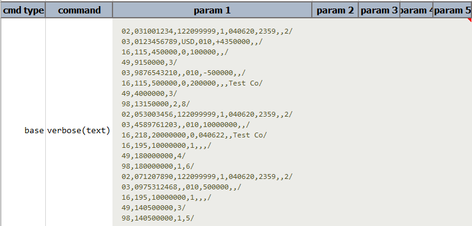
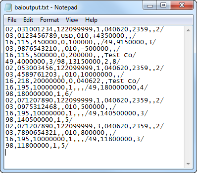

### Description

- **BAI2**  is  a  file  format  standard  developed  by  the  Banking  Administration  Institute to  enable  the 
  electronic  exchange  of  banking  data. BAI2 files come to an account holder from a bank.
- The Nexial expression `BAI2` automates parsing and validating the files with BAI2 file format.
- Read more about [BAI Standard Specifications](https://www.bai.org/docs/default-source/libraries/site-general-downloads/cash_management_2005.pdf) in PDF. 

#### BAI2 File Structure
- Record types and filed names that needs to be used in the `BAI2` expression:

| Record Code | Record Type | Purpose | Field Names |
| --- | --- | --- | --- |
| 01  | `File Header` | Begins File | `Record Code` `Sender ABA` `Receiver ABA` ` File Creation Date` `File Creation Time` `File ID` `Record Length` `File Block Size` `File Version Number`|
| 02  | `Group Header` | Begins Group |`Record Code` `Bank Customer Number` `Receiver ABA` `Group Status` `Effective Date` `Effective Time` `Currency Code` `Date Modifier`|
| 03  | `Account Header` | Begins Account | `Record Code` `Bank Customer Account` `Currency Code` `Summary Type Code` `Summary Amount` `Summary Item Count` `Funds Type`|
| 16  | `Transaction` | Within Account | `Record Code` `Detail Type Code` `Transaction Amount` `Funds Type` `Bank Ref Number` `Customer Ref Number` `Detail Text` |
| 49  | `Account Trailer` | Ends Account | `Record Code` `Account Control Total Amount` `Account Total Records`|
| 98  | `Group Trailer` | Ends Group | `Record Code` `Group Total Amount` `Group Total Accounts` `Group Total Records`|
| 99  | `File Trailer` | Ends File | `Record Code` `File Total Amount` `File Total Groups` `File Total Records`|

- BAI2 Sample File 
- 

### Operations

- **`csv`** - convert the file content to csv data type.
- **`errors`** - list out all the errors found during file validation.
- **`field(recordType,name)`** - list out all the values of a specific field of a specific record type.
- **`filter(recordType,condition)`** - filter all the matched records with given condition.
- **`save(path)`** - saves the content to given file path. File path is to be specified including file name.  
- **`store(var)`** - stores the content to given variable name in memory. This variable name can be used in consecutive steps. 

### Examples

- Sample BAI2 file used for examples:
-  

##### Example 1: Usage of `filter(recordType,name)`
**Use case:** Filter all the groups with `Group Status` as 1 
**Script:** 
- 

**Output:** 
- 

##### Example 2: Usage of `field(recordType,name)`
**Use case:** List all the Bank Customer Account numbers in the filtered groups
**Script:** 
- 

**Output:** 
- 

##### Example 3: Mixed use of expressions. Expression transformed through various data types `BAI2`, `LIST` and `NUMBER`.
**Use case:** Sum all the group total amounts and assert with total file amount  
**Script:** 
- 

**Output:** 
- 

##### Example 4: Usage of `store(var)`
**Use case:**
 - Filter all the transactions in the file and list out all the `Transaction Amount` values.
 -  You can then transform to `Number` data type and can expand with more operations. 
**Script:** 
- 

**Output:** 
- 

##### Example 5: Usage of `csv`
**Use case:**
 - Filter all the transactions in the file and convert into `CSV` data type.
 - And then the expression can be further extended with `CSV` operations. 
**Script:** 
- 

**Output:** 
- 

##### Example 6: Usage of `save(path)`
**Use case:**
 - Filter all the groups in the file and save the output to a file. 
**Script:** 

- 

**Output:** 
- Output with filtered groups are saved to given file `path`:

- 