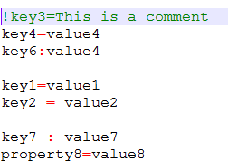
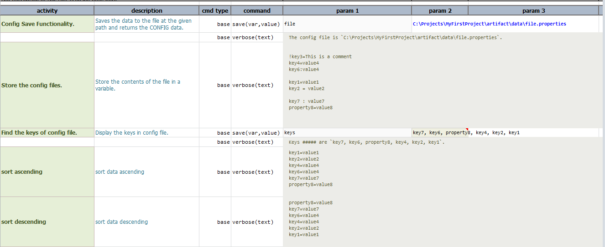

### Description
The CONFIG files are simple text files with key/value pairs. The general format of the properties CONFIG file is as 
explained below:

Generally expected to be a single line of the form, one of the following: 
- `property-bame=property-value`
- `property-name:property-value`

White space that appears between the property name and property value is ignored, so the following are equivalent.
1. `name=Stephen`
2. `name = Stephen`

Also: 
- White space at the beginning of the line is also ignored.
- Lines that start with the comment character `!` or `#` are ignored. Blank lines are also ignored.
- The property value is generally terminated by the end of the line. White space following the property value is not 
  ignored, and is treated as part of the property value.
  
### Operations

* **keys()** \- returns all the key names as list.
* **remove(key)** \- removes the key and returns the updated CONFIG data**.**
* **save(filePath)** \- saves the data to the file at the given path and returns the CONFIG data.
* **set(key, value)** \- sets the value to the given key and returns the updated CONFIG data**.**
* **store(var)** \- save current CONFIG expression to a data variable.  If the specified `var` exists, its value will be overwritten.  Using this operation, one can put an expression on pause and resume it at a later time.
* **text()** \- returns the content of the CONFIG data as text
* **value(key)** - returns the corresponding value as text.

### Examples

The properties file is located at **C:/Projects/MyFirstProject/artifact/data/** and the name of the file is **file.properties**

**script:**

**Result**:

The file x.properties is updated with the following content:-

