### Description
<a href="https://en.wikipedia.org/wiki/Comma-separated_values" class="external-link" target="_nexial_link">CSV, or Comma-Separated Values</a>, 
is text-based file format to store tabular data.  In many ways this file format can be viewed as a simplified, 
no-format, version of Excel.   Using this file format, one can store tabular data (i.e. 2-dimensional) of various 
types and sizes.  This expression, then, can help to manipulate a CSV file content as part of automation.

As popular as CSV has been since 
<a href="https://en.wikipedia.org/wiki/FORTRAN#FORTRAN_77" class="external-link" target="_nexial_link">FORTRAN 77</a> 
(yes, 1978), it might surprise some to know that there isn't yet a standard for it.  The closet of a standard would be 
<a href="https://tools.ietf.org/html/rfc4180" class="external-link" target="_nexial_link">RFC 4180</a>, 
which is a proposal and a formalization of CSV as a specification, but not yet accepted as specification.  As such, 
there are many, and some subtle, variations out there and many are staunchly supported by technology communities and 
companies alike.  The most popular varieties of CVS would be:

- **Excel CSV** - the CSV format produced by Microsoft Excel when using its Export functionality.  In essence, such 
CSV file format:
	 - uses comma as delimiter
	 - uses double quote for non-numeric value
	 - uses carriage return (`\r\n`) as record separator
	 - regard empty lines as an empty records
	 - allow subsequent lines to be longer than the first line (usually represents the header columns)        
- **RFC 4180** - the proposed CSV file submitted to IETF.  Essentially, this CVS file format:  
  - uses comma as delimiter
  - uses double quote for non-numeric value
  - uses carriage return (`\r\n`) as record separator
  - regard empty lines as an empty records
- **<a href="https://en.wikipedia.org/wiki/Tab-separated_values" class="external-link" target="_nexial_link">TDF or TSV</a>** - 
  The tab-delimited format, which uses the  `TAB` character instead of comma as field value delimiter.  This is also 
  the default CSV format for MySQL export. Such format:
  - uses `TAB` character as delimiter
  - uses double quote for non-numeric value
  - uses carriage return (`\r\n`) as record separator
  - regard empty lines as an empty records
  - ignore spaces between fields

Nexial CSV expression uses the **Excel CSV as the default format**, but can be configured to handle other formatting 
subtleties (see the `parse()` operation below).

### Different ways to initiate CSV expression
An CSV expression can be initiated in various ways:

|syntax                        |explanation                                                                            |
|------------------------------|---------------------------------------------------------------------------------------|
|`[CSV(file) => ...]`          |Initiate a CSV expression via an external file. This file can be expressed via a variable (syntax: `${var_points_to_my_csv_file}`), or as the fully qualified path (e.g. `C:\my_files\data.csv`).  Such expression will read in the entire content of the specified CSV file. Note that the specified file is considered as "disconnected", meaning that changes to the CSV content will not automatically/directly affect the CSV file until a **`save()`** operation is issued.|
|`[CSV(${csv_content}) => ...]`|Initiate a CSV expression via CSV content (expressed as text). The content can be expressed via a variable (syntax: `${csv_content}`).|
|`[CSV(var) => ...]`           |Continue a previously initiated CSV expression denoted by var. Note that var **`does not`** follow the `${...}` syntax. Simply specify the variable name to instruct Nexial to resume a previously initiated CSV expression (that was saved via the **`store()`** operation). See **`store()`** operation below for more details.|

**`IMPORTANT`: It is almost always necessary to invoke the parse() operation first prior to using other operations.**
The official CSV specification of Microsoft/CSV does not default to using header.  Hence one should consider something like the following:

`[CSV(...) => parse(header=true) ... ...]`

See `parse()` below for more details.

### Operations

#### asciiTable
- render CSV content into a ASCII-based table. Also known/usable as 'ascii-table'.  See example for 
  details.  Also, [`htmlTable`](#htmltable) is a related operation to generate HTML table.

#### column(column_name_or_index) 
- get all the data belonging to the same column as a **[`LIST`](LISTexpression)**.  For CSV without header information, 
  use column index (0-based). 

#### columnCount
- number of columns to the current state of the CSV content.

#### config 
- convert CSV content into [CONFIG](CONFIGexpression) instance.

#### distinct
- remove all duplicate rows from the CSV content.

#### excel(file,sheet,startCell)
- to import CSV into the `sheet` of the specified Excel starting from `startCell` position. The cell position is 
  specified using conventional Excel cell like `A3`, `P11`, from which the CSV content will be intended. If current
  CSV content contains header, then it will be included in the import as the first row.  Both `file` and `sheet` can
  reference non-existing resources, which Nexial will create on-the-fly.

#### fetch(conditions)
- fetch the first row that matched the specified 
  [conditions](../flowcontrols/filter#specification).  These conditions are evaluated on the columns based their 
  respective name or index. The condition follows the syntax as laid out in [Nexial Filter](../flowcontrols/filter). 

#### filter(conditions)
- keep only the rows that matches the specified 
  [conditions](../flowcontrols/filter#specification).  These conditions are evaluated on the columns based their 
  respective name or index. The condition follows the syntax as laid out above.  One can use the reserved word 
  `[ANY FIELD]` to target any field.  For example, `filter([ANY FIELD] contain USA)` means filter a row if any of 
  its fields contains `USA`.
- `conditions` follows the syntax as laid out in [Nexial Filter](../flowcontrols/filter). 

#### groupCount(columns)
- create a new CVS using the specified column(s) and a new column (last column) as the 
  count of occurrences.  Multiple columns are separated by comma (`,`).  The newly formed CSV will named the last 
  column (the count) as `Count`.  
  
  Let's see an example. Suppose we have a [CSV file of various sales information](CSV_sample1.csv), like this: 
   
  
  To create a CSV file that would count up the occurrences of different `Country`, we can do something like this:
  
  `[CSV(${sample_csv}) => parse(header=true) group-count(Country) text]`
  
  The above would: (1) parse the CSV file denoted as `${sample_csv}` and perform a "group count" on the column 
  `Country`. The end CSV file looks something like this: 
  
  
  
  You can download the same CSV file [here](CSV_groupCount1.csv) 
  
  It is possible to include multiple columns for grouping, such as `groupCount(Country,State)`, which would yield 
  results like this:
  
  

#### groupSum(columns)
- create new CSV using the specified column(s) to group rows of same valules.  The last
  specified column is considered as the one holding the values to aggregate, and will be named as `Sum`.

  This operation is similar to [`groupCount(columns)`](#groupcount(columns)) except, instead of counting occurrence of 
  equivalent data, this operation groups the equivalent data and sums up another corresponding numeric column.  In 
  other words, it's akin to saying "Look at all the values in Column A, group them by their values so that equivalent 
  values are in the same group.  Then find the corresponding Column B (assuming numeric value) and sum up the values 
  thereof by the associated group".
  
  Let's look at an example.  Suppose we have a [CSV file of various sales information](CSV_sample1.csv): 
   
  
  We can group by `Country` and sum the corresponding `Price` column, like this: 
  
  `[CSV(${sample_csv}) => parse(header=true) group-sum(Country,Price) text]`
  
  The result CSV would look something like this: 
  
   
  
  As show, the data in `Country` is grouped together and the corresponding `Price` summed by under the column named 
  `Sum`.  Just like `groupCount(columns)`, it is possible specify multiple columns for multi-level grouping and summing.
  
  Note that **the last column must be the target column to sum, and it must be a "numeric" column**.

#### headers
- retrieves the column names of the current CSV content as a **[`LIST`](LISTexpression)**.  If 
	 current CSV is not parsed with `header=true`, then `null` is returned.

#### htmlTable
- render CSV content into a HTML table.  Also known/usable as `html-table`.  For text-only rendering, 
  consider using [`asciiTable`](#asciitable) operation instead.  Let's see an example: 
  
  Suppose the following CSV: 
  
  
  Using `[CSV(...) => html-table text]`, we can render the same CSV into something like the following: 
  
  
  Note that some amount of CSS is needed to format the generated HTML as shown above.  In this case, the CSS looks
  like this: 
  
  
#### json
- convert current state of the CSV content to a JSON document.Technically speaking, it's a JSON array 
  (to represent rows) with multiple JSON document (each for one row).The CSV content in question may be one or more 
  rows, with or without headers. For example, here's the transformation from one CSV document (with header) to a JSON:

  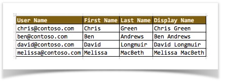 

  In contrast, here's another CSV document (without header) and the transformation to JSON:

   

  As shown above, CSV with header produces JSON with names (node names), and CSV without header produces JSON array of 
  array without name/label references.

#### length
-  Synonymous to **[`size`](#size)** and **[`rowCount`](#rowcount)**.

#### merge(var,keyColumn)
- merge the CSV data represented by `var` into existing CSV content.  `keyColumn`, 
  if specified, is used to merge the 2 CSV content in such a way that the record of the same key are merged 
  together.  In general, there are 3 uses of this operation:

- **merge two CSV files that have no header** - in such case, records will be merged line-by-line with no regard 
  to the data value.  For example: 
<code>
[CSV( ${csv file to merge from} ) => parse store(merge_from)] 
... ... 
[CSV( ${csv file to merge into} ) => parse(header=false) merge(merge_from,\(empty\)) store(merge_into)]
</code>
 

| file                                | snapshot            |
| ----------------------------------- | ------------------- |
| CSV to merge into:                  |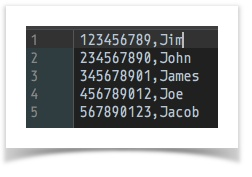|
| CSV to merge from:                  |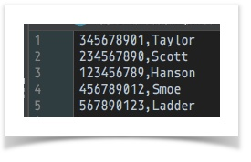|
| CSV to merge into, **AFTER** merge: |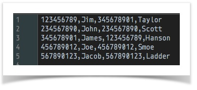|

 

Note that passing **`\(empty\)`** is required as the keyColumn to signify that no shared column is between these 
2 CSV data.
     
- **merge two CSV files that have headers, but without keyColumn** - in this case, `header` exists in both CSV file, 
  but they do not share any common column from the merge can be based on.  For example: 
<code>
[CSV( ${csv file to merge from} ) => parse(header=true) store(merge_from)] 
... ... 
[CSV( ${csv file to merge into} ) => parse(header=true) merge(merge_from,\(empty\)) store(merge_into)] 
</code>
 

| file                                | snapshot            |
| ----------------------------------- | ------------------- |
| CSV to merge into:                  ||
| CSV to merge from:                  |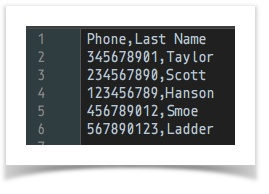|
| CSV to merge into, **AFTER** merge: |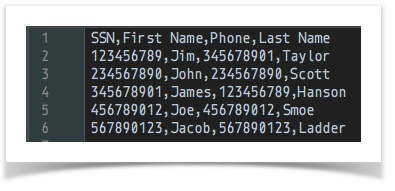|

 

Note that passing **`(empty)`** is required as the keyColumn to signify that no shared column is between these 2 
CSV data.

- **merge two CSV files that have headers and share the same `keyColumn`** - in this case, header exists for both 
  CSV data and they also share (at least) one common column whereby merge can use it to align the records.  For 
  example, 
<code>
[CSV( ${csv file to merge from} ) => parse(header=true) store(merge_from)] 
... ... 
[CSV( ${csv file to merge into} ) => parse(header=true) merge(merge_from,SSN) store(merge_into)] 
</code> 

| file                                | snapshot            |
| ----------------------------------- | ------------------- |
| CSV to merge into:                  |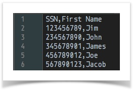|
| CSV to merge from:                  |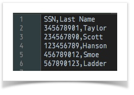|
| CSV to merge into, **AFTER** merge: |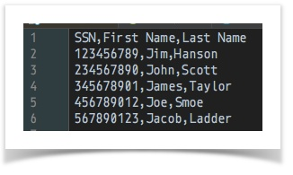|

 
Notice that the merged CSV is matching up the First Name and Last Name based on SSN, even though the order of 
these SSN are not the same.

#### parse(config)
- (re)parse current CSV data with consideration towards the specified configurations. By 
  default, Nexial uses the Excel CSV (see above) as the file format to parse a CSV file.  Using this operation, one 
  can change the way a CSV file is parsed. The configuration will be specified in the form of 
  `name=value|name=value|name=value|...` or `name=value,name=value,name=value,...`pairs.

  - **`delim`** - the character (single) to use as separator between field values.  For example, `delim=\,` would use 
    comma as delimiter, `delim=;` would use semi-colon as delimiter.  Default is comma.
    - Nexial also support auto-detection of delimiter, so you can omit `delim` to simplify your automation. 

  - **`quote`** - the character (single) to use to wrap non-numeric (such as text) values.  Default is double quote.  
    `quote='` would force Nexial to consider single quote as the "wrapping" for non-numeric values.
    - Nexial also supports auto-detection of value quoting, so you ca omit quote to simplify your automation.

  - **`header`** - true or false to signify if the first line should be treated as column names.  If `header=false`, 
    then field values can only be referenced by index (zero-based).  Default is `false`.

  - **`recordDelim`** - determine the character(s) between 2 records.  Default is carriage return (`\r\n`).
    - Nexial supports auto-detection of line delimiter, so you can omit `recordDelim` to simplify your automation.

  - **`maxColumns`** - instruct Nexial to allocate beyond the default max columns (512) in order to process very wide
    CSV file. Note that changing this value will have both memory footprint and performance implication. This setting
    is usually not needed.
    
  - **`trim`** - instruct Nexial to retain or trim of any leading and/or trailing whitespaces per parsed value. By 
    default, Nexial will trim each parsed value so ` California ` would be stored as `California` - the `trim` option is
    by default `true`. But at times it is critical to retain all the data found from its original sources. As such, one
    can specify `trim=false` to retain leading/trailing whitespaces. 
    
  - Example: `[CSV(text) => parse(delim=\,|header=true|recordDelim=\r\n) text]` reads:
    - convert text into a CSV component, using the default Excel CSV format.
    - re-parse the same text but this time using **comma as the field delimiter**, the 
      **carriage return (DOS) as the record/row delimiter** and treat the **first line as the header**.  Note that 
      comma needs to be escape since it is also used as a parameter separator.  Hence `delim=\,`.
    - convert the CSV component into text.

#### removeColumns(namesOrIndices)
- Remove the entire column qualified via namesOrIndices parameter, which can be 
  a list of column names or column positions (zero-based).  Multiple columns are separated by comma (`,`).

#### removeRows(conditions)
- Remove all rows that meet the specified 
  [conditions](../flowcontrols/filter#specification).  For example, consider the following CSV file:
	 
  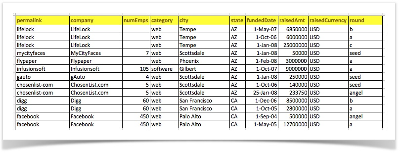

  **`[CSV(csv_file) => removeRows(city = Scottsdale|raisedAmt < 200000)]`** would remove all the rows where city is 
    `Scottsdale` and `raisedAmt` is less than `200000`.  The result should look like this:

  

  One can use the reserved word `[ANY FIELD]` to target any field.  For example, `removeRows([ANY FIELD] contain USA)` 
  means remove a row if any of its fields contains `USA`.
  
  The `conditions` parameter follows the syntax as laid out in [Nexial Filter](../flowcontrols/filter).

#### renameColumn(find,replace)
- Rename a column, as defined by `find`, with new value as defined by `replace`.  The column position is maintained.

#### render(template)
- Mass-generate a series of text based on the fusing of CSV data and a designated "template".  Suppose:

  1. we have a CSV file with the following content: 
  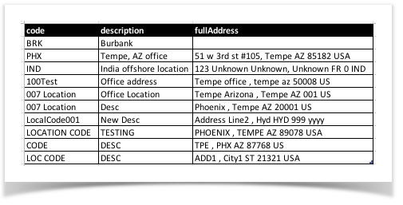

  2. we want to convert (and in reality, expand) to lines of text where each line represents one single record 
     "merged", like 
     
     <code>Here is <b>Tempe, AZ office</b>, which is located in <b>51 w 3rd st #105, Tempe AZ 85182 USA</b>, we call 
     ourselves <b>PHX</b>.</code>

  - THEN we can deduce the following as the "template": 
    <code>Here is <b>${description}</b>, which is located in <b>${fullAddress}</b>, we call ourselves 
    <b>${code}</b>.</code>

  - HENCE the expression `[CSV(${file}) => parse(...) render(${template})]` would yield: 
    

  - Nexial works behind the scene to replace each token (data variable) found in the template with record data found 
    in each CSV record.  For as many records as there are, Nexial will perform the same "merge" to produce many lines 
    of text.

#### replaceColumnRegex(searchFor,replaceWith,columnNameOrIndex)
- For the specified column (by name or by position), search for `searchFor` regular expression and replace matches 
  by `replaceWith`. Regex group supported.  For example, 
  `[CSV(${...}) => parse(...) replaceColumnRegex((\d+)(\d\d),$1.$2,1)]` would search in the 2nd column of the CVS for
  a match against the pattern "a series of at least 3 consecutive digits" and replace it with the same digits with a
  decimal point place just before the second-to-last digit.  In other words, `12345` would become `123.45`.

#### retainColumns(columnNamesOrIndices)
- Retain only the specified columns (by name or by position, separated by commas) in a CSV. Think of this operation as 
  the opposite of `removeColumns(namesOrIndices)`. Any misreferenced columns will be ignored.
  
#### row(index)
- retrieves one row of data as a **[`LIST`](LISTexpression)**.  index is zero-based.  If index is 
  not valid or too large, then null will be returned.

#### rowCount
- number of rows to the current state of the CSV content.  Synonymous to **[`size`](#size)** and **[`length`](#length)**.

#### pack
- remove all empty rows from current CSV content. This could either be blank lines or lines with only 
  field delimiter (such as comma).

#### save(file)
- save current CSV content to external file. If specified file represents an existing file, it 
  will be overwritten.

#### size
- retrieves the number of rows in current CSV content. Synonymous to **[`rowCount`](#row(index))** and 
  **[`length`](#length)**.

#### sortAscending(column)
- sort the entire CSV content by the specified column, in ascending order.  Note that 
  the target **CSV MUST HAVE HEADERS**!

#### sortDescending(column)
- sort the entire CSV content by the specified column, in descending order.  Note that 
  the target **CSV MUST HAVE HEADERS**!

#### store(var)
- save current CSV expression (including content) to a data variable.  If the specified var exists, 
  its value will be overwritten.  Using this operation, one can put an expression on pause and resume it at a later 
  time.

#### text
- transform the current CSV data to text.  This would be the plain text rendition of the CSV content.  
  Note that the latest CSV format as specified via the **[`parse(config)`](#parse(config))** operation is observed 
  and will affect the text output.

#### transpose
- transpose current CSV content so that row datas are displayed as column data, and column's as row's.

#### xml(root,row,cell)
- convert current state of the CSV content to a XML document.  It's a 2-level XML document, with the first level 
  representing 'rows' and second level 'one row'. The first level node name is specified through `root` parameter while 
  the second level node name is specified through row `parameter`. For each column, `cell` is used to specify its node 
  name.  It is possible to omit any of the `root`, `row`, `cell` specification - simply use a space to use the default 
  shown below:
  - `root` - default node name is rows
  - `row` - default node name is row
  - `cell` - default node name is cell

  For example, **`[CSV(csv_file) => XML( , , )]`** would transform a CSV file to a XML document where the root node is 
  rows, the next level node name is row and each of its element is named as cell.  

  The CSV content in question may be one or more rows, with or without headers.  For example, here's the transformation 
  from one CSV document (with header) to a XML document (for example, **`[CSV(csv_file) => XML(team,members,member)]`**):

  

  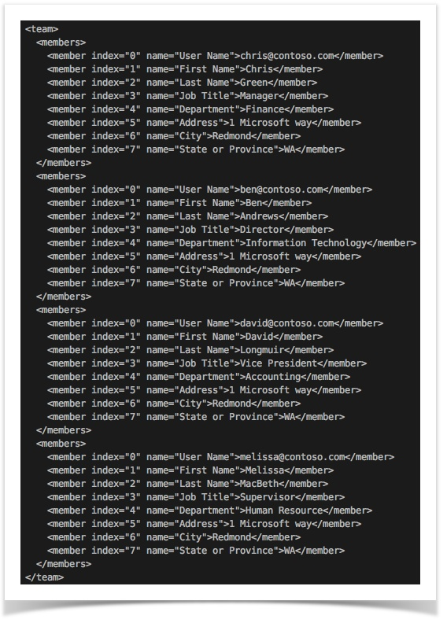

  The generated XML document has 'team' has the `root` node name (which represent all rows), 'members' as the node name 
  that encapsulate each row and 'member' as the node name that represents each cell.  In addition, an attribute is 
  generated to reference the column name (e.g., User Name, Address, etc.) and another attribute named index is also 
  generate to represent the column position of each cell value.

  In contrast, transforming a CSV content without header to a XML document would look a bit differently.  Below is 
  an example (using **`[CSV(csv_file) => XML( , , ,)]`**):

   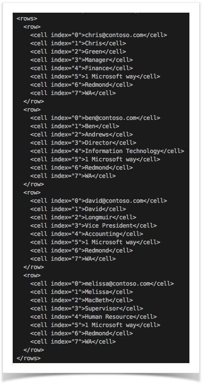
     
  As shown above, the column names are missing and default node names are applied.

---

### Examples

**Example 1: Using filter to limit the rows of a CSV file.**
- For more details about initializing a CSV structure, please read the section on 
  [Initiate CSV expression](CSVexpression#different-ways-to-initiate-csv-expression).

- For more details about filter condition, please read [Nexial Filter](../flowcontrols/filter).

  Suppose a file named expression-example1.csv exists in the artifact/data directory with the following content: 	   
  

  We can use the filter() operation to limit the rows of this CSV file.  Here are 3 examples of filter applied to 
  the same file: 
  

  You'll note that the [`parse(config)`](#parse(config)) operation is only invoked one (2nd line).  Using the 
  [`store(var)`](#store(var)) operation, we can reuse the CSV structure (in 3rd and 4th line).  In this example, we 
  assigned `myCSV` to the parsed CSV structure in line 2.
  - The first filter operation limits to rows where the column `First Name` is exactly `David`.  In this case, there 
    should only be 1 row (row 3 of the input CSV file) matched.
  - The second filter operation limits to rows where the column Mobile Phone contains `-6641` **AND** the column `Fax` 
    ends with `9825`.  The row 1 of input CSV file contains `123-555-6641` in its `Mobile Phone` column - this is the 
    only match for the first condition.  However this same line does not match the second condition (`Fax` ends with 
    `9825`). Hence this filter yields no rows matched.
  - The third filter operations limits to rows where **any field** ends with `3`.  As such we see that row 3 of the 
    input CSV file is a match since its `Office Phone` ends with 3 and its Fax ends with 3 (either match would 
    suffice). Other than that there isn't another match.

  Here's the output that depicts the same analysis above: 
  

  `filter2.txt` is empty, as expected.  Here's the content of `filter1.txt` and `filter3.txt`, respectively. 
   

  

---
