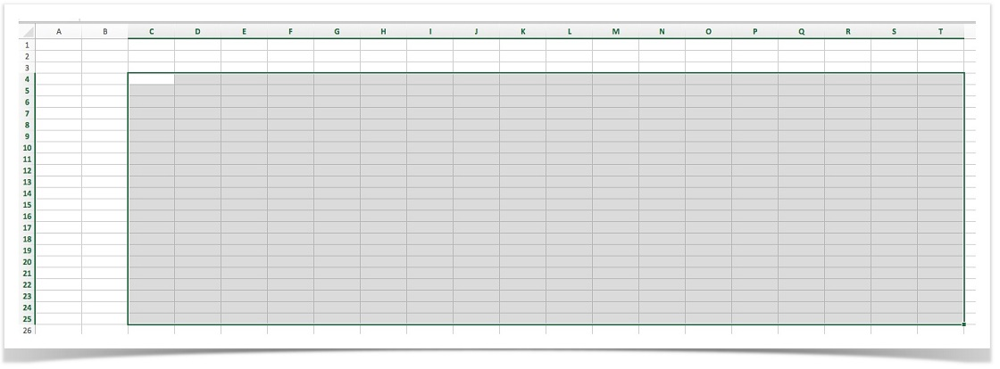
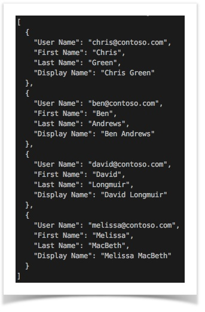
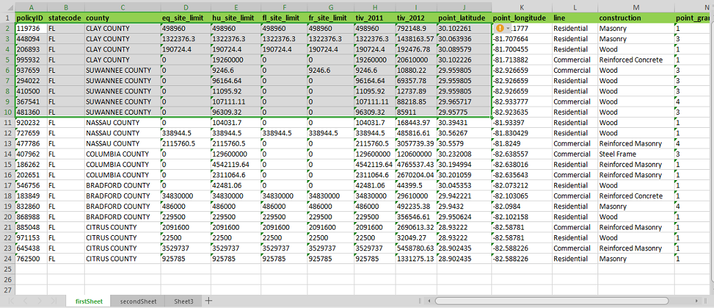
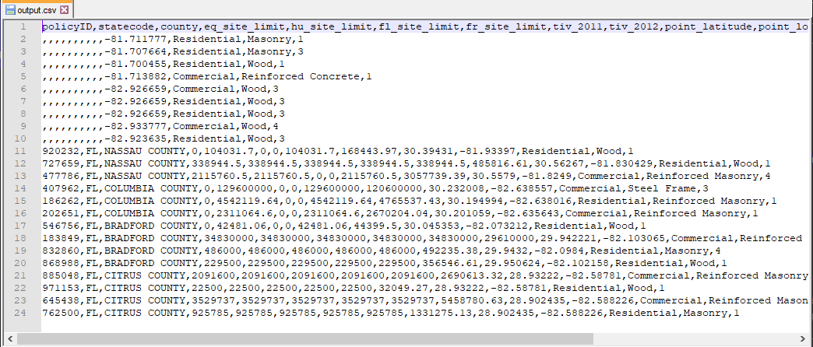

### Description
In many ways the Excel document works and feels like a [CSV](CSVexpression) document.  Most significant differences 
would be formatting, formula and sheets.  For the purpose of test automation, Nexial focuses only on the 
"_CSV-like, tabular data set"_ part of Excel spreadsheets.  To start using this expression, a reference to the full 
path of the target Excel file is needed.  Here are a few examples:

`[EXCEL(C:\my_project\my_data\my_excel.xlsx) => ...]`

`[EXCEL( ${spreadsheet location} ) => ...]` 

The second example uses a data variable to encapsulate the location of an Excel spreadsheet.

### Specifying cell location and range
Within this expression, it is quite common to reference a specific cell or a contiguous set of cells using the 
conventional Excel address format.  To specify a range, use the range format as follows:

`[column letter][row number]:[column letter][row number]`

For example, `C4:T25` would represent a contiguous range of cells starting from `C4`, spread breadth-wise to `T4` and 
then spread depth-wise to `T25`.  This would make up an "area" of 18x22, or 396, cells:

To specify the location of a cell, simply use the format: `[column letter][row number]`.

### Operations

#### clear(range)
Clear off any existing value from the cells found in the range specified by `range`.  After clearing off any existing 
value from the target cells, cell values are recaptured (via  **[`read(sheet,range)`](#read(sheet,range))**) again to 
ensure relevancy.

-----

#### columnCount
Return the number of columns captured.

-----

#### csv
Transform current EXCEL content into **[`CSV`](CSVexpression)**. Field delimiter will be set to the current value of
[`nexial.textDelim`](../systemvars/index#nexial.textDelim) (default to comma), and record delimiter will be set to
CRLF (`\r\n`).

-----

#### csvWithHeader
Transform current EXCEL content into **[`CSV`](CSVexpression)**, using the first row as header. Field delimiter will 
be set to the current value of [`nexial.textDelim`](../systemvars/index#nexial.textDelim) (default to comma), and 
record delimiter will be set to CRLF (`\r\n`).

-----

#### firstCell(column,regex,maxRow)
Find the first cell in the specified `column` that satisfies `regex` and transform it to a 
[TEXT expression](TEXTexpression). The `column` parameter is expected to be in the form of `A`, `B`, `C`, etc. - 
mimicking how columns are represented in Excel. The `regex` parameter act as a filter to find the first matching
cell. The `maxRow` is required to ensure that Nexial performs sufficient (but not burdensome) scanning of available
rows.

Note that this operation **MUST** be preceded with a call to [`read(sheet,range)`](#readsheetrange).
  
-----

#### json(firstRowAsHeader)
Transform current EXCEL content into **[`JSON`](JSONexpression)**. This operation provides 2 forms of transformations.
When `firstRowAsHeader` is set to `false`, the current EXCEL content is converted into a JSON array containing one or 
more JSON array. For example,

However, if `firstRowAsHeader` is set to `true`, then the first row of the current EXCEL content is assumed to be a
header row. The transformed JSON document would thus be a JSON array containing one or more JSON document, like this:

See [CSV &raquo; `json()`](CSVexpression#json) for additional details.

-----

#### pack
Trim (remove beginning and trailing spaces) the values of captured cell and remove any blank rows in the captured cells.

-----

#### read(sheet,range)
Read a contiguous set of cell values in a worksheet denoted by `sheet`, in a range denoted by `range`. See above for 
more details on specifying cell range.   All the cells in the specified range will be read, regardless if those cells 
contain any value.  After this operation, **`text`** will render the captured value as `LIST` of `LIST`.

-----

#### replace(search,replace)
Of all the cells captured through [`read(sheet,range)`](#readsheetrange), replace all instances of `search` with 
`replace`. Note that the replaced cells are only kept in memory. Use [`csv`](#csv), [`csvWithHeader`](#csvwithheader)
or [`save(file,sheet,start)`](#savefilesheetstart) to store the modified cell data externally.

-----

#### rowCount
Return the number of rows captured.

-----

#### save(file,sheet,start)
Save the captured cell values to a Excel `file` (existing or new), using the specified `sheet` as the target worksheet 
and `start` as the start cell position where the captured cell values will be saved to.  For example, 
`[EXCEL(${file}) => read(Sheet1,A5:M10) save(${file},Sheet1,A11:M16)]` would effectively copy cell value from `A5:M10` 
to `A11:M16` (same sheet).

-----

#### store(var)
Save current EXCEL expression to a data variable.  If the specified `var` exists, its value will be overwritten. Using 
this operation, one can put an expression on pause and resume it at a later time.

-----

#### text
Transform the current EXCEL cell data to text.  This would be the plain text rendition of the referenced cell data. 
Note that if **`text`** is called prior to the **[`read(sheet,range)`](#read(sheet,range))**  operation, then only the 
location of the underlying Excel file will be returned.  In order to return the cell content, the 
**[`read(sheet,range)`](#read(sheet,range))** operation must be invoked.

-----

#### transpose
Transpose captured cell values so that row data is displayed as column data, and column's as row's.

-----

#### worksheets
Retrieves a list of worksheets in the referenced Excel file.

-----

#### writeAcross(start,value1,value2,value3,...)
Starting from the cell location specified via `start`, save into cells the values as specified via 
`value1`, `value2`, `value3`, ... by moving to the right for each value specified.  For example,  
`[EXCEL( ${file} ) => read(Sheet1,B2:F20) writeAcross(B3,Banana,Grape,Apple,Kiwi,Black Concurrent]` would write the 
list of fruits (Banana, Grape, Apple, Kiwi, and Black Concurrent) into Sheet1, starting from `B3`.  Therefore  `Banana` 
is stored to `B3`, `Grape` is stored to `C3`, Apple to `D3`, and so on:

(before)  
  

(after)  

-----

#### writeDown(start,value1,value2,value3,...)
Store `value1`, `value2`, so on, starting from the cell position denoted by `start`.  See  
**[`writeAcross(start,value1,value2,value3,...)`](#writeacross(start,value1,value2,value3,...))** for more details.

-----

### Example
The content of excel file stored at location `C:\projects\xyz.xlsx` is:

 
**Script**: 

**Output**: 

-----

