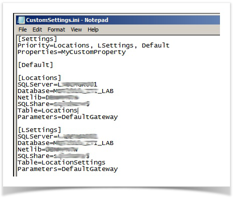
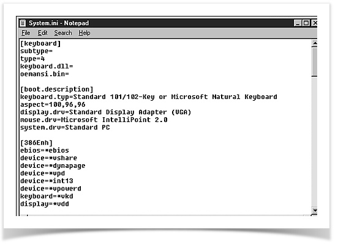
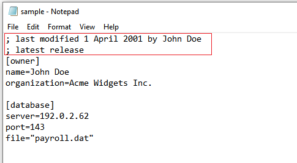

### Description
The <a href="https://en.wikipedia.org/wiki/INI_file" class="external-link" target="_nexial_link">**INI** file format</a> is an informal standard for configuration files for 
some platforms or software. INI files are simple text files with a basic structure composed of sections, properties, 
and values.  Here are some examples:

### Operations

#### `comment`
Returns the comment from the INI configuration data

-----

#### `merge(mergeFileOrContent`
Merges the content of the INI data

-----

#### `newComment(comment)`
Adds the given comment to the INI data

-----

#### `remove(section,key)`
Removes the key from the given section and returns the INI data

-----

#### `save(filepath)`
Saves the INI data to the given file path

-----

#### `set(section,key,value)`
Sets the key and value in the given section. If section is not available, creates 
the section and sets the key and value.

-----

#### `store(var)`
Save current INI expression to a data variable.  If the specified `var` exists, its value will 
be overwritten.  Using this operation, one can put an expression on pause and resume it at a later time.

-----

#### `text`
Returns the content of the INI data as text

-----

#### `value(section,key)`
Gets the value of corresponding key from the given section

-----

#### `values(section)`
Gets all the values available in the given section

-----

### Example
**Script**: 

**Output**: 

-----

