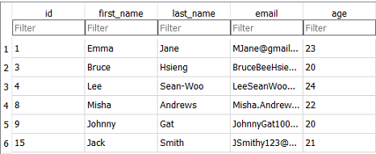
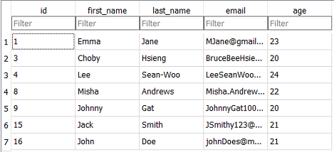
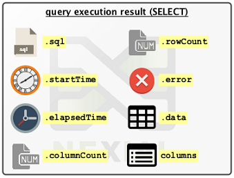
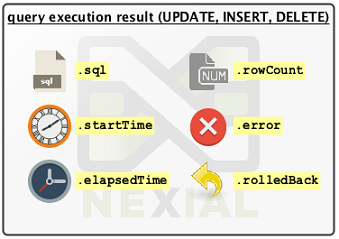
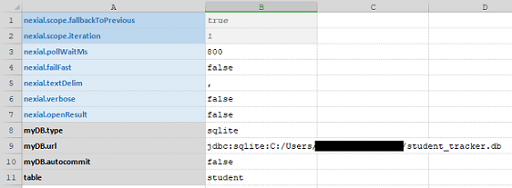

### Description
SQL expression allows one to express the processing of one or more SQL statements.

For connection setup, visit [Database Connection Setup](../commands/rdbms/index#database-connection-setup) for more
detail.

### Execution Result of Queries
The `resultName` parameter used in the operations below refers to the [Execution Result](../commands/rdbms/#working-with-execution-result) 
of the SQL queries. It is the variable associated with the query result that we can assign using the syntax
<code>--nexial:resultName</code> as shown in the examples below. 
In cases where there is no variable specified corresponding to the query, Nexial, by default uses 0-based index to refer to 
execution outcome of that particular query.

**For Example**

Our `student` table looks like this  

We write multiple queries into a single variable and assign only one of them a variable.  

As stated before, where there is no variable assigned to the query, nexial by default used a 0-based index. We use the index 0 
to address the outcome of this query. 

Similarly, we use the index 1 for the second query 

We assigned a variable to the third query, so we'll use that. Alternatively, we can use the index 2. 

Using index 3 for the last query 

The resulting `student` table looks like this after running the queries.  

-----

**If the query contains errors**

Normally, the execution outcome of a query would contain various pieces of information as shown in the pictures below.  
 

However, in case of an inaccurate or erroneous queries.  

The execution outcome will return an error upon running the execute. And running other operations on the outcome will return 
either 0 or null.
 

Output: 

However, some meaningful information can be extracted the execution outcome of an erroneous query. For example 

Output: 

-----

**Referencing Queries in External File** 

Nexial built-in functions, data variables and expressions can also be used in the SQL queries. For Example:  

<code> select * from ${table}; </code> where table is: 
 

SQL queries can either be written directly into the script or can be stored in a file and run. However, writing 
queries in a file has the following advantages:

- Ease of readability compared to queries written directly into the script
- Better flexibility in terms of modification since the queries are separate from the script.
- Externalized queries provide for ease of maintenance and reusabilty.
- Queries written in a file also can make use of built-in functions, data variables and expressions. 

As a best practice, the file(s) containing the queries should be stored under the data or the script directory as it helps 
with portablity. 

-----

### Operations

#### `execute(db)`
Execute the associated SQL statement(s) using `db` as the database connection. Most of the operations mentioned below must
be preceded by `execute(db)` as a requirement. `

**Example**

**Database:** 

**Script:** Inserting new tuples into the table 

**Output:** Insertion successful 

**Output:** Insertion failed. Nexial prints the query as the output.

 
-----

#### `cells(resultName,column)`
Return a list of data matching `column`.

**Example**

**Existing Database:** 

**Script:** Fetching the entries in the `first_name` column 

**Output:** 

-----

#### `columns(resultName)`
Returns the column names of an execution result named `resultName`. Must be invoked 
after **`execute()`**.

**Example**

**Database:** 

**Script:** 

**Output:** 

-----

#### `columnCount(resultName)`
Returns the number of columns for a given execution result named `resultName`. 
  Must be invoked after **`execute()`**.

**Example**

**Database:** 

**Script:** 

**Output:** 

-----
  
#### `csv(resultName)`
Transform the content of execution result named `resultName` to [`CSV`](CSVexpression). 
  Must be invoked after **`execute()`**.

**Example**

**Database:** 

**Script:** 

**Output:** 
 

-----

#### `elapsedTime(resultName)`
Returns amount of milliseconds to execute and retrieve an execution result named 
  `resultName`. Must be invoked after **`execute()`**.

**Example**

**Database:** 

**Queries:** 
insert2.sql 
 

update.sql 

**Script:** 

**Output:** 

**Resulting Database:** 
 

-----

#### `error(resultName)`
Returns any error, as [`TEXT`](TEXTexpression), incurred during the execution and 
  retrieval of an execution result named `resultName`. Must be invoked after **`execute()`**.
  
**Example**

**Script:** 

**Output:** 
 

-----

#### `resultCount`
Find out the number of execution results rendered through the most recent `execute()` 
  operation. Must be invoked after **`execute()`**.
  
**Example**

**Database:** 

**Script:** Running a single select query. 

**Output:** 

**SQL File: operation.sql**  

**Script:** Running multiple queries 

**Output:** 

**Resulting Database** 

-----

#### `rolledBack(resultName)`
Returns `true`/`false` value if the execution and retrieval of an execution result 
  named `resultName` has caused a roll back event. Must be invoked after **`execute()`**.
  
**Example**

**Database:**  

**SQL file: insertRollback.sql**  

**Script:**  

**Output:**  

**Resulting Database:**  

-----

#### `rowCount(resultName)`
Returns the number of rows for a given execution result named `resultName`. Must be 
  invoked after **`execute()`**.

**Example**

**Database:** 

**Script:** 

**Output:** 

  
-----

#### `sql(resultName)`
Returns the SQL statement used to derive an execution result named `resultName`. Must be 
  invoked after **`execute()`**.

**Example**

**SQL File: update.sql** 

**Script:** 

**Output:** 

**Resulting Database**  

  
-----

#### `startTime(resultName)`
Returns the time, in epoch, when the execution of a result named `resultName` was 
  started. Must be invoked after **`execute()`**.

**Example**

**Script:** 

**Output:** 

-----

#### `store(var)`
Store the current state of this expression for later use.

**Example**

**Database:** 

**Script:** 

**Output CSV:** 

-----

#### `text`
Transform the associated SQL statement(s) into plain text.

**Example**

**Script:** 

**Output:** 

**Text File: output.txt**  

-----

