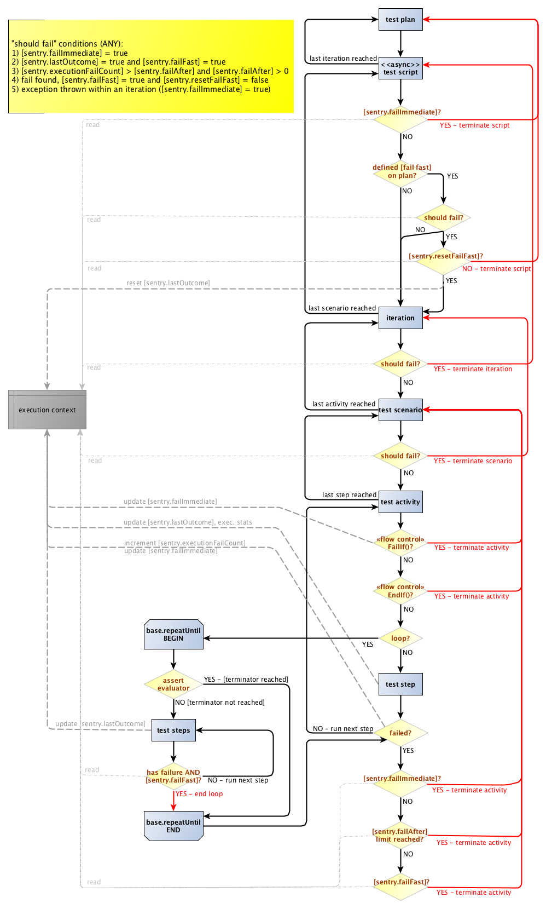

There's probably a better place for this... A number of inquiries have surfaced as to the 'nitty-gritty' of 
execution flows and controls in terms of failures and early termination.  Here is an attempt to provide some 
explanation.  Perhaps a more thorough undertaking is needed...

Failure has a way of interrupting the flow of a test execution.  This is necessary in order to prevent unnecessary 
automation or worse, any misleading false-positives.  The key factors to interrupting the flow of a test execution are:

1.  `nexial.failFast`
2.  `based.failImmediate` 
3.  `EndIf(...)` ([flow control](../flowcontrols/index)) 
4.  `FailIf(...)` ([flow control](../flowcontrols/index))
5.  `nexial.failAfter` 
6.  `nexial.resetFailFast` 
7.  unrecoverable exceptions

