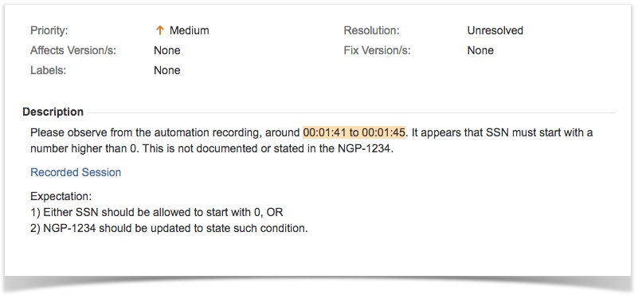

### Description
Nexial supports the recording (like screencast) of an automation session so that the automation can be played back at 
a later time.  This can be useful towards troubleshooting, root cause analysis, usability studies, etc.  Ideally such 
recording would be attached to as part of a defect or service ticket, with the time span noted for review.  For 
example (fictitious):

Some of most apparent benefits of using recording over screenshots are:
1. Ability to observe the steps leading up to the issue at hand.
2. Easier approach to reproduce the steps leading up the issue at hand.
3. Ability to observe other possible factors outside of the application itself.  For example, the screen resolution 
   or other running process might have functional impact to the application.

A few things to note:
1. It is possible to perform multiple recordings per one automation run.  Each recording will be named in the similar 
   fashion as the screenshot:  
   `[test script name].[run ID/timestamp].[iteration].xlsx_[test scenario]_[test activity]_[row number].mp4`  

   For example, `MyScript.20170510_132852.001.xlsx_TestSSN_Start_Application_A5.avi`  

   Another recording will start from another row or another test scenario, and will have different name.  This is 
   how one can tell them apart.  However, there can only be one active recording at a time.  Starting a new recording 
   without explicitly stopping the current one will cause Nexial to forcefully stopping the current recording.
2. No sound will be recorded.
3. Any mouse or keyboard events will also be recorded.  The recording is scoped to the **entire desktop**.
4. By default Nexial records in MP4 format.  If you'd like to record in AVI format 
   (see [`nexial.record.format`](../systemvars/index#nexial.screenRecorder)), you should do a one-time installation of 
   the <a href="https://assets.techsmith.com/Downloads/TSCC.msi" class="external-link" target="_nexial_external">TSCC codec (free)</a>.
5. The same behavior is expected as with Nexial output and screenshot captures. If 
   [`nexial.outputToCloud`](../systemvars/index.html#nexial.outputToCloud) is true, then the recorded video will be 
   uploaded to cloud as well.

### How-To
1. If the target video is AVI, make sure you have the 
   <a href="https://assets.techsmith.com/Downloads/TSCC.msi" class="external-link" target="_nexial_external">TSCC codec (free)</a>
   installed on the host where the recording will be performed.
2. From your Nexial script, identify where the recording should start.  Add in a new command 
   [base &raquo; `startRecording()`](../commands/base/startRecording())`, like this:  
   
3. Identify where the recording should stop using, like this:  
   
4. That's it! Run your automation as you normally would.
5. From the generated Nexial output file, you should see something like this:  
   
6. One may click on the link to download/play the recorded automation run.  For OS X, an AVI player such as 
   <a href="http://ftp.free.org/mirrors/videolan/vlc/2.2.4/macosx/vlc-2.2.4.dmg" class="external-link" target="_nexial_target">VLC</a> 
   or <a href="https://mac.eltima.com/download/elmediaplayer.dmg" class="external-link" target="_nexial_target">Elmedia Player</a> 
   can be used to playback the recording.

