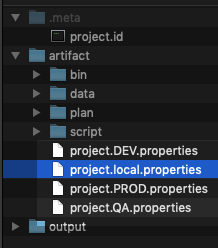

Nexial provides a mechanism to manage a set of project-level data variables - via `artifact/project.properties`. Using 
this file, one can define a set of data variables that can be used for all the artifacts in the same project structure. 
This feature helps to streamline data management and expedite script development. 


### Toggling Multiple `project.properties`
Suppose we manage environment-specific data variables in different `project.properties` files, like this:<br/>


Here are their respective content (shorten for brevity):<br/>
- `project.properties`
   ```
   ...
   ...
   # local environment
   MyTest.site.homepage=http://localhost:8080/home
   ```

- `project.DEV.properties`
   ```
   ...
   ...
   # DEV environment
   MyTest.site.homepage=http://sdcsdev01:8888/v2/home
   ```

- `project.QA.properties`
   ```
   ...
   ...
   # QA environment
   MyTest.site.homepage=http://sdcsqa02/v2/home
   ```

- `project.PROD.properties`
   ```
   ...
   ...
   # PROD environment
   MyTest.site.homepage=https://www.superduper123.com/home
   ```

As shown, each `project.properties` file contains its own version of `MyTest.site.homepage`. The main idea here is to
ensure that along with the data definition in `project.properties`, the environment-specific one is loaded as well.
This means that when automating against the QA environment, we would load `project.properties` as well as 
`project.QA.properties`. Similarly when we automate against the PROD environment, we would load `project.properties` as
well as `project.DEV.properties`, and so on.

To accomplish this, we can use a simple script to automate the process of combining the right `project.properties` files
together and then running the Nexial automation thereafter. Before proceeding to creating this script, there's one more 
thing we should do - **rename `project.properties` to `project.local.properties`**:<br/>



Now we can design a script that would:
1. Combine `project.local.properties` and an environment-specific properties file (e.g. `project.DEV.properties`) into
   `artifact/project.properties`
2. Run Nexial automation as normal

There are many ways to accomplish this. Below are 2 working examples (one for Windows and another for Mac):


-----

### Conclusion
