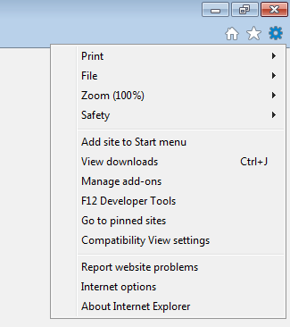

### Automation on IE
**Context:** 
- Nexial scripting is same for all the browsers but IE browser has some concerns about time constraints, IE version 
support that's why sometimes nexial scripts don't work well in IE browser but works well in other browsers.
Certain browsers and certain web application altogether have different settings. Let's follow some steps for web automation on IE browser.

**Prerequisites/Steps To Follow while web automation:**
1. IE browser must be 100% zoom. Lets have a look how to check/change IE settings- 
   - Open IE browser. You can see some menu options at the right cornerin the image.  
       
   - Go to tools option(Alt+X). You will get Zoom option with value in bracket. 
    

   - If the value is not 100%, click on Zoom and select 100% Zoom. 
    
   
   Alternative for above steps is open IE browser and simply press **ctrl+0**.
2. Nexial scripts should run on IE browser with window maximized. Nexial have command
[web.maximizeWindow()](../commands/web/maximizeWindow()) to maximize the window page.

3. We have to look for following [system variables](../systemvars)-
- **nexial.browser.forceJSClick** - This must be set to **`true`**. Sometimes for certain web application in certain browsers,
 timings is not as expected mostly in IE browser. For this issue, you can forcefully call click event via javascript by setting this variable to **`true`**.
For more details, click [here](../systemvars/index#nexial.forceJSClick)
- **nexial.forceIE32** - This is only applicable for automation on IE. This variable must be set to **`false`**.
Setting this system variable to <code>false</code> would instruct Nexial to use the 32-bit version for the 32-bit 
Windows OS and 64-bit version for 64-bit Windows OS while <code>true</code> (default) would force the use the 32-bit 
version of IEDriverServer. This is mainly for speed up automation and avoid super slower issue in IE. 
For more details, click [here](../systemvars/index#nexial.forceIE32)
- **nexial.pollWaitMs** - This is maximum time to wait for impact caused by action. Sometimes web application will take 
time load all the element in browser or may be it will change position or order. Default value is around 250ms but 
in case of IE browser, value should be greater than 800ms.It should not be too large so that it will affect the performance.
For more details, click [here](../systemvars/index#nexial.pollWaitMs)