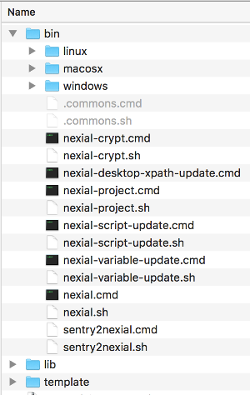
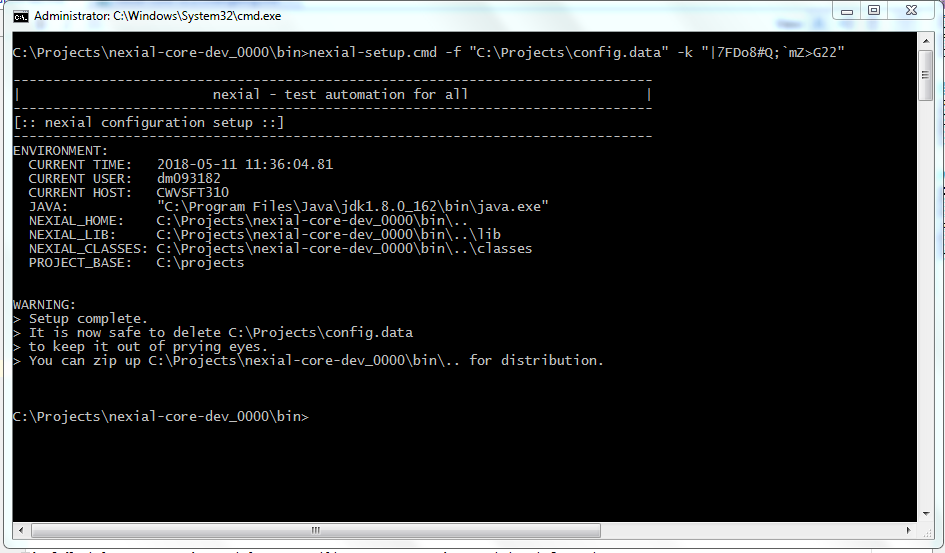
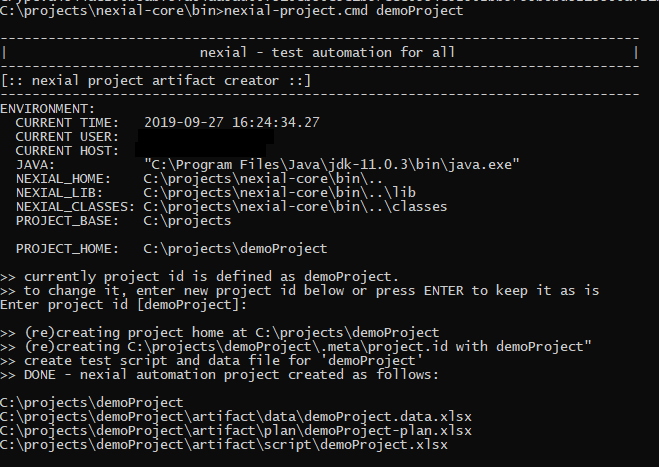

## Introduction
Nexial ships with a variety of batch files and shell scripts to aid the process of automation. These scripts range
from project creation to execution, and we will be adding more from time to time.

All batch files can be found under `${NEXIAL_HOME}/bin`: 

## Available Batch Files

#### **nexial**
This is the main script is used to execute Nexial script or plan.  This command has following command line options:

|options           |explanation  |
|------------------|-------------|
|**`-data`**       | This option will ensure the data file location relative to executing script.  Default data file is `../data/<script_name>.data.xlsx`.| 
|**`-datasheets`** | This option will restrict to a comma-seperated list of data sheets for this test execution.  Default will utilize all the sheets of data file.|
|**`-interactive`**| [_optional_] Run Nexial in [Interactive Mode](../interactive). |
|**`-output`**     | This will ensure output directory where results are stored.  Default location is `../../output` relative to script/plan.|
|**`-override`**   | [_optional_] Add or override data variables in the form of `name=value`.  Multiple overrides are supported via multiple `-override name=value` arguments. Note that variable name or value with spaces must be enclosed in double quotes.|
|**`-plan`**       | This option is for running plan. This will require full path of plan.  This is required if `-script` is missing.|
|**`-script`**     | This option is for running script. This will require full path of script.  This is required if `-plan` is missing.|
|**`-scenario`**   | This will run one or more test scenarios separated by comma.|

 

**Example** 
- Execute a Nexial script: 

  `nexial.cmd -script c:\projects\myProject\artifact\script\myProject.xlsx`

- Execute a Nexial plan: 

  `nexial.cmd -plan c:\projects\myProject\artifact\plan\myProject.xlsx`

- Execute one specific scenario (i.e. worksheet): 

  `nexial.cmd -script c:\projects\myProject\artifact\script\myProject.xlsx -scenario test1`

- Execute 2 scenarios with data variable overrides 

  `nexial.cmd -script c:\projects\Project1\artifact\script\script17.xlsx -scenario scenario1,scenario1a -override nexial.outputToCloud=true -override myData=XYZ`

---------------------------------------------

#### **nexial-setup**

This is the script used to setup the user specific configurations. This command has following command line options:

|options                 |explanation                                                      |
|------------------------|-----------------------------------------------------------------|
|**`-file`** or **`-f`** | This is the location of the configuration (in the form of key value pairs) user wants to setup.| 
|**`-key`** or **`-k`**  | This is the key used to encrypt the data.                       |

 

**Example** 
- Setup user defined configurations: 

  `nexial-setup.cmd -f "C:\Projects\config.data" -k "|7FDo8#Q;;mZ>G22"`
  
**Usage**
1. Open a console and point it to `${NEXIAL_HOME}/bin`

2. Run `nexial-crypt.cmd` (Windows) or `./nexial-crypt.sh` (*NIX, OSX) with the configuration file and the secret key as follows:
  
   `nexial-setup.cmd -f "C:\Projects\config.data" -k "|7FDo8#Q;;mZ>G22"`

3. The config.data file content looks like the following: 
   
   
 
4. When the Nexial command is run with the appropriate arguments it creates a lib called setup.jar inside the lib folder.
   Also a message is displayed asking you to delete the config file as shown below: 
   
   
   
5. Now you can further zip this using the `jar` command and distribute it further with the team. For example: 
   `jar -cf nexial.zip .`

6. That is it! The latest zip you have is configured with the necessary configurations.

**Note** 
1. For information about setting up an email-server configuration please look at [One Time Server Setup](EmailNotifications#one-time-server-setup)
on the Email Notifications page.

---------------------------------------------

#### **nexial-crypt**

This script is used to encrypt the sensitive data.

For sensitive information such as password, it may be important to store them encrypted at rest to avoid tampering or 
misuse.  The `nexial-crypt.[cmd|sh]` script is used to support this.  At a high level, this is how it works:

1. A Nexial user uses the nexial-crypt utility to encrypt the sensitive information.
2. The nexial-crypt utility provides the encrypted form back to the Nexial user.
3. Nexial user then copy the encrypted data into the appropriate data file.
4. During automation, Nexial will dynamically decrypt the encrypt data as and when it is referenced within the 
   corresponding Nexial script.
5. However, Nexial will not convert the encrypted form to its original form in the Nexial output file(s).

It should be considered as best practice to encrypt information that would otherwise be misused.  In a team setting 
where automation scripts are made available (e.g. via SCM), this is especially important.

**Usage**
1. Open a console and point it to `${NEXIAL_HOME}/bin`

2. Run `nexial-crypt.cmd` (Windows) or `./nexial-crypt.sh` (*NIX, OSX) with the target sensitive data as an argument:
   

3. The script will encrypt the argument and provide the encrypted form:
   

4. Copy the highlighted encrypted data (including `crypt:`) to data file:
   

5. That's it! Now you can reference this data via its name, as is `${TopSecret}`.

**Notes**
1. At times, using command line console (especially on Windows) can present some challenges when encrypting special 
   characters such as pipe (`|`), percent (`%`), ampersand (`&`) or question mark (`?`).  When dealing with special 
   character, be sure to surround the entire input parameter with double quote.  For example, 
   
   `nexial-crypt.cmd "ab&c"` 
   `nexial-crypt.cmd "ab|c"`

2. If the intent input contains double quote (`"`), then one would need to surround the entire input with double 
   quote, and also prepend the double quote with another double quote.  For example, 

   `nexial-crypt.cmd "ab""c"`

---------------------------------------------

#### **nexial-desktop-xpath-update**
This script updates the XPath(s) used for desktop automation (i.e. application.json). This script has following options:

|options  |explanation                                                                                      |
|---------|-------------------------------------------------------------------------------------------------|
|**`-t`** |**[REQUIRED]** This option is for location of a single JSON test script or a directory to update.|
|**`-v`** |This option is to turn on verbose logging. This is optional.                                     |

---------------------------------------------

#### **nexial-project**
This command is used to create new nexial-project. For example, the following will create a new project with the name 
`projectName`. By default it will be created in `C:\projects\projectName` folder for Windows, or 
`/Users/<user_id>/projects/projectName` for MacOSX/*NIX:

`nexial-project.cmd projectName`

`nexial-project.sh projectName` 

**Example** 

Command 

Project Created 

---------------------------------------------

#### **nexial-script-update**
This script updates one or more test scripts with the latest available commands (dropdowns in spreadsheets). It has 
two command line options: 

|options  | explanation                                                                                      |
|---------|--------------------------------------------------------------------------------------------------|
|**`-t`** |**[REQUIRED]** This option is for location of a single Excel test script or a directory to update.|
|**`-v`** |This option is to turn on verbose logging. This is optional.                                      |

**Example** 
The following will update all the scripts from given path. 

`nexial-script-update.cmd -v -t C:\projects\myProject\artifact\script` 

---------------------------------------------

#### **nexial-variable-update**

This script refactors the data variables referenced across test artifacts to provide uniformity across script authors 
and teams. One may specify the current keys and new keys in the form of:
`-d "key1=NEW_KEY1;key2=NEW_KEY2;..."`
 
This script has four command line options:  

|options  |explanation                                                                                      |
|---------|-------------------------------------------------------------------------------------------------|
|**`-d`** |**[REQUIRED]** This option is for data variables to replace in the form of `old_var=new_var`     |
|**`-t`** |**[REQUIRED]** This option is for providing the path of project/starting location of update data variable          |
|**`-v`** |This option is to turn on verbose logging                                                        |
|**`-p`** |This option is to preview the results for the data variables being updated without affecting any files. So it won't update data variables across artifacts.|

 
For example, The following renames the key `oldKey1` to `newKey1`, and `oldKey2` to `newKey2`, and so on: 

`nexial-variable-update.cmd -v -d oldKey1=newKey1;oldKey2=newKey2;oldKey3=newKey3 -t projectFullPath` 

If you just want to examine the positions of `oldKey1`, `oldKey2` and so on which will be affected, but don't 
want to refactor them. Following will preview the substitutions: 

`nexial-variable-update.cmd -v -d oldKey1=newKey1;oldKey2=newKey2;oldKey3=newKey3 -t projectFullPath -p` 

Format of data variable update preview has four columns:

|column                     |explanation                                                                     |
|---------------------------|--------------------------------------------------------------------------------|
|**`File`**                 |This will have relative path of file with respect to starting location of update data variable given by `-t` command line option. |
|**`Worksheet/Scenario`**   |This will have worksheet name of data file or scripts.                          |
|**`Position`**             |This is the position of line/cell being refactored/affected.                    |
|**`Updating Lines/Cells`** |Updating lines/Cells column will have line/cells before replacement and after replacement separated by `=>`. |

 

**Example** 
Let's have a look at variable update preview. Following command is executed for the preview: 
 
The variable update preview would look like so: 

---------------------------------------------

#### **nexial-log-parser**

This script captures required log statements (mainly for elapsed time between request and response of given step) from a log 
file generated through execution and stored to new file. 

|options  |explanation                                                                                      |
|---------|-------------------------------------------------------------------------------------------------|
|**`-t`** |**[REQUIRED]** This option is for provding the location of a log file to be parsed.                           |
|**`-s`** |**[REQUIRED]** This option is for providing the location where a new log file  is to be generated.                      |
|**`-c`** |This option is for specifying type of logs to be tracked. Possible values for this are desktop, rdbms, ws and all(default). This is optional.|

 

**Example**  
The following will create new log file with required logs only. 

`nexial-log-parser.cmd -t C:\projects\myProject\output\20180608_121212\nexial-20180608_121212.log -s C:\projects\myProject\newLogs.log -c ws`  

This will extract `ws` request and response logs from `nexial-20180608_121212.log` and store it to `newLog.log`.

This script comes into picture when one wants to capture response time for step. For example, someone wants to do 
performance testing for API calls, `ws` criteria will gather information about request and response time from logs and 
calculate elapsed time for the same.

---------------------------------------------

#### **nexial-project-inspector**

The script scans existing artifacts of a project and generate an interactive HTML report. 
This script has the following command line options: 

|options  |explanation                                                                               |
|---------|------------------------------------------------------------------------------------------|
|**`-m`**|Specify how output will be viewed (local or remote). Default is local.                     |
|**`-t`** |**[REQUIRED]** This is for providing the location of the project directory to scan.       |
|**`-v`** |Turn on verbose logging.                                                                  |

 

**Example** 
The following script will scan the demoProject directory 

`nexial-project-inspector -t C:\projects\demoProject -v` 

---------------------------------------------

#### **nexial-macro-update**

This script refactor the macro name referenced across test scripts and macro files to provide uniformity across script 
author and teams. 
This script has four command line options:  

|options  |explanation                                                                               |
|---------|------------------------------------------------------------------------------------------|
|**`-t`** |**[REQUIRED]** This option is for providing the path of project/starting location of updating macro.  .     |
|**`-f`** |**[REQUIRED]** This option is for providing the file name of macro from which macro name to be replaced.    |
|**`-s`** |**[REQUIRED]** This option is for specifying worksheet of above macro file.                              |
|**`-m`** |**[REQUIRED]** This option is for specifying the macro name which needs to be replaced across scripts.   |
|**`-p`** |This option is to preview the results for the macros being updated without affecting any files.|

 

**Example**  
The following renames the macro `oldMacro1` to `newMacro1`, and `oldMacro2` to `newMacro2`, and so on: 

`nexial-variable-update.cmd -t searchPath -f macroFile -s macrosheet -m oldMacro1=newMacro1,oldMacro2=newMacro2`

---------------------------------------------

#### **nexial-artifact-repair**

This script repairs the artifacts by removing unnecessary, non-existing url links, comments from original file.
This is mostly useful when excel file has links to non existing files asking for updated everytime the user opens the file.
However, the updates fail because the target file does not exist. 

This batch file only supports Nexial excel files e.g. script, plan, data, macro files. 

If preview location(`-d`) is not provided, it will take backup of original file and override the original with repaired file. 

##### Note 
- Maximum row and column limit to read/write data is set to `10000`. 
- Maximum row and column limit is more likely to impact on data files.
- This script will read/write data till the first empty row. Rows after first empty row is ignored.

This script has following command line options:  

|options  |explanation                                                                                          |
|---------|-----------------------------------------------------------------------------------------------------|
|**`-t`** |**[REQUIRED]** This option is to provide the path of project/starting location or file for repairing artifact.       |
|**`-d`** |**[OPTIONAL]** This option is to provide the destination path to preview repaired files without affecting original file. |

 

**Example**  
The following repair all files from `searchPath` and store at destinationPath.

`nexial-artifact-repair.cmd -t <searchPath> -d <destinationPath>`

---------------------------------------------

