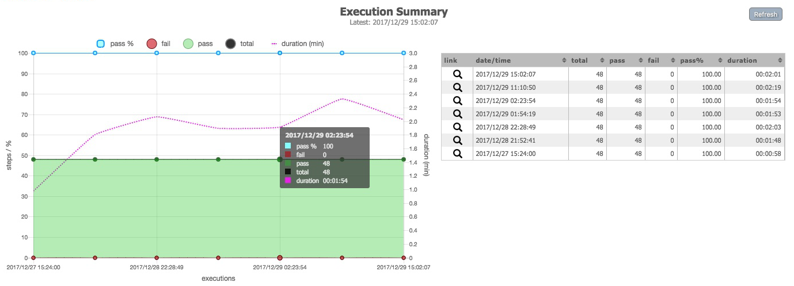
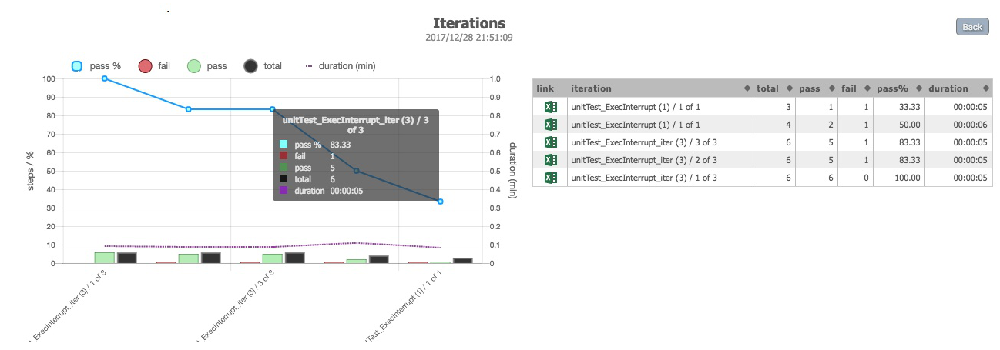
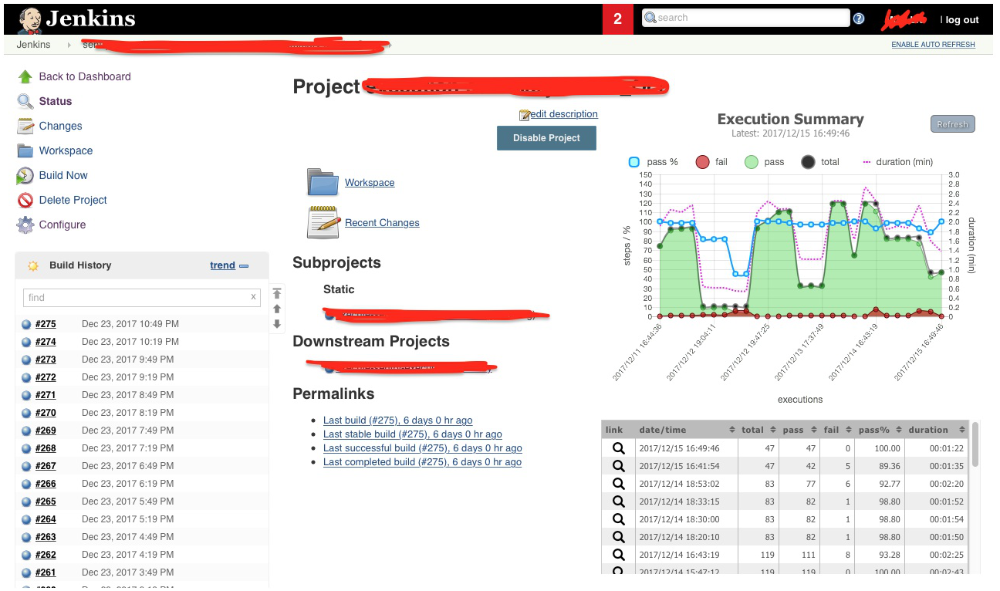
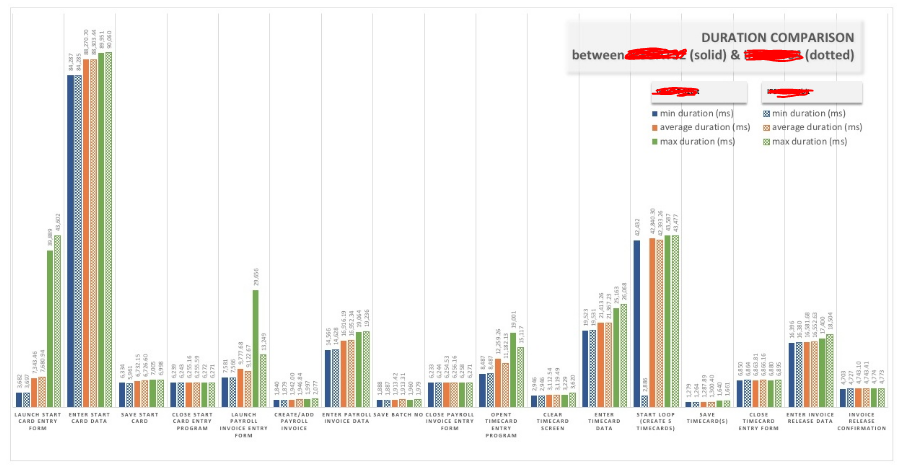

**Introduction**
----------------

The main idea behind the creation of a "dashboard" is to provide insights and visualization that draws in not only the quality engineers, but the entire project team, to engage in Test Automation.  Quality is everyone's concern, and must be front and center for everyone throughout the entire product delivery process.  Instead of pouring through emails, disparate reports or hear-say, the aim of this dashboard is to provide a focal point where facts (about testing and quality) are presented plainly and effectively. We are still in early stages of this end goal. We look forward to your trying it out and your feedback.

**Show me...**
--------------

As of now, we provide the following:

1.  Number of steps executed per execution or per iteration
2.  Number of steps PASSed per execution or per iteration
3.  Number of steps FAILed per execution or per iteration
4.  Overall PASS % per execution or per iteration
5.  Time spent per execution or per iteration

Here are a few examples of what it looks like:

**Top-level Execution Summary (collection of all executions):**

The page above shows the various high-level information per execution. The table on the right provides the same information, but allows one to sort the data point of interest.  If desired, one can click on a specific execution on the graph or on the table (via the magnifying glass) to access the next level of summary (Iteration).

**Iteration-level Execution Summary (with links to Nexial output):**

The page above shows the execution summary across iterations of the same test run.  The Excel icon on the table allows one to access the Nexial output for a specific iteration.

The above 2 pages are excerpts from Confluence.  But it is also quite possible to display the same information of a Jenkins job page or even as standalone.  Here's an example of the Nexial Execution Dashboard on a Jenkins job page:

**How Do I Get Started...**
---------------

### For Nexial Automation Engineer

In order to display your test automation results as a dashboard like those shown above, the test execution must be conducted with the following:

1.  Use any Nexial build.
2.  Enable the option to upload execution result to the cloud, via  
      
    **`nexial.outputToCloud=true`**  
      
    This will enable execution result to be uploaded to the cloud, which in turn will be collected by Nexial to compose the dashboard details. 
    This option can be enabled via command line as well as data file.
    
3.  Enable the project prefix option via  
      
    **`nexial.runID.prefix=...`**  
      
    This is **optional**, but an effective way to segregate your executions into logical or meaningful groupings such as "Regression" (e.g. `nexial.runID.prefix=regression`), "Smoke Test" (e.g. `nexial.runID.prefix=smoketest`), or even release and sprint specific (e.g. `nexial.runID.prefix=Release_19_0_4` or `nexial.runID.prefix=Sprint_24`).  For more information about project prefix see [this](../systemvars/index#nexial.runID.prefix).  
    **Prefix must not contain a dot or a slash.**  
      
    Note that this option must be enable via command line (not data file), since Nexial must read and take it into effect prior to parsing project-specific information.
4.  Enable your project specific build number(not the Nexial build number). A project may have its own build number for example V1.2.3 Beta, V 1.2.4 etc. You can pass the build number by specifying  
    **`nexial.scriptRef.buildnum=... `**`(e.g. nexial.scriptRef.buildnum=V1.2.3)`  
    This property is **optional**. You can also set other **scriptRef** properties. Refer to [this](../systemvars/index#nexial.scriptRef).  
      
5.  Run your test as you normally would.
      
Here's an example:

Note the first command of using `set JAVA_OPT=...` to enable both the options.  

You'll see the URL of the execution output towards the end of the execution, like this:

### How to Compose Dashboard Details
We run nexial script to collect all the necessary data as summary.json from execution-summary.json specific to project which is uploaded to cloud. 

### Steps to consolidate summary 
1. The last n number of runs data to be consolidated, n is execCount provided in config.json which is specific to project. If it's not present it will consider default execCount. 
2. Listing out latest n number of execution-summary.json.
3. Consolidate necessary data like number of steps PASSed and FAILed, total steps, PASS % and duration.
4. Upload consolidated summary.json to project specific nexial-summary folder.

### For DevOps or CI/CD Support

Please see [Nexial Execution Dashboard HOWTO](ExecutionDashboardHOWTO), under Jenkins Setup section.

### To publish dashboard on Confluence

Please see [Nexial Execution Dashboard HOWTO](ExecutionDashboardHOWTO), under Confluence Setup section.

**What's next...**
------------------

What's shown is only the first rendition of an automation execution dashboard.  Further enhancement are already in the works.  You can get an early preview for one of new features (Activity level comparison) here: 

We will also be adding in other metrics in to the dashboard, such as:

1.  Test Coverage Map
2.  Nexial Command Utilization
3.  Failure Rate
4.  Defect Linkage
5.  Cross-System (Integration) Test Automation report
6.  Execution Frequency

Stay tuned!