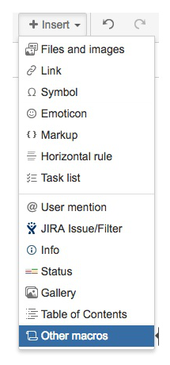

### Introduction
This is a feature of Nexial to render a dashboard-like, Web-based report across multiple test executions. This report 
helps its reader to visual the high-level execution characteristics over time, which includes:

*   Number of steps executed per execution or per iteration
*   Number of steps PASSed per execution or per iteration
*   Number of steps FAILed per execution or per iteration
*   Overall PASS % per execution or per iteration
*   Time spent per execution or per iteration

In addition to the above, one may also access the individual execution report (spreadsheet) per iteration.


### Jenkins Setup

#### Displaying Execution Dashboard on a Jenkins job page

1.  **One-time** Setup
	*   Plugins needed: <a href="https://wiki.jenkins.io/pages/viewpage.action?pageId=60915753" class="external-link" target="_nexial_link">anything-goes</a>
	*   Jenkins | Manage Jenkins | Configure Global Security ( `http://\[jenkins_host\]/configureSecurity/` ):
	    *   Under Markup Formatter, select `Allow arbitrary HTML includin JavaScript (UNSAFE)`  
	    

2.  On Job Page
	*   click `edit description`
	*   enter description as<br/>
	    ```html
	    <iframe style="float:right; height:700px !important; width:500px !important; margin:0; padding:4px; border:none" 
	           src="<YOUR_S3_LOCATION_AS_URL>/executionsummary.html?project=INSERT_YOUR_PROJECT_NAME_HERE&orientation=rightside">
	    </iframe>
	    ``` 
	   **replace src url with your `executionsummary.html` url**<br/>
	   **replace `INSERT_YOUR_PROJECT_NAME_HERE` with your project name**<BR/>
	   **replace `<YOUR_S3_LOCATION_AS_URL>` with your project name**<br/>
	*   click `Submit` to save changes
	*   Note that you can put the above HTML as part of your job description (recommend at the end).


#### Confluence Setup

#### Displaying Execution Dashboard on a Confluence page

1.  Create or Edit a Confluence Page.
2.  Move cursor to the appropriate spot on the page.(Where you see `plus(+)` sign)
3.  From Confluence Edit toolbar, select Insert > Other Macros  <br/>
    
4.  From the popup window, enter `HTML` to search.
5.  Select the macro `HTML`.<br/>
    
6.  Click `Insert`
7.  Back on the Confluence page, in Edit mode, you should see a "box" titled HTML.
8.  Insert this html text in box, enter
    ```html
    <iframe width="100%" height="650px" style="float:right;width:100% !important;min-height:100% important;margin:0;padding:0;border:none" 
            src="<YOUR_S3_LOCATION_AS_URL>/executionsummary.html?project=INSERT_YOUR_PROJECT_NAME_HERE">
    </iframe>
    ```
    **replace src url with your `executionsummary.html` url**<br>
    **replace `INSERT_YOUR_PROJECT_NAME_HERE` with your project name**<br/>
	   **replace `<YOUR_S3_LOCATION_AS_URL>` with your project name**<br/>
        
9.  Finish the rest of your editing, and click `Save`.

