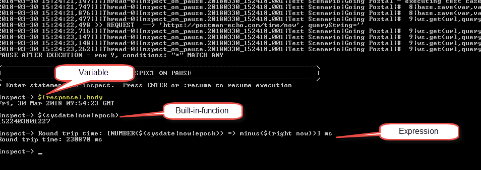

> **NOTE**: **[Nexial Interactive](../interactive)** now includes Inspection, and is generally considered a better 
> feature for exploring data variables and expression during execution. After reading about Inspection, you may want
> to also learn more about **[Nexial Interactive](../interactive)**.

With [`PauseBefore()`](../flowcontrols/index#pausebefore()--pauseafter()) and 
[`PauseAfter()`](../flowcontrols/index#pausebefore()--pauseafter()), one can pause an execution to review 
console logs and application state. With the capability of "inpsect-on-pause", one can also inquire in real time
the state and value of data variables, or the use of [built-in functions](../functions) and 
[Nexial expressions](../expressions). Since this can be enabled from any test step, this is particularly useful 
for troubleshooting and debugging running scripts.

### Benefits
- Observe the value of a data variable at a particular point in the execution.
- Observe the outcome of a [`Nexial Expressions`](../expressions/index) in the script at a particular point in the 
  execution.
- Observe the outcome of a [`Nexial Built-in-Functions`](../functions/index.html) in the script at a particular 
  point in the execution.

### How does it work?
- Find the test step(s) where the execution should be paused.
- Add [`PauseBefore()`](../flowcontrols/index#pausebefore()--pauseafter()) or 
  [`PauseAfter()`](../flowcontrols/index#pausebefore()--pauseafter()) to the flow control column of such step(s).
- set the system variable [`nexial.inspectOnPause`](../systemvars/index#nexial.inspectOnPause) as `true`. This
  can be done in [various places](../userguide/DataManagement).
- [Execute your script](../userguide/BatchFiles#nexialcmd--nexialsh) as one normally would. Nexial would pause the
  execution just before (`PauseBefore()`) or just after (`PauseAfter()`) the test steps where the "pause" control 
  flow was placed. Now we can interact with Nexial to inspect data variables, etc.
- When inspection is complete, one can press `ENTER` key or type in `:resume` to continue execution.

**Note**: Nexial is designed to disable "pauses" in CI/CD environment, which it determines dynamically at runtime. One
can also force [Nexial to consider current environment as CI/CD](../userguide/ExecutingNexialInCICD). 

### Example
The example below obtain the current timestamp from a API, check the response received and process it to get the 
elapsed time and round-trip time: 

Notice that a `PauseAfter()` is added in the flow control of the last step. The system variable 
[`nexial.inspectOnPause`](../systemvars/index#nexial.inspectOnPause) is set to `true` in the corresponding data file.

When the inspect-on-pause is in effect, you should see a prompt on the console as shown below: 

Now we can:
- Inspect the payload of the API response via `${response}.body}`
- Run a built-in function to find the current date/time in _epoch_ via `$(sysdate|now|epoch)`
- Run a Nexial expression to find the elapsed time:  
  `Round trip time: [NUMBER($(sysdate|now|epoch)) => minus(${right now})] ms`
 
  

To exit inspect-on-pause and resume execution, simply press `Enter` key on the console.

