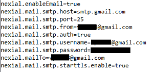

### Overview

Using the [`nexial-setup.cmd`](BatchFiles#nexial-setup) or [`nexial-setup.sh`](BatchFiles#nexial-setup) command allows
you to setup the common configurations by providing it the location of the configuration file only once. 

The ideal person to use this command could be the one who is responsible for managing the team/projects eg. Team Lead or 
the one who manages all secret credentials related to project. They can use this feature to put secret credentials and 
configuration at one place (encrypted, if required) and bundle it into `setup.jar` and then share among the team. 

Read more about `nexial-setup.cmd` on the [Nexial Batch Files](BatchFiles#nexial-setup) page.

**Advantages**
- One time setup, no need to configure system variables for every project/test.
- Encryption of sensitive information such as passwords and secret keys. 
- Running the command creates a configuration jar. This nexial build can be distributed to other members of team 
allowing the team to work with the same configuration without having to set it up individually. 

### Email Notification Setup Example

With one-time setup, you can provide email server configuration details once and build `setup.jar` using 
[`nexial-setup.cmd`](BatchFiles#nexial-setup) or [`nexial-setup.sh`](BatchFiles#nexial-setup).

**_project.properties_**

~~~
# Values are for reference purpose only  
nexial.enableEmail=true
nexial.mail.smtp.host=<SMTP_HOST>
nexial.mail.smtp.port=<SMTP_PORT>
nexial.mail.smtp.from=<Sender_Email_Id>
nexial.mail.smtp.auth=true
nexial.mail.smtp.username=<Auth_Email_id_or_Sender_email_id>
nexial.mail.smtp.password=<Email_Password>
nexial.mail.smtp.starttls.enable=true
~~~
  

<!--   -->
Command: 
 

To setup Email Notification with Gmail, [click here](../tipsandtricks/IntegratingNexialWithEmail#email-notification-via-gmail)

### Nexial OutputToCloud Setup Example
Note that cloud storage support is not enabled by default (it's not free). One can enable such capability
by adding the following configuration for S3 connectivity (in addition to setting
<code>nexial.outputToCloud</code> as <code>true</code>: 
<table>
<tbody>
<tr>
  <th align="left">nexial.otc.region</th>
  <td>
    The desire
    <a href="https://docs.aws.amazon.com/AmazonRDS/latest/UserGuide/Concepts.RegionsAndAvailabilityZones.html"
       class="external-link" target="_nexial_link">AWS region</a>. Default is <code>us-west-2</code>.
  </td>
</tr>
<tr>
  <th align="left">nexial.otc.accessKey</th>
  <td>The
    <a href="https://docs.aws.amazon.com/general/latest/gr/aws-sec-cred-types.html#access-keys-and-secret-access-keys"
       class="external-link" target="_nexial_link">AWS access key</a> to access target S3 service.
  </td>
</tr>
<tr>
  <th align="left">nexial.otc.secretKey</th>
  <td>The
    <a href="https://docs.aws.amazon.com/general/latest/gr/aws-sec-cred-types.html#access-keys-and-secret-access-keys"
       class="external-link" target="_nexial_link">AWS secret key</a> to access target S3 service.
  </td>
</tr>
<tr>
  <th align="left">nexial.otc.url</th>
  <td>The URL of alternative AWS S3 service eg. <a href="/userguide/InstallingMinio">minio</a></td>
</tr>
<tr>
  <th align="left">nexial.outputCloudBase</th>
  <td>The target bucket and path (prefix) to use for storing execution output.</td>
</tr>
</tbody>
</table>
