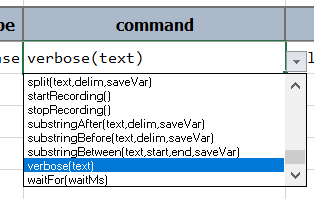
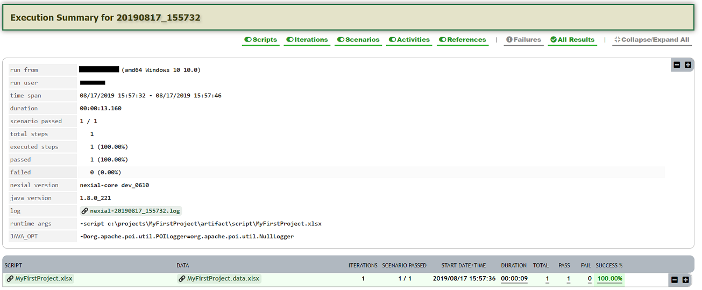

### Creating Your First Project
Creating Project Structure
<div class="tabs">
    <ul class="tab-links tabs-collapsed">
        <li class="active"><a href="#tab1">Windows</a></li>
        <li><a href="#tab2">Mac OSX</a></li>
    </ul>
    <div class="tab-content">
        <div id="tab1" class="tab active">
        <ol>
            <li>
				Open the command prompt and change the current directory to the "bin" directory under the Nexial installation directory.<br/>
				a. To do this, enter "cd .." until it only displays "C:\\>"<br/>
				b. Once in the C drive, enter "cd projects\nexial-core\bin"
				<br/>
            </li>
			<li>
			    From here, enter "nexial-project.cmd MyFirstProject"
			</li>
			<li>
			    If everything works, then you should see the message "creating project home at ..." and "DONE"
				<br/>
			</li>
			<li>
			    You should see the following directory created, along with various files in it:<br/>
				<br/>
			</li>
        </ol>
		Do not close the command prompt as you will need this later.
        </div>
        <div id="tab2" class="tab" style= "display:none;">
        <ol>
            <li>
			
            </li>
			<li>
			    
			</li>
			<li>
			   
			</li>
            
        </ol>
        </div>
    </div>
</div>
<br/>
   
   1. To gain better understanding of the project structure, check out 
      [Understanding Nexial project structure](UnderstandingProjectStructure)
   
   2. To gain better understanding of the Nexial automation script format and usage, check out 
      [Understanding Nexial Test Artifact](UnderstandingExcelTemplates)
   
   3. _Now it's time to run some automation_!


### Running your first test automation
The "Hello World" of Nexial automation

1. Open `C:\projects\MyFirstProject\artifact\script\MyFirstProject.xlsx` \- we refer to this Excel file as the _test script_ or the _automation
 script_. By [convention](UnderstandingProjectStructure) all Excel files under the `artifact/script` directory are considered as automation scripts.

2. Start the first test case by doing the following:<br/>
	<b>a.</b> Enter "Greetings" under the <b>activity</b> column. This column's purpose is to give a name to your actions.
	<br/>
	
	<br/>
	<b>b.</b> Under the <b>description</b> column, enter "say hello". This column is meant to contain a description of what the action should do.
	<br/>
	
	<br/>
	<b>c.</b> In the <b>cmd type</b> column, there should be a drop down menu. From this menu, select "base". This column organizes and specifies various types of Nexial commands.
	<br/>
	
	<br/>
	<b>d.</b> In the <b>command</b> column, you can now select a new command from the drop down menu. The commands you can select from in this column 
	come from a Nexial list of commands labeled as "base" commands due to the type of command we selected in the <b>cmd type</b> column from the previous step. 
	For our test, we will select, "verbose(text)".
	<br/>
	
	<br/>
	<b>e.</b> In the <b>param 1</b> column, type in "Hello World". This column as well as the other <b>param #</b> columns are parameters that you fill in based on the 
	<b>command</b> column's required parameter. In our example, the "verbose(<b>text</b>)" command requires <b>text</b> as a parameter.
	<br/>
	
	<br/>
	Your project should now look something like this:
   

3. Save/close this automation script.

4. Go to the command prompt and type: "```nexial.cmd -script ```" (leaving a space after -script). Before pressing <b>Enter</b> see the following steps:
	<br/>
	a. You can either manually type the address of where your file is located, in our case it is: "```c:\projects\MyFirstProject\artifact\script\MyFirstProject.xlsx```"
	<br/>
	b. Or you can drag and drop the xlsx file into the command prompt.
	<br/>
	c. After doing either step a or b, press <b>Enter</b> and wait a little bit.

5. If all's well, you should see something like the following on your console:<br/>
    
   
   For now, don't worry too much about these logs. The most critical portion is near the end 
   where Nexial reports a summary of the test. The above screenshot showed that 1 iteration ran, 
   with 1 step completed within 842ms.

6. After the above finishes processing, if your "<b>MyFirstProject.data.xlsx</b>" file (an Excel file located in the "data" folder) had "nexial.openResult" set as ```true```, 
two things should open up:
	<br/>
	a. Excel should open a new spreadsheet displaying a copy of the tests you ran as well as your test results.
	<br/>
	b. Your main browser should open up a results page of the test we just ran.
	<br/>
	
   The new Excel file should look something like this:
   <br/>
   
   <br/>
   Meanwhile, your browser should display something like this:
   
   <br/>
   
**Congratulations**! You have just successfully run your first automation script via Nexial. Let's 
dig deeper...


### a little bit more...
1. let's create a few more lines for this test case:
   _MORE TO COME..._


### Diving Deeper
1. install .NET Framework 4.6.2 for desktop automation

