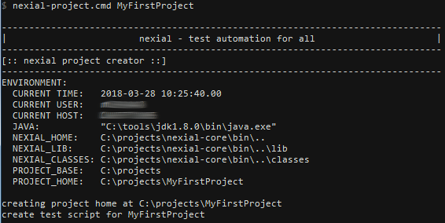

### Setting up Your First Project
1. Create Project Structure
   
   1. Open console and point to `bin` directory under the Nexial installation directory.<br/>
       
   
   2. Invoke the project creator script - `nexial-project.cmd MyFirstProject`
      
   
   3. If everything works, then you should see the message "`creating project home at ...`" and "`DONE"`
   
   4. You should see the following directory create, along with various files in it:<br/>
      
   
   5. To gain better understanding of the project structure, check out 
      [Understanding Nexial project structure](UnderstandingProjectStructure)
   
   6. To gain better understanding of the Nexial automation script format and usage, check out 
      [Understanding Nexial Test Artifact](UnderstandingExcelTemplates)
   
   7. _Now it's time to run some automation_!


### Running your first test automation
##### "Hello World" of Nexial automation
1. Open `C:\projects\MyFirstProject\artifact\script\MyFirstProject.xlsx` \- we refer to this Excel file as the 
   _test script_ or the _automation script_. By [convention](UnderstandingProjectStructure) all Excel files under the 
   `artifact/script` directory are considered as automation scripts.

2. Start first test case by typing in the following:<br/>
   

3. Enter the next 3 columns with the `base|verbose(text) command`:<br/>
   
   
   Under `param 1` is the value to be used during runtime for the corresponding command.  In this 
   case it matches to the `text` of `base|verbose(text)` - meaning, "printing to this row the 
   words `Hello World`".

4. Save/close this automation script.

5. From console, do the following:
   ```batch
   cd C:\projects\nexial-core\bin
   set JAVA_OPT=-Dnexial.openResult=on
   nexial.cmd -script c:\projects\MyFirstProject\artifact\script\MyFirstProject.xlsx
   ```

   **Critical**, note the following:
   1. The second line above (`-Dnexial.openResult=on`) is optional.  It is used to instruct 
      Nexial to open the test result when the test is complete. It is safe to omit but could save 
      you a few steps.
   
   2. In some situation where SMTP is not permitted, email notification **must** be disabled.
      The second line **cannot be omitted** and **MUST** be
      `set JAVA_OPT=-Dnexial.openResult=on -Dnexial.enableEmail=off`
      or
      `set JAVA_OPT=-Dnexial.enableEmail=off` 
   
   3.  The third line is to invoke Nexial to run the test as scripted in the file specified via 
       `-script` argument.

6. If all's well, you should see something like the following on your console:<br/>
    
   
   For now, don't worry too much about these logs.  The most critical portion is near the end 
   where Nexial reports a summary of the test.  The above screenshot showed that 1 iteration ran, 
   with 1 step completed within 842ms.

7. If you have `openResult` set as `on` or `true`, then the output file should have been opened as well.  
   You see the first line (Row 4) looking something like this:<br/>
   
   
   1. Cell E5 prints `Hello World`.  At this time it might not appear obvious since we just print 
      out a static string of text. Our next example will show more interesting tests.
   
   2. `L1:O2` is the execution summary.  It shows where the test was run, who and when it was run 
      and top-level execution numbers.  Note that the time duration is slightly different than 
      what's reported on the console.  The additional time as specified in the console is the 
      additional time to clean up the test run.
   
   3. Column M shows the elapsed time in millisecond to complete the corresponding test step
   
   4. Column N shows `PASS`, `FAIL` or `SKIP` as the result of the corresponding test step. 

**Congratulations**! You have just successfully run your first automation script via Nexial. Let's 
dig deeper...


### a little bit more...
1. let's create a few more lines for this test case:
   _MORE TO COME..._


### Diving Deeper
1. install .NET Framework 4.6.2 for desktop automation

