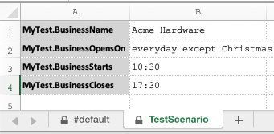
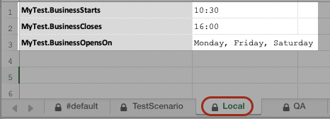
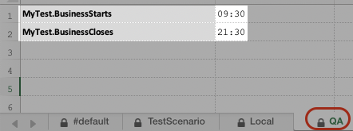

### Specify Data File
By using the `-data` command-line option, we can override the above convention. For example, 
`./nexial.sh -script $MY_PROJECT_HOME/artifact/script/DifferentDataFile.xlsx -data /Users/me/data/QA/AnotherDataFile.xlsx`

Nexial will use the fully qualified data file, as specified, instead of the conventional data file. However one can 
also simplify the above command-line option by omitting the fully qualified location of the target data file: 
`./nexial.sh -script $PROJECT_HOME/artifact/script/DifferentDataFile.xlsx -data AnotherDataFile.xlsx`

When the precise location of `AnotherDataFile.xlsx` is not specified, Nexial searches through these locations 
(order precedence):
- `$PROJECT_HOME/artifact/script`
- `$PROJECT_HOME/artifact/data`
- `$PROJECT_HOME/artifact`

Let's see this feature in action. Here, we have `AnotherDataFile.xlsx` located in `artifact/data`: 

The content of `AnotherDataFile.xlsx` looks like this: 
 &nbsp; 

As the execution output shows (below), Nexial is now using the data defined in `artifact/dataAnotherDataFile.xlsx`:

-----

### Specifying Datasheets
Nexial provides the ability to alter the default convention via the `-datasheets` command-line option.

Suppose we have 2 other datasheets in the same data file: 
 &nbsp; 

We can specify the use of these datasheets via command-line option: 
`./nexial.sh -script $MY_PROJECT_HOME/artifact/script/MyTest.xlsx -datasheets Local,QA`

Now Nexial will not consider the data variables defined in `TestScenario`. The sequence of data variable resolution
would now be:
- Load data variables defined in `#default`
- Load data variables defined in `Local`, possibly overriding previously defined ones
- Load data variables defined in `QA`, possibly overriding previously defined ones

**NOTE: "The last one WINS!"**

Since `${MyTest.BusinessStarts}` is defined in the `#default`, `Local` and `QA` datasheets, the one defined in `QA`
datasheet will take effect because the `QA` datasheet is the last one to load. Now observe the execution output: 

The value of the referenced data variables are as follows:
- `${MyTest.BusinessStarts}` --> `09:30` (from `QA` datasheet)
- `${MyTest.BusinessCloses}` --> `21:30` (from `QA` datasheet)
- `${MyTest.BusinessOpensOn}` --> `Monday, Friday, Saturday` (from `Local` datasheet)

Suppose we switch the order of the datasheets from `Local,QA` to `QA,Local`. What do you think the output would look 
like? 

In this case, the value of referenced data variables are as follows:
- `${MyTest.BusinessStarts}` --> `10:30` (from `Local` datasheet)
- `${MyTest.BusinessCloses}` --> `16:00` (from `Local` datasheet)
- `${MyTest.BusinessOpensOn}` --> `Monday, Friday, Saturday` (from `Local` datasheet)

-----

### Combing the use of `-data` and `-datasheet`
We can combine the use of both `-data` and `-datasheet` to device a flexible and extensible way of handling 
environment-specific data. Consider the following examples:

Running "happy path" with the "good data" that is valid in "QA": 
`./nexial.sh -script $MY_PROJECT_HOME/artifact/script/HappyPath.xlsx -data QA.xlsx -datasheet Good-Data`

Running "happy path" with expected data in "QA", first use "last quarter" data and then override with "this quarter": 
`./nexial.sh -script $MY_PROJECT_HOME/artifact/script/HappyPath.xlsx -data QA.xlsx -datasheet LastQuarter,CurrentQuarter`

Running the error conditions with the "outdated orders" found in the "QA" environment: 
`./nexial.sh -script $MY_PROJECT_HOME/artifact/script/Exceptions.xlsx -data QA.xlsx -datasheet OutdatedOrder`

Running the error conditions in "UAT", using first the data from "last month" and then overload with data from "this 
month": 
`./nexial.sh -script $MY_PROJECT_HOME/artifact/script/Exceptions.xlsx -data UA.xlsx -datasheet LastMonth,ThisMonth`

-----

### Conclusion
The ability to load unconventional datasheets during execution gives us flexibility and control over the 
automation data set. One can achieve via the `-datasheet` command-line option. One can design an environment-specific 
dataset via dedicated datasheets. One can also design a "default" datasheet to maintain the environment-agnostic dataset 
(consider the `#default` datasheet for this) to further simplify the maintenance of data variables. 

The ability to use different data file during execution gives us more coarse-grained control over our data set. One can 
design segregated sets of data - and potentially each with different ownership - for each environment. When used in
combination with the `-datasheet` command-line option, we can achieve even greater flexibility and control over the
environment-specific data.
